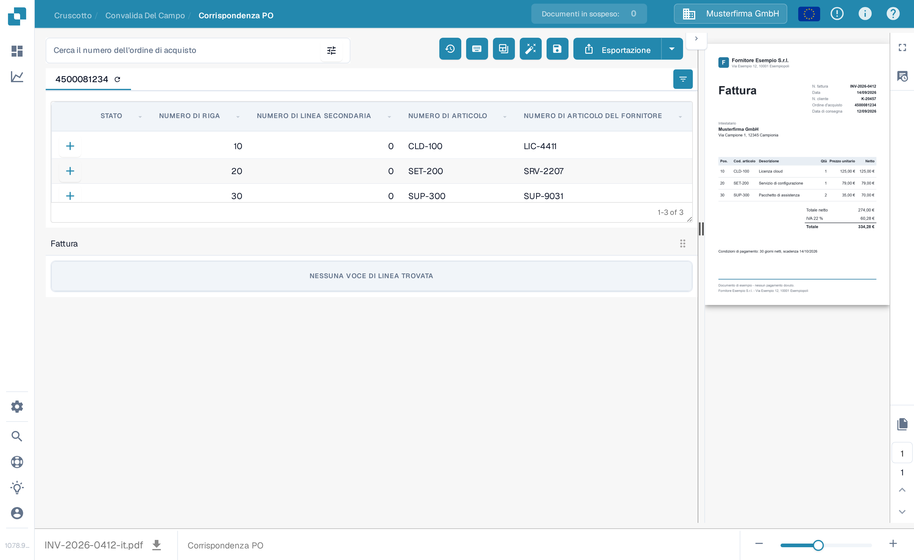
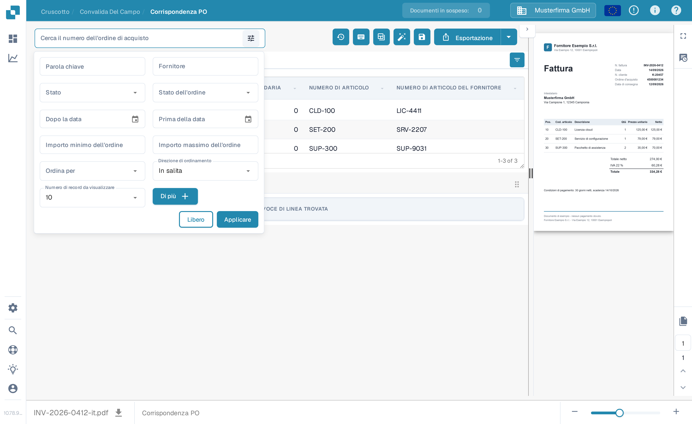

# Strumenti di Abbinamento Ordini di Acquisto

Nella schermata di abbinamento PO la ricerca degli ordini di acquisto e gli strumenti si trovano sopra le righe dell'ordine di acquisto. L'anteprima della fattura resta a destra. Le azioni disponibili possono variare in base ai tuoi permessi, ai dati del documento e alle impostazioni della tua organizzazione.

<figure><figcaption>
Trovi il campo di ricerca e la barra degli strumenti delle azioni sopra le righe dell'ordine di acquisto.
</figcaption></figure>

## Trovare l'ordine di acquisto giusto

Inserisci un numero d'ordine di acquisto in **Cerca il numero dell'ordine di acquisto** e seleziona un risultato. L'icona del filtro accanto al campo apre altre opzioni di ricerca: Parola chiave, Fornitore, Stato, Stato dell'ordine, Dopo la data, Prima della data, Importo minimo dell'ordine, Importo massimo dell'ordine, Ordina per, Direzione di ordinamento e Numero di record da visualizzare. Scegli **Applicare** per usare i filtri oppure **Libero** per reimpostarli. Filtrare l'elenco non abbina e non esporta la fattura.

<figure><figcaption>
Apri l'icona del filtro accanto al campo di ricerca per altre opzioni di ricerca.
</figcaption></figure>

## Azioni della barra degli strumenti

Leggi il suggerimento di un'icona prima di selezionarla. La barra degli strumenti può mostrare:

| Azione | Cosa fa |
| --- | --- |
| **Cronologia abbinamenti** (orologio) | Apre le attività di abbinamento precedenti per questo documento. Non avvia un nuovo abbinamento. |
| **Guida** (?) | Apre la pagina di guida sull'abbinamento PO in una nuova scheda del browser. |
| **Scorciatoie da tastiera** (tastiera) | Mostra le scorciatoie disponibili in questa schermata. Vedi [Scorciatoie da tastiera](keyboard-shortcuts.md). |
| **Modalità di formazione** (tabella) | Attiva o disattiva lo trascinamento delle righe PO nella tabella della fattura. È utile solo quando il documento ha righe di fattura; la schermata di esempio qui sotto non ne ha. |
| **Attività / Crea attività** | Apre le attività del documento o ne crea una quando queste azioni sono disponibili per il tuo documento e il tuo ruolo. Vedi [Attività](../tasks.md). |
| **Contabilità automatica** | Apre la contabilità per questo documento quando i dati contabili sono presenti. |
| **Abbinamento PO automatico** (bacchetta) | Esegue l'abbinamento automatico. Se l'organizzazione ha attivato l'esportazione automatica e il risultato ne rispetta le condizioni, questa azione può anche esportare. Controlla il documento prima di usarla. Vedi [Abbinamento automatico dei dati degli ordini di acquisto](automatic-purchase-order-data-matching.md). |
| **Salvare** (dischetto) | Salva le modifiche all'abbinamento PO del documento. |
| **Sincronizzare i dati** | Disponibile solo per la corrispondente impostazione sulla quantità dell'ordine di acquisto; aggiorna i dati selezionati dell'ordine dal sistema collegato. Usa il numero d'ordine visualizzato e le opzioni di sincronizzazione disponibili. |
| **Esportazione** | Esporta il documento dopo l'abbinamento. Se la tua organizzazione offre più destinazioni di esportazione, usa la freccia accanto a **Esportazione** per sceglierne una. |

La scheda dell'ordine di acquisto ha anche un'icona di aggiornamento per ricaricare quell'ordine di acquisto. L'icona delle impostazioni delle colonne all'estrema destra dell'intestazione della tabella decide quali colonne dell'ordine di acquisto sono visibili. Entrambi cambiano la vista della tabella PO, non i valori estratti della fattura.

## Scorciatoie da tastiera

Seleziona l'icona della tastiera per vedere l'elenco attuale delle scorciatoie. Gli esempi più comuni sono **Ctrl+F** per portare il campo sulla ricerca PO, **Ctrl+K** per riaprire la finestra delle scorciatoie, **Ctrl+S** per salvare e **Ctrl+E** per esportare. Per l'elenco completo della tua schermata fa fede la finestra stessa.

<figure><figcaption>
Apri l'icona della tastiera per vedere le scorciatoie supportate da questa schermata.
</figcaption></figure>


Questo esempio usa una fattura e un ordine di acquisto sintetici nella sandbox DocBits. La fattura non ha righe estratte, quindi non può dimostrare un abbinamento riuscito. Le azioni di abbinamento, salvataggio, sincronizzazione ed esportazione non sono state eseguite per queste immagini.

