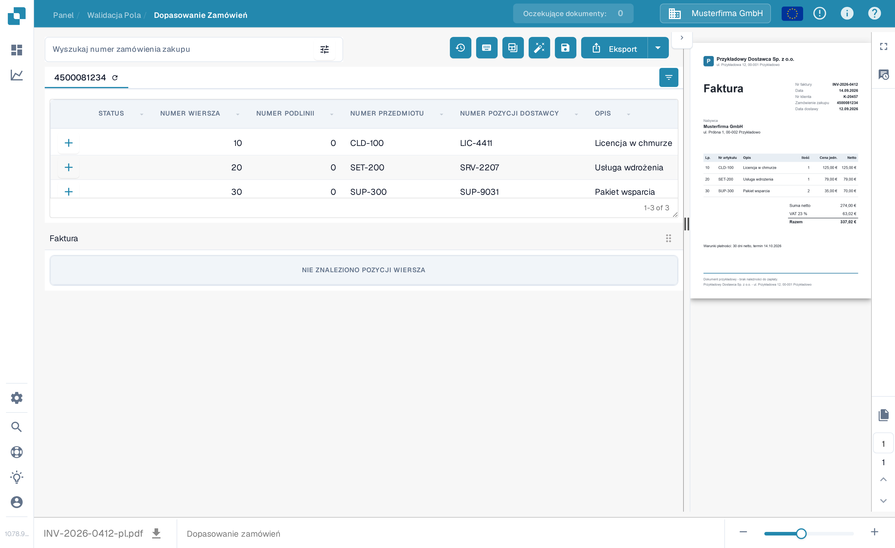
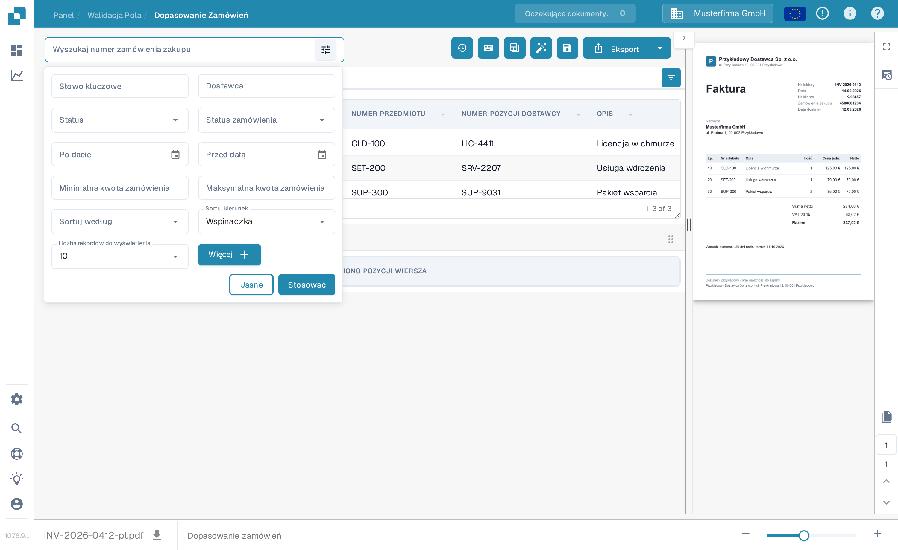
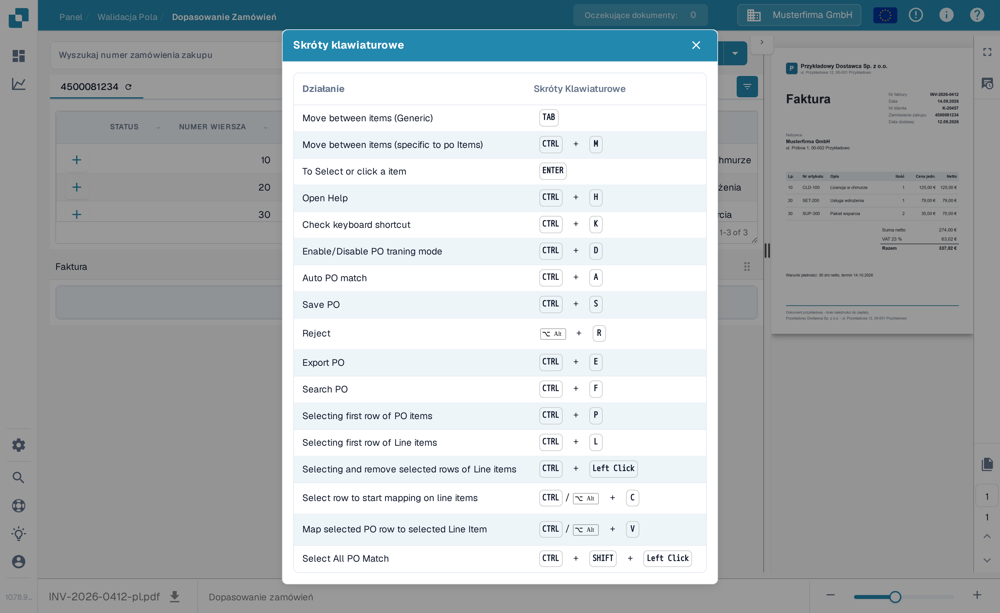

# Narzędzia dopasowywania zamówień zakupu

Na ekranie dopasowywania zamówień zakupu wyszukiwanie zamówień i narzędzia znajdują się nad wierszami zamówienia zakupu. Podgląd faktury pozostaje po prawej stronie. Dostępne działania mogą się różnić w zależności od Twoich uprawnień, danych dokumentu oraz ustawień Twojej organizacji.

<figure><figcaption>
Pole wyszukiwania i pasek narzędzi akcji znajdziesz nad wierszami zamówienia zakupu.
</figcaption></figure>

## Znajdowanie właściwego zamówienia zakupu

Wpisz numer zamówienia zakupu w polu **Wyszukaj numer zamówienia zakupu** i wybierz wynik. Ikona filtra obok pola otwiera dodatkowe opcje wyszukiwania: Słowo kluczowe, Dostawca, Status, Status zamówienia, Po dacie, Przed datą, Minimalna kwota zamówienia, Maksymalna kwota zamówienia, Sortuj według, Sortuj kierunek i Liczba rekordów do wyświetlenia. Wybierz **Stosować**, aby użyć filtrów, albo **Jasne**, aby je zresetować. Filtrowanie listy nie dopasowuje i nie eksportuje faktury.

<figure><figcaption>
Kliknij ikonę filtra obok pola wyszukiwania zamówienia, aby otworzyć więcej opcji wyszukiwania.
</figcaption></figure>

## Akcje na pasku narzędzi

Przed wybraniem ikony przeczytaj jej podpowiedź. Pasek narzędzi może pokazywać:

| Akcja | Co robi |
| --- | --- |
| **Historia dopasowań** (zegar) | Otwiera wcześniejsze działania dopasowań dla tego dokumentu. Nie uruchamia nowego dopasowania. |
| **Pomoc** (?) | Otwiera stronę pomocy o dopasowywaniu zamówień zakupu w nowej karcie przeglądarki. |
| **Skróty klawiaturowe** (klawiatura) | Pokazuje skróty dostępne na tym ekranie. Zobacz [Skróty klawiaturowe](keyboard-shortcuts.md). |
| **Tryb szkoleniowy** (tabela) | Włącza lub wyłącza przeciąganie wierszy zamówienia zakupu do tabeli faktury. Przydatny tylko wtedy, gdy dokument ma wiersze faktury; przykładowy ekran poniżej ich nie ma. |
| **Zadania / Utwórz zadanie** | Otwiera zadania dokumentu lub tworzy zadanie, gdy te akcje są dostępne dla Twojego dokumentu i roli. Zobacz [Zadania](../tasks.md). |
| **Automatyczne rozliczanie** | Otwiera rozliczanie dla tego dokumentu, gdy dane księgowe są dostępne. |
| **Automatyczne dopasowanie zamówienia** (różdżka) | Uruchamia dopasowanie automatyczne. Jeśli organizacja włączyła eksport automatyczny, a wynik spełnia jego warunki, ta akcja może również wyeksportować dokument. Sprawdź dokument, zanim jej użyjesz. Zobacz [Automatyczne dopasowywanie danych zamówień zakupu](automatic-purchase-order-data-matching.md). |
| **Zapisz** (dyskietka) | Zapisuje zmiany dopasowania zamówienia zakupu w dokumencie. |
| **Synchronizuj dane** | Dostępne tylko dla odpowiedniego ustawienia ilości zamówienia zakupu; odświeża wybrane dane zamówienia z połączonego systemu. Użyj wyświetlonego numeru zamówienia i dostępnych opcji synchronizacji. |
| **Eksport** | Eksportuje dokument po dopasowaniu. Jeśli Twoja organizacja oferuje wiele celów eksportu, użyj strzałki obok **Eksport**, aby wybrać jeden. |

Zakładka zamówienia zakupu ma też ikonę odświeżenia do ponownego wczytania tego zamówienia. Ikona ustawień kolumn po prawej stronie nagłówka tabeli decyduje, które kolumny zamówienia zakupu są widoczne. Obie zmieniają widok tabeli zamówienia zakupu, a nie wartości wyodrębnione z faktury.

## Skróty klawiaturowe

Wybierz ikonę klawiatury, aby zobaczyć aktualną listę skrótów. Typowe przykłady to **Ctrl+F**, aby ustawić fokus na wyszukiwaniu zamówienia, **Ctrl+K**, aby ponownie otworzyć okno skrótów, **Ctrl+S**, aby zapisać, oraz **Ctrl+E**, aby wyeksportować. Pełną listę dla Twojego ekranu pokazuje samo okno.

<figure><figcaption>
Otwórz ikonę klawiatury, aby zobaczyć skróty obsługiwane na tym ekranie.
</figcaption></figure>


Ten przykład używa syntetycznej faktury i zamówienia zakupu w sandboxie dokumentacyjnym DocBits. Faktura nie ma wyodrębnionych wierszy, więc nie może pokazać udanego dopasowania. Akcje dopasowania, zapisu, synchronizacji i eksportu nie były uruchamiane podczas tworzenia tych obrazów.

