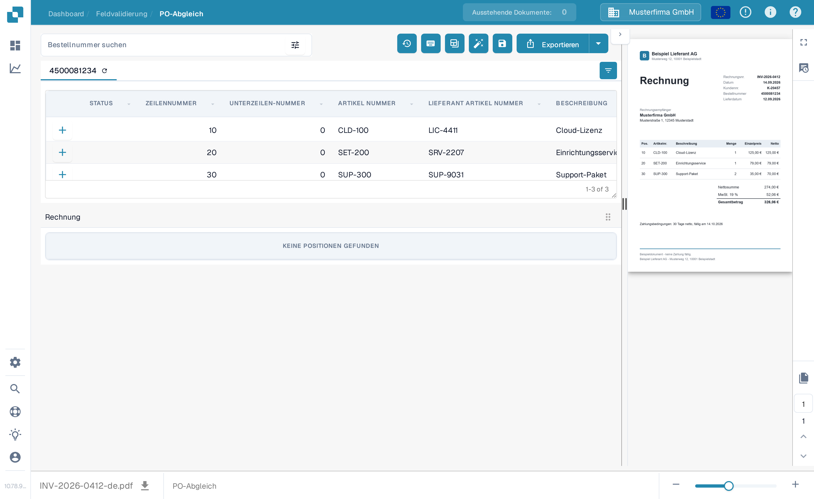
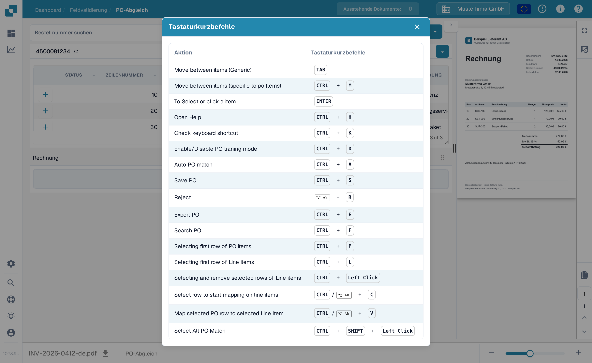

# Bestellnummer-Abgleich-Tools

Auf dem PO-Abgleich-Bildschirm befinden sich die Bestellnummer-Suche und die Werkzeuge über den Bestellnummer-Positionen. Die Rechnungs-Vorschau bleibt rechts. Die verfügbaren Aktionen können je nach Ihren Berechtigungen, den Dokumentdaten und den Einstellungen Ihrer Organisation abweichen.

<figure><figcaption>
Suchfeld und Aktions-Werkzeugleiste finden Sie über den Bestellnummer-Positionen.
</figcaption></figure>

## Die richtige Bestellnummer finden

Geben Sie eine Bestellnummer in **Bestellnummer suchen** ein und wählen Sie ein Ergebnis. Das Filter-Symbol neben dem Feld öffnet weitere Suchoptionen: Schlüsselwort, Lieferant, Status, Status der Bestellung, Nach Datum, Vor Datum, Mindestbestellwert, Maximaler Bestellwert, Sortieren nach, Richtung sortieren und Anzahl der anzuzeigenden Datensätze. Wählen Sie **Anwenden**, um die Filter zu nutzen, oder **Löschen**, um sie zurückzusetzen. Das Filtern der Liste gleicht die Rechnung nicht ab und exportiert sie nicht.

<figure><figcaption>
Öffnen Sie das Filter-Symbol neben dem Suchfeld, um weitere Suchoptionen zu erhalten.
</figcaption></figure>

## Aktionen der Werkzeugleiste

Lesen Sie den Tooltip eines Symbols, bevor Sie es auswählen. Die Werkzeugleiste kann Folgendes anzeigen:

| Aktion | Wirkung |
| --- | --- |
| **Abgleich-Historie** (Uhr) | Öffnet frühere Abgleich-Aktivitäten für dieses Dokument. Sie startet keinen neuen Abgleich. |
| **Hilfe** (?) | Öffnet die Hilfeseite zum Bestellnummer-Abgleich in einem neuen Browser-Tab. |
| **Tastenkombinationen** (Tastatur) | Zeigt die auf diesem Bildschirm verfügbaren Tastenkombinationen. Siehe [Tastenkombinationen](keyboard-shortcuts.md). |
| **Trainingsmodus** (Tabelle) | Schaltet das Ziehen von Bestellnummer-Zeilen in die Rechnungstabelle ein oder aus. Sinnvoll ist das nur, wenn das Dokument Rechnungspositionen hat; die Beispielansicht unten hat keine. |
| **Aufgaben / Aufgabe erstellen** | Öffnet Dokument-Aufgaben oder erstellt eine Aufgabe, wenn diese Aktionen für Ihr Dokument und Ihre Rolle verfügbar sind. Siehe [Aufgaben](../tasks.md). |
| **Auto Accounting** | Öffnet die Buchhaltung für dieses Dokument, wenn Buchhaltungsdaten vorhanden sind. |
| **Automatischer PO-Abgleich** (Zauberstab) | Führt den automatischen Abgleich aus. Wenn die Organisation den automatischen Export aktiviert hat und das Ergebnis dessen Bedingungen erfüllt, kann diese Aktion auch exportieren. Prüfen Sie das Dokument vorher. Siehe [Automatischer Bestelldaten-Abgleich](automatic-purchase-order-data-matching.md). |
| **Speichern** (Diskette) | Speichert die Änderungen am Bestellnummer-Abgleich des Dokuments. |
| **Daten synchronisieren** | Nur für die passende Bestellnummer-Mengeneinstellung verfügbar; aktualisiert ausgewählte Bestellnummer-Daten aus dem verbundenen System. Nutzen Sie die angezeigte Bestellnummer und die verfügbaren Synchronisierungsoptionen. |
| **Exportieren** | Exportiert das Dokument nach dem Abgleich. Wenn Ihre Organisation mehrere Exportziele anbietet, wählen Sie über den Pfeil neben **Exportieren** ein Ziel aus. |

Der Bestellnummer-Tab hat außerdem ein Aktualisierungs-Symbol zum Neuladen der Bestellnummer. Das Symbol für Spalteneinstellungen rechts in der Tabellenkopfzeile steuert, welche Bestellnummer-Spalten sichtbar sind. Beides ändert nur die Ansicht der Bestellnummer-Tabelle, nicht die extrahierten Werte der Rechnung.

## Tastenkombinationen

Wählen Sie das Tastatur-Symbol, um die aktuelle Liste der Tastenkombinationen zu sehen. Häufige Beispiele sind **Strg+F** für die Bestellnummer-Suche, **Strg+K** zum erneuten Öffnen des Dialogs, **Strg+S** zum Speichern und **Strg+E** zum Exportieren. Maßgeblich für die vollständige Liste auf Ihrem Bildschirm ist der Dialog.

<figure><figcaption>
Öffnen Sie das Tastatur-Symbol, um die von diesem Bildschirm unterstützten Tastenkombinationen zu sehen.
</figcaption></figure>


Dieses Beispiel verwendet eine synthetische Rechnung und Bestellnummer in der DocBits-Sandbox. Die Rechnung hat keine extrahierten Positionen, ein erfolgreicher Abgleich lässt sich damit nicht zeigen. Abgleich-, Speicher-, Synchronisierungs- und Export-Aktionen wurden für diese Bilder nicht ausgeführt.

