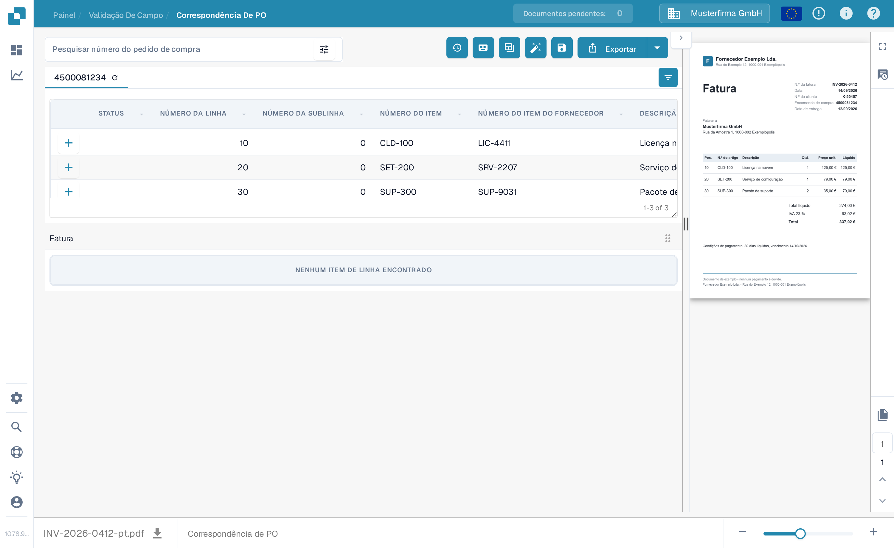
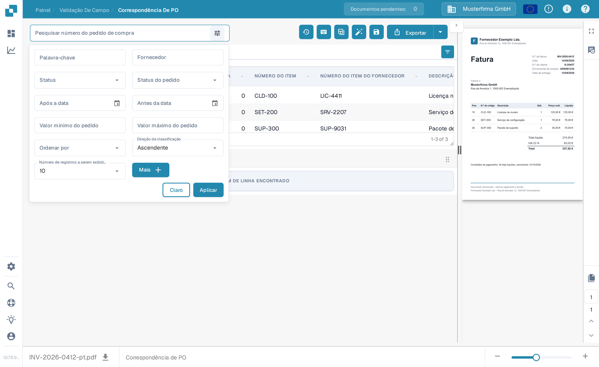
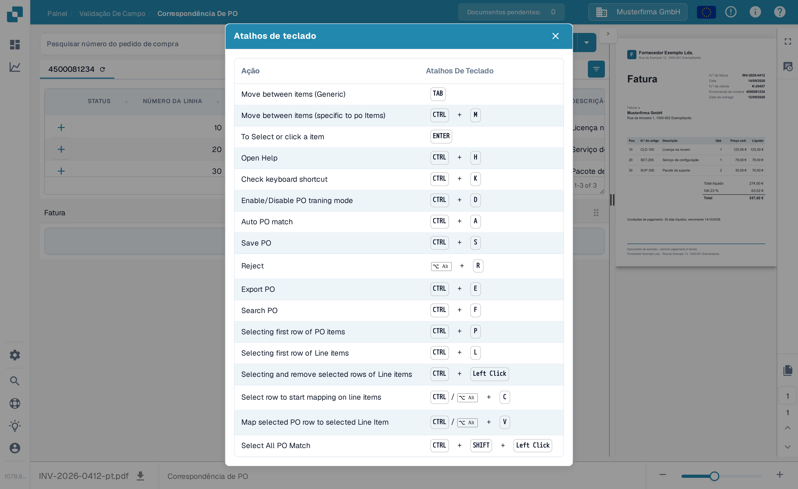

# Ferramentas de Correspondência de Pedidos de Compra

A tela de Correspondência de PO coloca a pesquisa e as ferramentas de pedidos de compra acima das linhas do pedido. A pré-visualização da fatura permanece à direita. As ações disponíveis podem variar conforme suas permissões, os dados do documento e as configurações da sua organização.

<figure><figcaption>
Encontre o campo de pesquisa e a barra de ferramentas de ações acima das linhas do pedido de compra.
</figcaption></figure>

## Encontrar o pedido de compra certo

Digite um número de pedido de compra em **Pesquisar número do pedido de compra** e selecione um resultado. O ícone de filtro ao lado do campo abre opções de pesquisa adicionais: palavra-chave, fornecedor, status, status do pedido, intervalo de datas, valor do pedido, ordenação e número de registros. Escolha **Aplicar** para usar os filtros ou **Claro** para redefini-los. Filtrar a lista não realiza a correspondência nem exporta a fatura.

<figure><figcaption>
Abra o ícone de filtro ao lado do campo de pesquisa de pedidos de compra para mais opções de pesquisa.
</figcaption></figure>

## Ações da barra de ferramentas

Leia a dica de ferramenta de um ícone antes de selecioná-lo. A barra de ferramentas pode exibir:

| Ação | O que ela faz |
| --- | --- |
| **Histórico de correspondência** (relógio) | Abre atividades de correspondência anteriores deste documento. Não inicia uma nova correspondência. |
| **Ajuda** (?) | Abre a página de ajuda da Correspondência de PO em uma nova aba do navegador. |
| **Atalhos de teclado** (teclado) | Mostra os atalhos disponíveis nesta tela. Veja [Atalhos de Teclado](keyboard-shortcuts.md). |
| **Modo de treinamento** (tabela) | Ativa ou desativa arrastar linhas do pedido de compra para a tabela da fatura. É útil apenas quando o documento possui itens de linha de fatura; a tela de exemplo abaixo não possui. |
| **Tarefas / Criar tarefa** | Abre as tarefas do documento ou cria uma tarefa quando essas ações estão disponíveis para o seu documento e função. Veja [Tarefas](../tasks.md). |
| **Contabilidade Automática** | Abre a contabilidade deste documento quando há dados contábeis. |
| **Correspondência Automática de PO** (varinha) | Executa a correspondência automática. Se a organização ativou a exportação automática e a correspondência resultante atender às suas condições, esta ação também poderá exportar. Revise o documento antes de usá-la. Veja [Correspondência Automática de Dados de Pedido de Compra](automatic-purchase-order-data-matching.md). |
| **Salvar** (disquete) | Salva as alterações da correspondência de PO no documento. |
| **Sincronizar dados** | Disponível apenas para a configuração de quantidade de pedido de compra correspondente; atualiza os dados selecionados do pedido de compra a partir do sistema conectado. Use o número de pedido de compra exibido e as opções de sincronização disponíveis. |
| **Exportar** | Exporta o documento após a correspondência. Se a sua organização oferecer vários destinos de exportação, use a seta ao lado de **Exportar** para selecionar um. |

A aba do pedido de compra também tem um ícone de atualização para recarregar esse pedido de compra. O ícone de configurações de coluna à direita do cabeçalho da tabela controla quais colunas do pedido de compra ficam visíveis. Eles alteram a visão da tabela do pedido de compra, não os valores extraídos da fatura.

## Atalhos de teclado

Selecione o ícone de teclado para ver a lista atual de atalhos. Exemplos comuns incluem **Ctrl+F** para focar a pesquisa de pedidos de compra, **Ctrl+K** para reabrir o diálogo de atalhos, **Ctrl+S** para salvar e **Ctrl+E** para exportar. O diálogo é a fonte da lista completa na sua tela atual.

<figure><figcaption>
Abra o ícone de teclado para ver os atalhos suportados por esta tela.
</figcaption></figure>


Esta captura de tela usa uma fatura e um pedido de compra sintéticos no ambiente de demonstração da documentação do DocBits. A fatura não possui itens de linha extraídos, portanto não pode demonstrar uma correspondência bem-sucedida. As ações de correspondência, salvamento, sincronização e exportação não foram executadas para estas capturas de tela.

