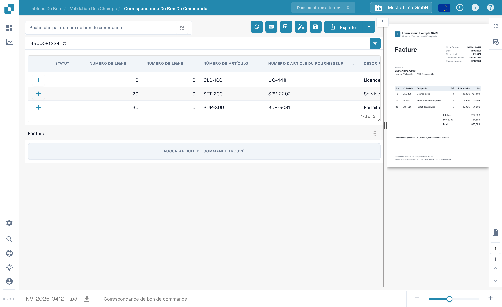
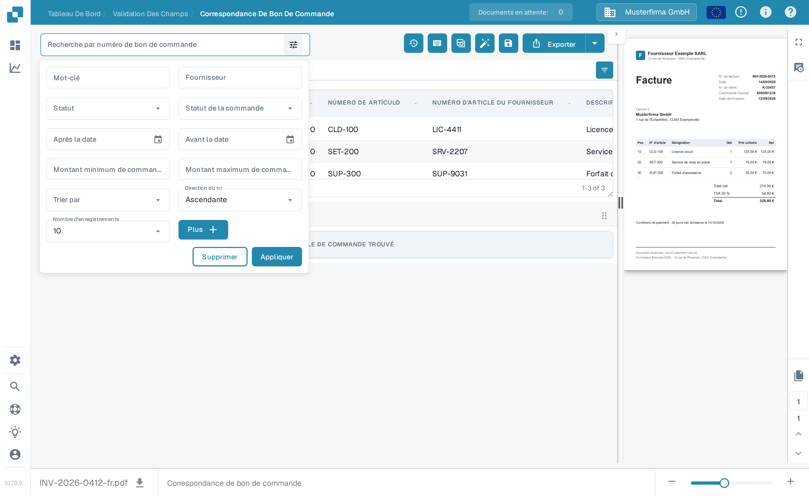
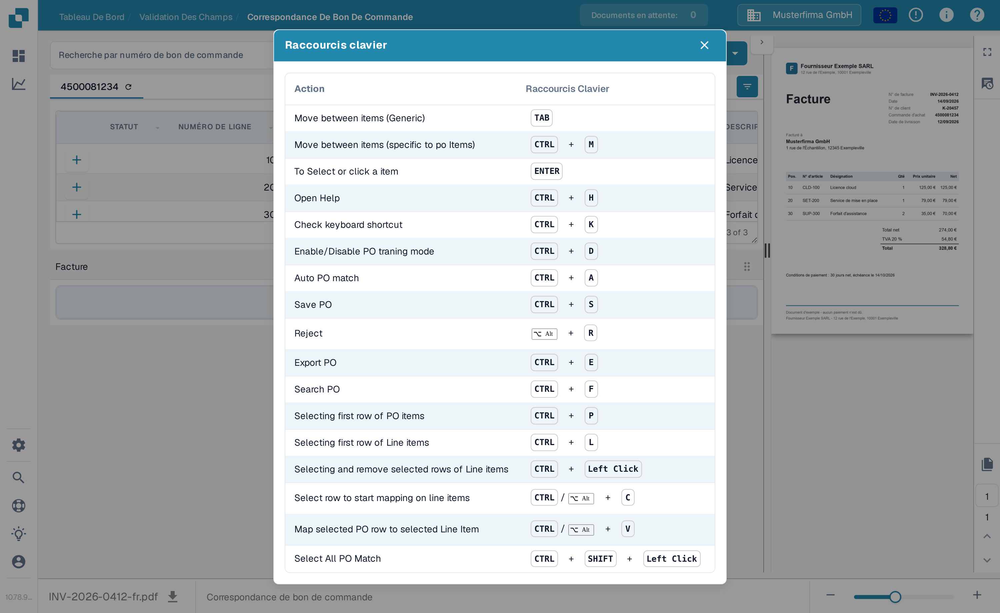

# Outils de Correspondance de Bon de Commande

L'écran de correspondance de bon de commande place la recherche et les outils du bon de commande au-dessus des lignes du bon de commande. L'aperçu de la facture reste à droite. Les actions disponibles peuvent varier selon vos autorisations, les données du document et les paramètres de votre organisation.

<figure><figcaption>
La zone de recherche et la barre d'outils se trouvent au-dessus des lignes du bon de commande.
</figcaption></figure>

## Trouver le bon bon de commande

Saisissez un numéro de bon de commande dans **Recherche par numéro de bon de commande** et sélectionnez un résultat. L'icône de filtre à côté de la zone de recherche ouvre des options de recherche supplémentaires : mot-clé, fournisseur, statut, statut de la commande, plage de dates, montant de la commande, tri et nombre d'enregistrements. Sélectionnez **Appliquer** pour utiliser les filtres ou **Supprimer** pour les réinitialiser. Le filtrage de la liste n'apparie et n'exporte pas la facture.

<figure><figcaption>
Sélectionnez l'icône de filtre à côté de la zone de recherche pour plus d'options.
</figcaption></figure>

## Actions de la barre d'outils

Lisez l'infobulle d'une icône avant de la sélectionner. La barre d'outils peut afficher :

| Action | Ce qu'elle fait |
| --- | --- |
| **Historique d'appariement** (horloge) | Ouvre les activités d'appariement précédentes de ce document. Elle ne lance pas un nouvel appariement. |
| **Aide** (?) | Ouvre la page d'aide de la correspondance de bon de commande dans un nouvel onglet du navigateur. |
| **Raccourcis clavier** (clavier) | Affiche les raccourcis disponibles sur cet écran. Consultez [Raccourcis Clavier](keyboard-shortcuts.md). |
| **Mode Formation** (tableau) | Active ou désactive le glissement des lignes du bon de commande dans le tableau de facture. Elle n'est utile que lorsque le document contient des lignes de facture ; l'écran d'exemple ci-dessous n'en a aucune. |
| **Tâches / Créer une tâche** | Ouvre les tâches du document ou crée une tâche lorsque ces actions sont disponibles pour votre document et votre rôle. Consultez [Tâches](../tasks.md). |
| **Comptabilité automatique** | Ouvre la comptabilité de ce document lorsque les données comptables sont présentes. |
| **Correspondance automatique de bon de commande** (baguette) | Lance l'appariement automatique. Si l'organisation a activé l'exportation automatique et que l'appariement obtenu remplit ses conditions, cette action peut aussi exporter. Vérifiez le document avant de l'utiliser. Consultez [Correspondance Automatique des Données de Bon de Commande](automatic-purchase-order-data-matching.md). |
| **Enregistrer** (disquette) | Enregistre les modifications d'appariement dans le document. |
| **Synchroniser les données** | Disponible uniquement pour le paramètre de quantité de bon de commande correspondant ; recharge les données sélectionnées du bon de commande depuis le système connecté. Utilisez le numéro de bon de commande affiché et les options de synchronisation disponibles. |
| **Exporter** | Exporte le document après l'appariement. Si votre organisation propose plusieurs cibles d'exportation, utilisez la flèche à côté d'**Exporter** pour en sélectionner une. |

L'onglet du bon de commande comporte aussi une icône de rafraîchissement pour recharger ce bon de commande. L'icône de paramètres de colonnes, à droite de l'en-tête du tableau, contrôle les colonnes du bon de commande affichées. Ces actions changent la vue du tableau du bon de commande, pas les valeurs extraites de la facture.

## Raccourcis clavier

Sélectionnez l'icône de clavier pour voir la liste actuelle des raccourcis. Exemples courants : **Ctrl+F** pour activer la recherche de bon de commande, **Ctrl+K** pour rouvrir la fenêtre des raccourcis, **Ctrl+S** pour enregistrer et **Ctrl+E** pour exporter. La fenêtre reste la source de la liste complète sur votre écran actuel.

<figure><figcaption>
Sélectionnez l'icône de clavier pour voir les raccourcis pris en charge par cet écran.
</figcaption></figure>


Cette capture utilise une facture et un bon de commande synthétiques dans l'organisation synthétique Sandbox de la documentation DocBits. Sa facture ne contient aucune ligne extraite ; elle ne peut donc pas démontrer un appariement réussi. Les actions d'appariement, d'enregistrement, de synchronisation et d'exportation n'ont pas été exécutées pour ces captures.

