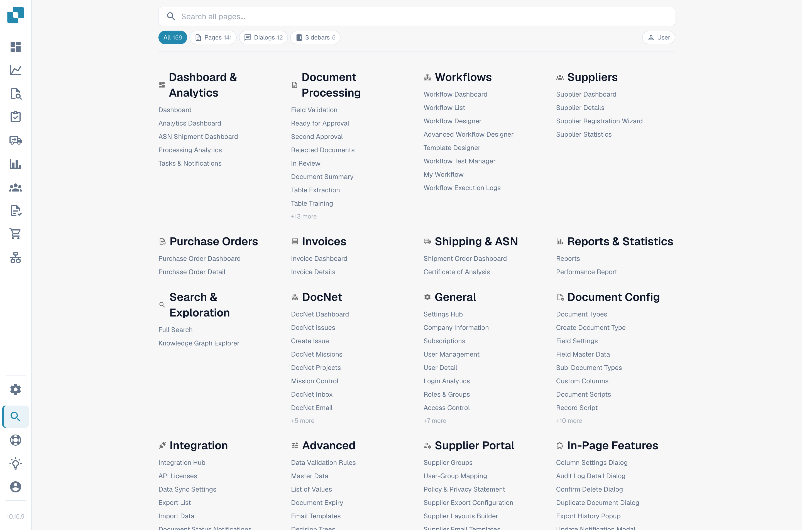

# Mapa Witryny

Mapa Witryny to pełny, przeszukiwalny indeks wszystkiego, co udostępnia DocBits — każdej strony, okna dialogowego, wpisu paska bocznego, akcji i funkcji wewnątrz strony, pogrupowanych według kategorii. Stanowi dłuższe uzupełnienie [Globalnego Szybkiego Wyszukiwania](global-quick-search.md).

## Jak otworzyć

Otwórz Mapę Witryny z paska bocznego (wpis bliżej dołu) lub naciśnij <kbd>Cmd</kbd>/<kbd>Ctrl</kbd> + <kbd>K</kbd> i wybierz **Zobacz wszystkie wyniki**. Bezpośredni adres URL to `/sitemap`.

<figure><figcaption>
Mapa Witryny z przeglądem kategorii i nagłówkiem wyszukiwania.
</figcaption></figure>

## Przeglądanie katalogu

Mapa Witryny jest pogrupowana w kategorie odzwierciedlające strukturę aplikacji — Ustawienia, Przetwarzanie Dokumentów, Workflow, Walidacja itd. Każda kategoria wymienia najpierw strony, a potem funkcje wewnątrz stron pogrupowane według podkategorii.

Wpisy są kolorowane według typu:

* **Strona** — pełna nawigowalna ścieżka.
* **Okno dialogowe** — modal otwierany z innego miejsca aplikacji.
* **Pasek boczny / Panel / Menu** — powierzchnia nawigacyjna lub kontekstowa.
* **Akcja** — przycisk lub skrót wykonujący coś bez nawigowania.

Kliknij dowolny wpis, aby przejść do niego bezpośrednio. Wpisy wymagające parametru (np. typu dokumentu lub identyfikatora) zawierają wbudowany selektor — wybierz wartość przed kliknięciem.

## Wyszukiwanie i filtry

Stały nagłówek u góry strony zawiera pole wyszukiwania i pigułki filtrów. Wpisz kilka znaków, aby filtrować listę na żywo po nazwie i opisie. Użyj pigułek typu, aby ograniczyć do jednego typu wpisu — na przykład tylko **Okno dialogowe**.

Bieżące wyszukiwanie i filtr są dodawane do URL, dzięki czemu przefiltrowany widok można zapisać jako zakładkę lub udostępnić.

<mark>Mapa Witryny respektuje te same uprawnienia co reszta DocBits. Strony, do których nie masz dostępu, nie pojawiają się.</mark>

## Tryb dewelopera

Przełącznik **Użytkownik / Dev** w nagłówku włącza dodatkowe informacje dla deweloperów partnerskich:

* Wewnętrzną ścieżkę trasy każdego wpisu.
* Etykiety parametrów (`:docType`, `:docId`, klucze deep link).

Tryb dewelopera jest zapamiętywany w przeglądarce. Przełącz z powrotem na tryb Użytkownik dla zwykłego widoku.

## Powrót na górę

Mapa Witryny jest długa. Po przewinięciu poza pierwszy ekran w prawym dolnym rogu pojawia się przycisk Powrót na górę.
