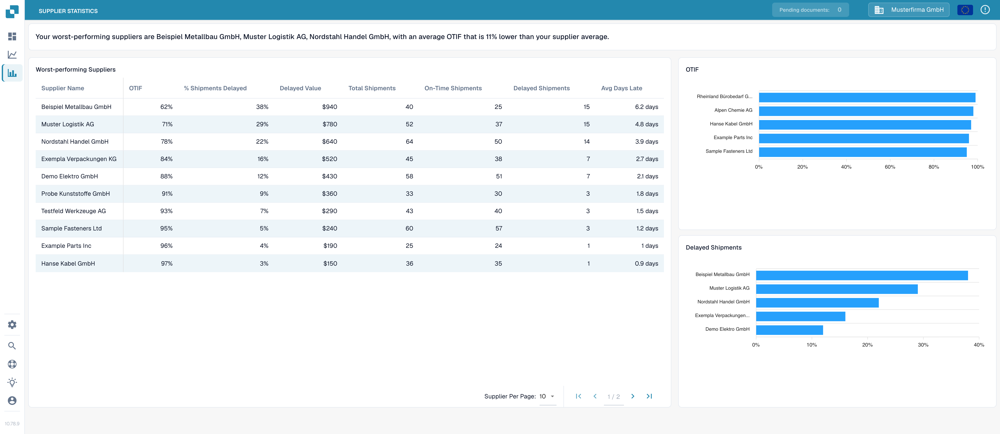
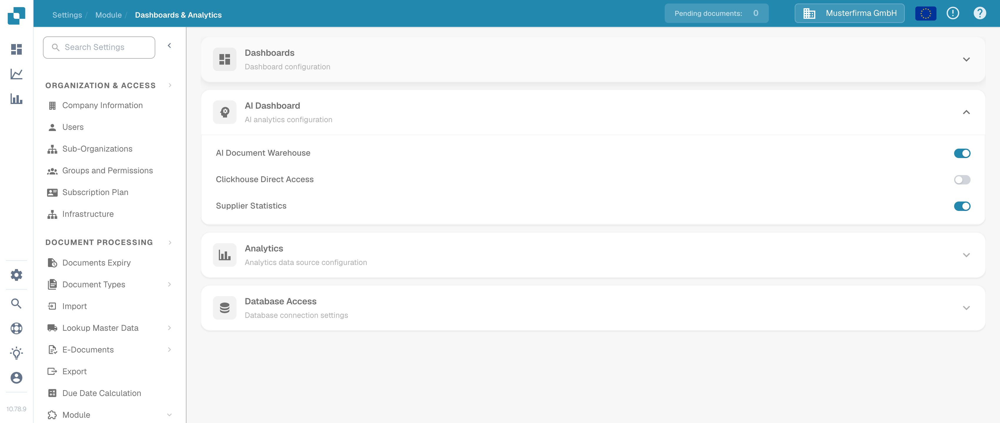

# Supplier Statistics

<figure><figcaption>
Supplier Statistics page
</figcaption></figure>

Supplier Statistics shows how reliably your suppliers deliver goods on time. It ranks suppliers by their OTIF performance and highlights the ones that cause the most delays, so you can address problem suppliers with concrete numbers.

## Before you start

Supplier Statistics is an optional module. To use it, an administrator must enable it first:

1. Go to **Settings → Module → Dashboards & Analytics** and open the **AI Dashboard** section.
2. Turn on **AI Document Warehouse**. A confirmation dialog appears because this feature uses a Clickhouse subscription — confirm it.
3. The **Supplier Statistics** toggle appears below **Clickhouse Direct Access**. Turn it on.

Once enabled, a **Supplier Statistics** entry appears in the main menu on the left. Click it to open the page.

## What the page shows

### AI summary

At the top of the page a short sentence names your worst-performing suppliers and states how far their average OTIF is below (or above) the average of all your suppliers.

### Worst-performing Suppliers table

The table lists the suppliers with the weakest delivery performance. Each row contains:

| Column | Meaning |
|--------|---------|
| **Supplier Name** | The supplier the row refers to. |
| **OTIF** | On-Time In Full — the percentage of this supplier's deliveries that arrived both on time and complete. A higher percentage is better. |
| **% Shipments delayed** | The percentage of this supplier's shipments that were delayed. |
| **Delayed Value** | The monetary value of the delayed shipments. |
| **Total Shipments** | The number of shipments counted for this supplier. |
| **On-Time Shipments** | The number of shipments that arrived on time. |
| **Avg Days Late** | The average number of days by which this supplier's deliveries were late. |

If no shipment data has been collected yet, the table shows **No Record Found!** until documents with supplier and delivery data are processed.

### OTIF and Delayed Shipments charts

On the right side two bar charts give a quick comparison:

- **OTIF** — the five suppliers with the highest OTIF percentages.
- **Delayed Shipments** — the five suppliers with the highest percentage of delayed shipments.

### Pagination

Below the table, **Supplier Per Page** sets how many suppliers are shown at once (10, 20, 25 or 50). Use the page arrows to move between pages.

## Where to go next

- How the toggles are grouped on the settings page is described on the [Module settings page](../../administration-and-setup/settings/document-processing/module/README.md).
- The underlying shipment data is managed in the [Shipment Order Dashboard](shipment-order-dashboard.md).
