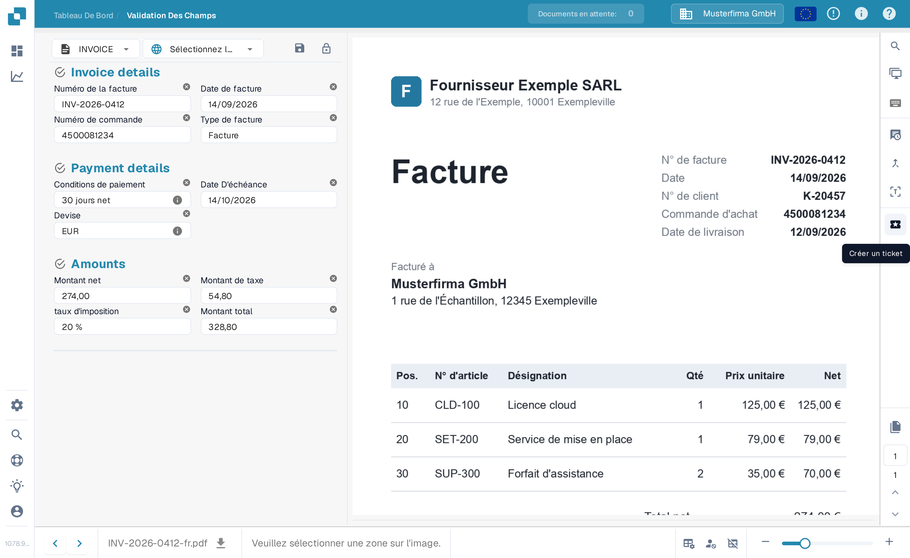
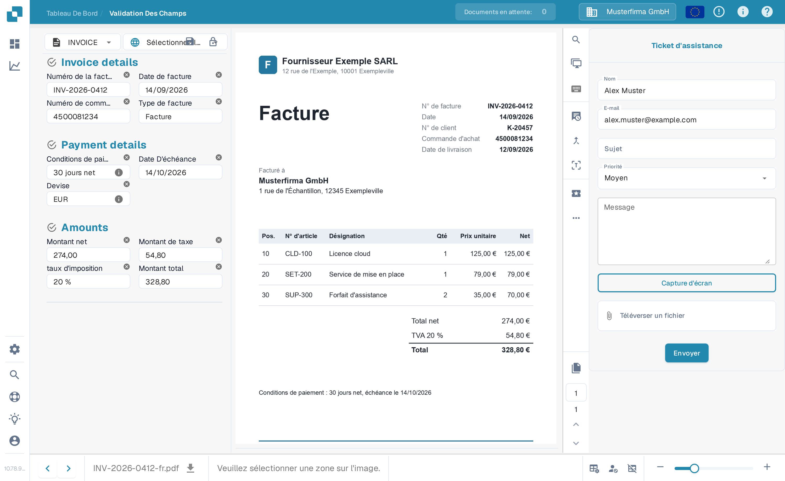

# Créer un ticket

Il s'agit d'un outil disponible pour vous, sur l'écran de validation, en cas de problème lors de la validation de votre document dans DocBits. Pour savoir comment vérifier un document, consultez l'[écran de validation](../validation-screen/README.md).

Cette fonctionnalité se trouve dans le menu au-dessus de la zone d'aperçu du document, comme ci-dessous

<figure><figcaption>
Le bouton « Créer un ticket » dans la barre d'actions de l'écran de validation.
</figcaption></figure>

Une fois cliqué, le formulaire de ticket suivant vous sera affiché.

<figure><figcaption>
Le formulaire « Ticket d'assistance ».
</figcaption></figure>

C'est ici que vous remplirez vos coordonnées ainsi que décrirez l'erreur. Vous pouvez également, si applicable, joindre une capture d'écran du problème et attacher un fichier pertinent.
