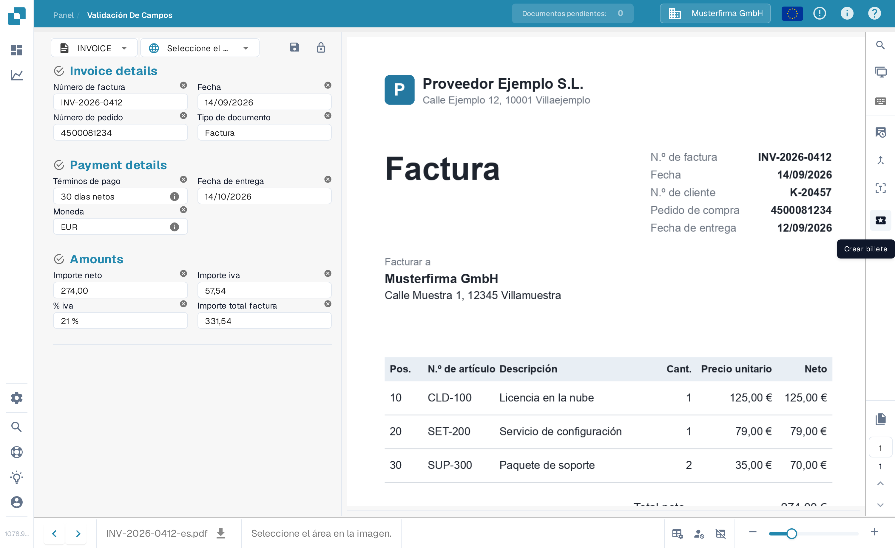
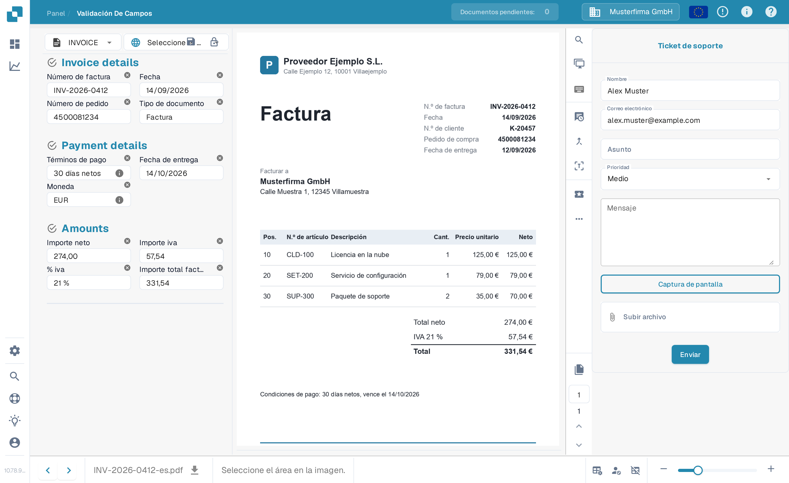

# Crear un ticket

Esta es una herramienta disponible para ti, en la pantalla de validación, en caso de que ocurra algún tipo de problema mientras validas tu documento en DocBits.

Esta función se encuentra en el menú sobre el área de vista previa del documento, como se muestra a continuación

<figure><figcaption>
El botón Crear billete en la barra de acciones de la pantalla de validación.
</figcaption></figure>

Una vez hecho clic, se mostrará el siguiente formulario de ticket.

<figure><figcaption>
El formulario Ticket de soporte.
</figcaption></figure>

Aquí es donde completarás tus detalles y describirás el error. También puedes, si corresponde, adjuntar una captura de pantalla del problema y un archivo relevante.
