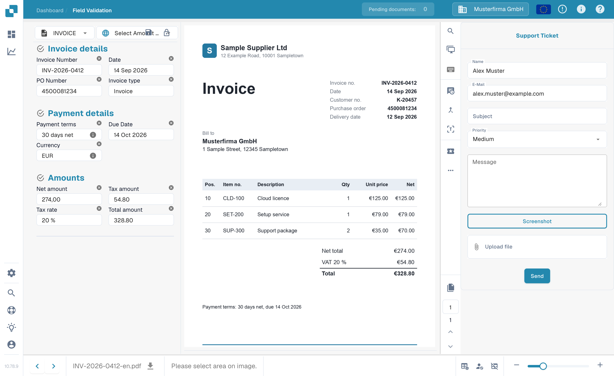

# Create a ticket

This is a tool available to you, on the validation screen, in the event of some sort of issue occurring when validating your document in DocBits.

This feature is located in the menu above the document preview area, like below

<figure><figcaption>
The Create ticket button in the action bar of the validation screen.
</figcaption></figure>

Once clicked, the following ticket form will be displayed to you.

<figure><figcaption>
The Support Ticket form.
</figcaption></figure>

This is where you will fill in your details as well as describe the error. You can also ,if applicable, attach a screenshot of the issue and attach a relevant file.

