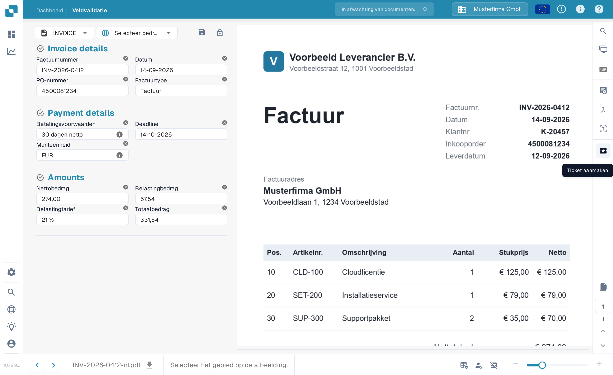
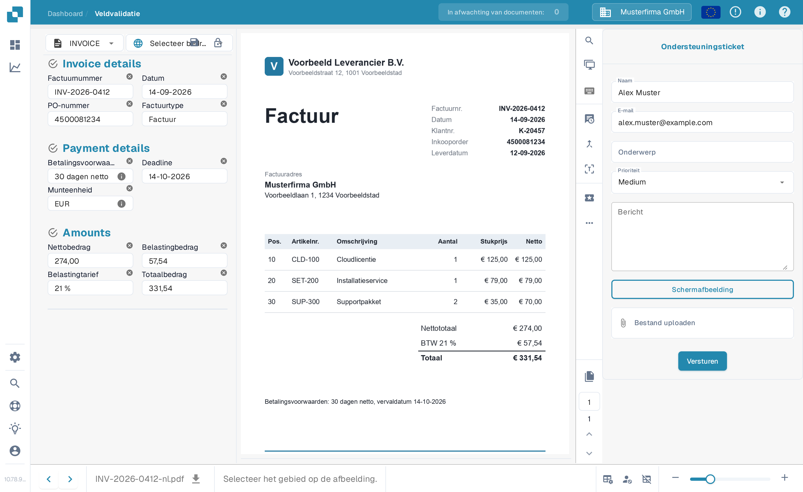

# Maak een ticket aan

Dit is een hulpmiddel dat u ter beschikking staat, op het validatiescherm, wanneer er zich een probleem voordoet bij het valideren van uw document in DocBits. Zie [het validatiescherm](../validation-screen/README.md) voor meer informatie over het controleren van een document.

Deze functie bevindt zich in het menu boven het voorbeeldgedeelte van het document, zoals hieronder

<figure><figcaption>
De knop 'Ticket aanmaken' in de actiebalk van het validatiescherm.
</figcaption></figure>

Zodra u erop klikt, wordt het volgende ticketformulier aan u getoond.

<figure><figcaption>
Het formulier 'Ondersteuningsticket'.
</figcaption></figure>

Hier vult u uw gegevens in en beschrijft u de fout. U kunt ook, indien van toepassing, een schermafbeelding van het probleem bijvoegen en een relevant bestand toevoegen.
