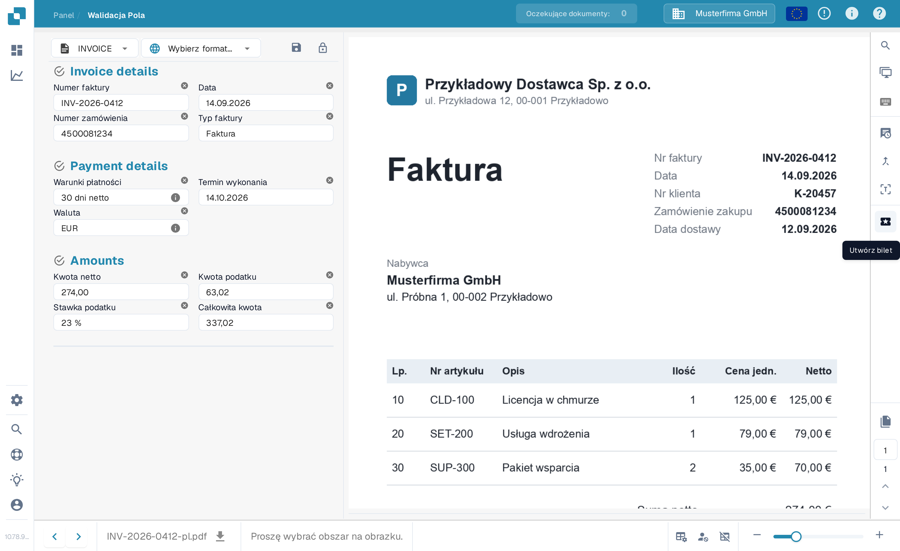
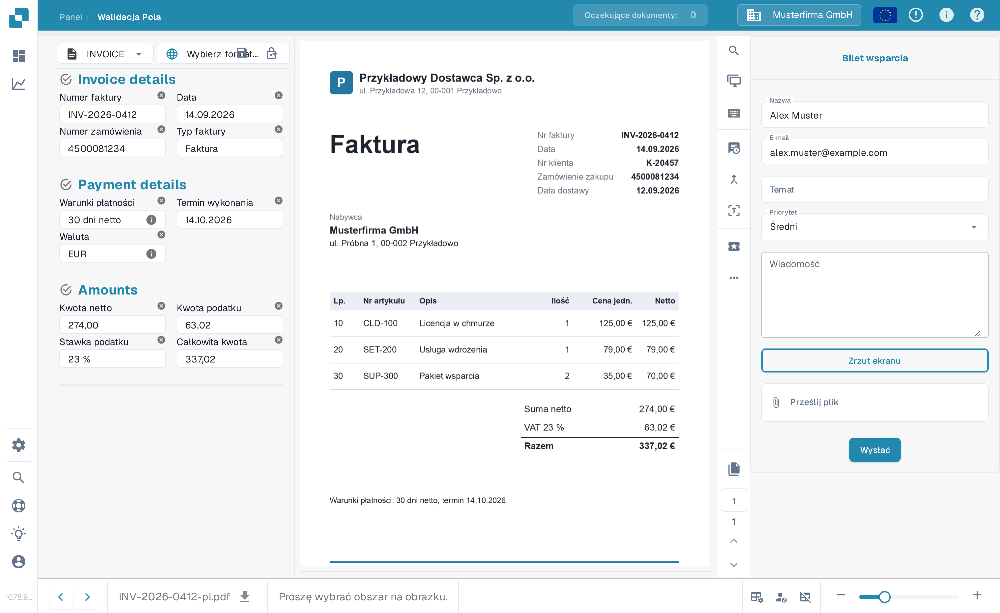

# Utwórz zgłoszenie

Jest to narzędzie dostępne na ekranie walidacji, na wypadek gdyby podczas walidacji dokumentu w DocBits wystąpił jakiś problem. Zobacz [Ekran Walidacji](../validation-screen/README.md), aby dowiedzieć się więcej o sprawdzaniu dokumentu.

Ta funkcja znajduje się w menu nad obszarem podglądu dokumentu, jak poniżej

<figure><figcaption>
Przycisk „Utwórz bilet” na pasku akcji ekranu walidacji.
</figcaption></figure>

Po kliknięciu wyświetlony zostanie następujący formularz zgłoszenia.

<figure><figcaption>
Formularz „Bilet wsparcia”.
</figcaption></figure>

Tutaj wypełnisz swoje dane oraz opiszesz błąd. Możesz również, jeśli ma to zastosowanie, dołączyć zrzut ekranu problemu i załączyć odpowiedni plik.
