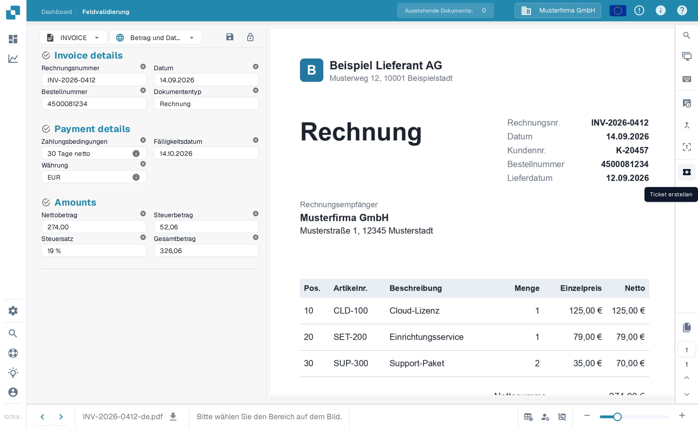
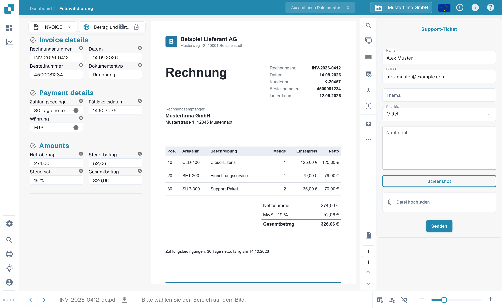

# Ticket erstellen

Dies ist ein Werkzeug, das Ihnen auf dem Validierungsbildschirm zur Verfügung steht, falls beim Validieren Ihres Dokuments in DocBits eine Art von Problem auftritt. Wie Sie ein Dokument im [Validierungsbildschirm](../validation-screen/README.md) prüfen, ist dort beschrieben.

Diese Funktion befindet sich im Menü oberhalb des Dokumentvorschaubereichs, wie unten dargestellt

<figure><figcaption>
Die Schaltfläche „Ticket erstellen“ in der Aktionsleiste des Validierungsbildschirms.
</figcaption></figure>

Nach dem Klicken wird Ihnen das folgende Ticket-Formular angezeigt.

<figure><figcaption>
Das Formular „Support-Ticket“.
</figcaption></figure>

Hier tragen Sie Ihre Angaben ein und beschreiben den Fehler. Sie können außerdem, falls zutreffend, einen Screenshot des Problems sowie eine relevante Datei anhängen.
