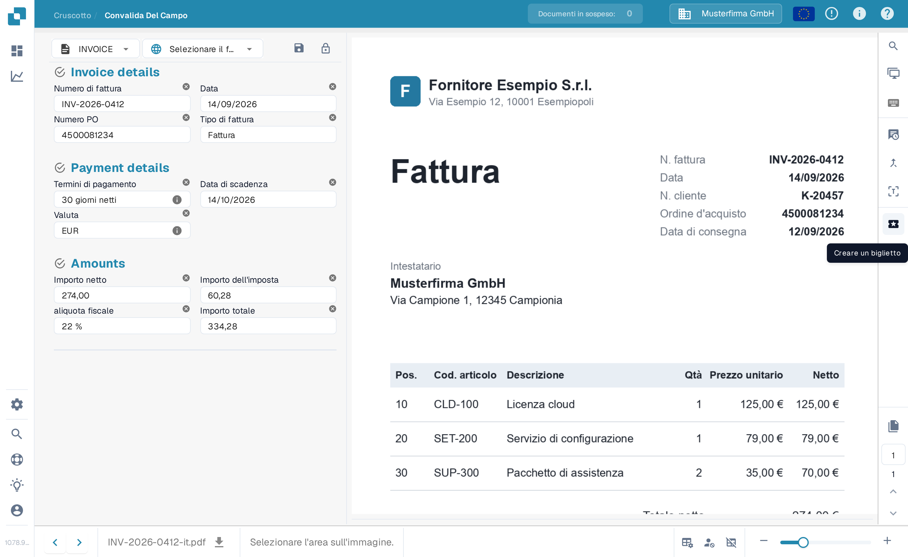
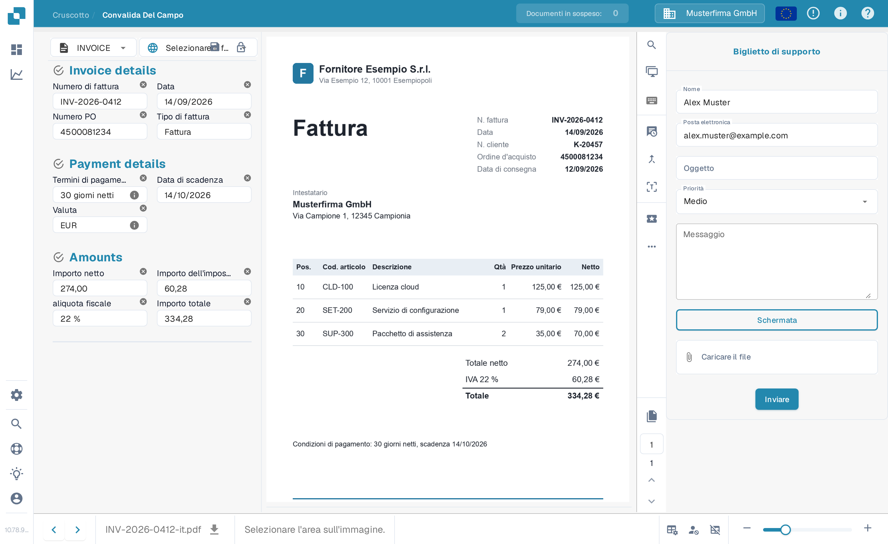

# Crea un ticket

Questo è uno strumento disponibile per te, nella schermata di convalida, nel caso si verifichi qualche tipo di problema durante la convalida del tuo documento in DocBits. Per sapere come verificare un documento, consulta la [schermata di convalida](../validation-screen/README.md).

Questa funzionalità si trova nel menu sopra l'area di anteprima del documento, come mostrato di seguito

<figure><figcaption>
Il pulsante «Creare un biglietto» nella barra delle azioni della schermata di convalida.
</figcaption></figure>

Una volta cliccato, ti verrà mostrato il seguente modulo di ticket.

<figure><figcaption>
Il modulo «Biglietto di supporto».
</figcaption></figure>

Qui dovrai compilare i tuoi dettagli e descrivere l'errore. Puoi anche, se applicabile, allegare uno screenshot del problema e un file rilevante.
