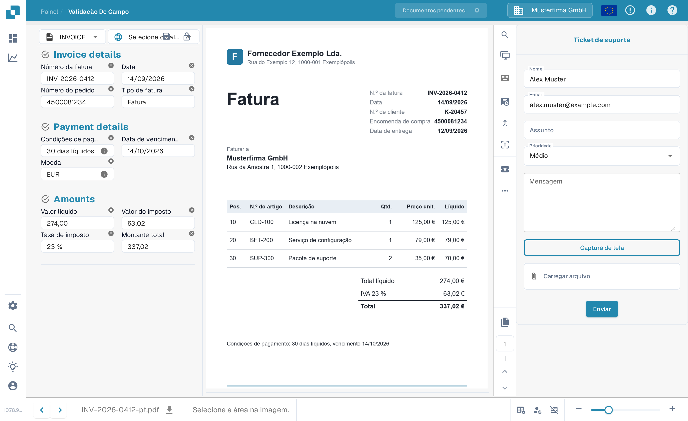

# Criar um ticket

Esta é uma ferramenta disponível para você, na tela de validação, no caso de ocorrer algum tipo de problema ao validar seu documento no DocBits. Como verificar um documento na [tela de validação](../validation-screen/README.md) está descrito lá.

Este recurso está localizado no menu acima da área de visualização do documento, como abaixo

<figure><figcaption>
O botão "Criar tíquete" na barra de ações da tela de validação.
</figcaption></figure>

Depois de clicar, o seguinte formulário de ticket será exibido para você.

<figure><figcaption>
O formulário "Ticket de suporte".
</figcaption></figure>

É aqui que você preencherá seus dados e descreverá o erro. Você também pode, se aplicável, anexar uma captura de tela do problema e anexar um arquivo relevante.
