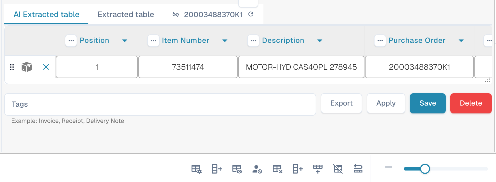

# Schermo di validazione



## Panoramica

<figure><figcaption></figcaption></figure>

### Origine del Documento (Document Origin)


DocBits Origin Setting Explained: Country Standards for Dates & Number Formats


### **Pulsante Salva:**

<figure><figcaption></figcaption></figure>

* **Pulsante Salva:**
  * **Scopo:** Salva lo stato attuale del documento o script su cui si sta lavorando.
  * **Caso d'uso:** Dopo aver apportato modifiche o annotazioni a un documento, utilizzare questo pulsante per assicurarsi che tutte le modifiche siano salvate.

### **Aggiungi regole speciali:**

<figure><figcaption></figcaption></figure>

<figure><figcaption></figcaption></figure>

* **Aggiungi Regole Speciali / Aggiungi Script in DocBits:**
  * **Scopo:** Consente agli utenti di implementare regole o script specifici che personalizzano il modo in cui i documenti vengono elaborati.
  * **Caso d'uso:** Utilizzare questa funzione per automatizzare attività come l'estrazione di dati o la convalida del formato, migliorando l'efficienza del flusso di lavoro.


Vedi qui aggiungi [Script in DocBits](../../../administration-and-setup/settings/global-settings/document-types/script/scripting-in-docbits/)


### **Campi Fuzzy:**

<figure><figcaption></figcaption></figure>

* **Campi Fuzzy:**
  * **Scopo:** Aiuta a identificare e correggere i campi in cui i dati potrebbero non corrispondere perfettamente ma sono abbastanza vicini.
  * **Caso d'uso:** Utile nei processi di convalida dei dati in cui le corrispondenze esatte non sono sempre possibili, come nomi o indirizzi leggermente errati.

### **Campi obbligatori:**

<figure><figcaption></figcaption></figure>

Ci sono campi che sono richiesti per ulteriori modifiche, questi possono essere modificati nelle impostazioni.

Usa il suggerimento per scoprire se:

* È un campo obbligatorio (richiesto)
* Convalida richiesta
* Bassa fiducia
* Mismatch dell'importo totale delle tasse

**Campi Obbligatori:**

* **Scopo:** Identifica i campi obbligatori all'interno dei documenti che devono essere compilati o corretti prima di ulteriori elaborazioni.
* **Caso d'uso:** Garantisce che i dati essenziali siano catturati accuratamente, mantenendo l'integrità dei dati e la conformità con le regole aziendali.

<figure><figcaption></figcaption></figure>

## Tabella estratta (voci di riga)

<figure><figcaption>
La tabella estratta sotto i campi di intestazione
</figcaption></figure>

Sotto i campi di intestazione DocBits mostra la tabella delle voci di riga del documento: una riga per ogni riga della fattura, una colonna per ogni [colonna della tabella](../../../administration-and-setup/settings/global-settings/document-types/table-columns.md) configurata per il tipo di documento. Quando un tipo di documento ha più tabelle (ad esempio articoli e oneri), ogni tabella ha la propria scheda sopra la griglia.

### Da dove proviene la tabella

Sopra la griglia c'è una scheda per ogni percorso di estrazione che l'organizzazione ha attivato:

| Scheda | Significato |
|---|---|
| **Tabella estratta** | Estrazione basata su regole (impostazione *Estrazione delle tabelle*). Per un fornitore con una tabella addestrata, queste righe provengono dalle regole salvate e vengono estratte allo stesso modo su ogni documento di quel fornitore; per un fornitore non addestrato la scheda può essere vuota. |
| **Tabella estratta dall'AI** | L'estrazione AI della tabella (impostazione *Estrazione AI delle tabelle*). Viene compilata quando il fornitore non ha regole salvate, e per le colonne contrassegnate *Usa AI* anche quando le regole esistono. Un tooltip *AI table not found* sulla scheda significa che l'AI non ha restituito nulla per questo documento. |
| **Tabelle PO** | Solo nel costruttore di layout: le righe dell'ordine di acquisto usate per l'abbinamento. |

Se non compare nessuna delle due schede, entrambe le impostazioni delle tabelle sono disattivate per l'organizzazione (Impostazioni → Elaborazione del documento → Classificazione ed estrazione). Il livello AI che legge la tabella è impostato per organizzazione e può essere sovrascritto per fornitore, vedi [Modello di IA specifico per fornitore](supplier-specific-ai-model-for-field-and-table-extraction.md).

### Lavorare nella tabella

* **Modificare una cella**: fai clic al suo interno e digita. Le colonne di tipo importo, numero e data vengono validate mentre digiti.
* **Aggiungi nuova riga della tabella**: aggiunge una riga vuota in fondo. Usala quando una riga non è stata riconosciuta.
* **Eliminare una riga**: l'icona del cestino alla fine della riga.
* **Aggiungi colonne mappate vuote**: mostra le colonne configurate che l'AI ha lasciato vuote, così puoi compilarle a mano.
* **Ripristina colonna della tabella**: riporta una colonna che avevi rimosso dalla vista per questo documento.
* **Elimina tabella**: cancella tutte le righe di questa tabella su questo documento. La configurazione non viene toccata.
* **Aggiungi nuova colonna della tabella** (amministratori): la stessa finestra di dialogo delle impostazioni delle colonne della tabella, senza uscire dal documento.
* **Tag** (solo tabella AI): brevi suggerimenti testuali per l'AI, ad esempio *"l'ultima colonna è l'importo netto"*. Vedi [Tag della tabella AI](../ai-table/ai-table-tags.md).
* **Applica** / **Salva** / **Elimina** accanto ai tag: *Applica* esegue di nuovo la tabella AI per questo documento con i tag e le modifiche alle colonne che hai fatto, senza memorizzare nulla (se il documento ha righe abbinate a un PO, DocBits avvisa che gli abbinamenti vengono rimossi); *Salva regole* memorizza la mappatura delle colonne e i tag attuali per questo fornitore; *Elimina regole* li rimuove ed esegue di nuovo l'estrazione AI per questo documento.
* **Esporta**: scarica la tabella come file CSV.
* **Vai alla vista di estrazione delle tabelle**: apre l'addestramento della tabella per questo documento. Usalo quando lo stesso fornitore continua a dare risultati sbagliati: disegna la tabella una volta, mappa le colonne e fai clic su *Salva regole*; da quel momento le righe compaiono nella scheda *Tabella estratta*. Vedi [Campi di addestramento Linee/Tabella di addestramento](../../../administration-and-setup/setup/document-training/training-line-fields-table-training/README.md).


Se la tabella è stata estratta dall'AI e apri l'addestramento della tabella, DocBits chiede *Table is already extracted by AI. Do you want to train manually?* Dopo aver salvato le regole, la tabella AI non viene più usata per questo fornitore.


### Estrarre di nuovo la tabella

* **Stesso documento, tabella AI:** aggiungi o modifica i tag e fai clic su **Applica**; la tabella AI viene ricostruita solo per questo documento. Per eliminare anche i tag e la formattazione salvati per il fornitore, fai clic su **Elimina** (*Elimina regole*): DocBits conferma *Rules has been deleted successfully* ed esegue di nuovo l'estrazione AI.
* **Stesso documento, regole addestrate:** apri *Vai alla vista di estrazione delle tabelle*, correggi la tabella e fai clic su *Salva e ri-estrai*.
* **Intero documento di nuovo (intestazione e tabella):** Dashboard → menu del documento → *Riavvia*. Necessario dopo che un amministratore ha modificato le colonne della tabella o le impostazioni di estrazione.

### Cosa blocca l'approvazione

La tabella viene controllata quando salvi o approvi. Una cella rossa o un messaggio sotto la tabella indica uno di questi casi:

| Messaggio | Causa | Cosa fare |
|---|---|---|
| Colonna obbligatoria vuota | Una colonna contrassegnata *Obbligatoria* non ha valore in questa riga. | Compila la cella, oppure chiedi a un amministratore se la colonna debba davvero essere obbligatoria. |
| *Line total does not match quantity x unit price (expected …, got …)* | `quantità × prezzo unitario + oneri − sconto` differisce dal totale della riga di più di 0,02. Spesso uno dei quattro valori è stato letto nella colonna sbagliata. | Correggi il valore che non corrisponde al documento; se una colonna come *Oneri* viene compilata sistematicamente con il valore sbagliato, avvisa il tuo amministratore (vedi [Risoluzione dei problemi](../../../administration-and-setup/settings/global-settings/document-types/table-columns/troubleshooting-1.md)). |
| *Line items add up to … but the net total is …* | La somma dei totali di riga differisce dall'importo netto nell'intestazione. | Verifica se manca una riga, se una riga è duplicata o se un importo dell'intestazione è stato letto male. |
| *Line Item Table is missing Mandatory column for PO* | Il PO matching richiede numero articolo, prezzo unitario, quantità e importo totale; una di queste colonne è nascosta. | Amministratore: rendi di nuovo visibile la colonna in Colonne della Tabella. |

Un amministratore può disattivare tutti i controlli sulla tabella per un tipo di documento con *Salta la validazione della tabella* (Tipi di Documento → Altre impostazioni); le discrepanze di riga e le colonne obbligatorie vuote non vengono più segnalate.

Maggiori informazioni sui controlli: [Controlli automatici nella schermata di validazione](automatic-checks-on-the-validation-screen.md) e [Risoluzione dei Problemi di Estrazione delle Tabelle](../../../overview-and-basics/faq/document-processing/table-extraction-troubleshoot.md).

### **Lente d'ingrandimento:**

<figure><figcaption></figcaption></figure>

* **Lente d'ingrandimento (Magnify Glass):**
  * **Scopo:** Fornisce una vista ingrandita di un'area selezionata del documento.
  * **Caso d'uso:** Aiuta a esaminare dettagli fini o testo piccolo nei documenti, garantendo accuratezza nell'inserimento o revisione dei dati.

<figure><figcaption></figcaption></figure>

### **Apri nuova finestra:**

<figure><figcaption></figcaption></figure>

* **Apri Nuova Finestra:**
  * **Scopo:** Apre una nuova finestra per il confronto affiancato dei documenti o il multitasking.
  * **Caso d'uso:** Utile quando si confrontano due documenti o si fa riferimento a informazioni aggiuntive senza lasciare il documento corrente.

### **Scorciatoie da tastiera:**

<figure><figcaption></figcaption></figure>

* **Scorciatoie da Tastiera:**
  * **Scopo:** Consente agli utenti di eseguire azioni rapidamente utilizzando combinazioni di tasti.
  * **Caso d'uso:** Migliora la velocità e l'efficienza nella navigazione e nell'elaborazione dei documenti riducendo al minimo la dipendenza dalla navigazione con il mouse.

<figure><figcaption></figcaption></figure>

### **Compiti:**

<figure><figcaption></figcaption></figure>

Per condividere informazioni interne, puoi creare compiti e assegnarli a un dipendente specifico o a un gruppo all'interno dell'azienda.

* **Compiti:**
  * **Scopo:** Consente agli utenti di creare compiti relativi ai documenti e assegnarli ai membri del team.
  * **Caso d'uso:** Facilita la collaborazione e la gestione dei compiti all'interno dei team, assicurando che tutti conoscano le loro responsabilità.

<figure><figcaption></figcaption></figure>

### **Modalità annotazione:**

<figure><figcaption></figcaption></figure>

<figure><figcaption></figcaption></figure>


DocBits Annotation Mode Tutorial: Add Notes in Validation & Download With/Without Annotations


You can leave annotations on a document. This can be helpful to leave information for other users who further edit this document.

* **Modalità Annotazione:**
  * **Scopo:** Consente agli utenti di lasciare note o annotazioni direttamente sul documento.
  * **Caso d'uso:** Utile per fornire feedback, istruzioni o note importanti ad altri membri del team che lavoreranno sul documento in seguito.

### **Unisci:**

<figure><figcaption></figcaption></figure>

I documenti possono essere uniti qui, ad esempio se mancava una pagina di una fattura, queste pagine possono essere unite in seguito in questo modo senza dover eliminare o ricaricare l'intero documento.

* **Unisci Documenti:**
  * **Scopo:** Combina più documenti in un unico file.
  * **Caso d'uso:** Utile in scenari in cui parti di un documento sono scansionate separatamente e devono essere consolidate.

### **Vista OCR:**

<figure><figcaption></figcaption></figure>

Nella vista OCR, il testo viene automaticamente filtrato dal documento. Questo viene utilizzato per riconoscere caratteristiche rilevanti, come il codice postale, il numero di contratto, il numero di fattura e l'ordinamento di un documento.

* **Vista OCR:**
  * **Scopo:** Riconosce automaticamente il testo all'interno dei documenti utilizzando la tecnologia di riconoscimento ottico dei caratteri.
  * **Caso d'uso:** Semplifica il processo di digitalizzazione di testi stampati o scritti a mano, rendendoli ricercabili e modificabili.

<figure><figcaption></figcaption></figure>

### **Crea ticket:**

<figure><figcaption></figcaption></figure>

A differenza dei compiti che vengono trasmessi internamente all'interno dell'azienda, questo ticket di supporto è importante per notificarci e creare immediatamente un ticket in caso di errori e/o discrepanze. Questo rende il processo molto più semplice perché puoi inviare immediatamente il bug con il documento appropriato. C'è anche l'opzione di impostare la priorità, fare uno screenshot del documento o caricarne uno.

* **Crea Ticket:**
  * **Scopo:** Consente agli utenti di segnalare problemi o discrepanze creando un ticket di supporto.
  * **Caso d'uso:** Essenziale per la rapida risoluzione dei problemi e dei bug, aiutando a mantenere l'integrità e il corretto funzionamento del sistema.

<figure><figcaption></figcaption></figure>

### **Log script documento:**

<figure><figcaption></figcaption></figure>

Gli script possono essere creati nelle impostazioni sotto Tipi di Documento; queste informazioni verranno quindi visualizzate qui.

* **Log Script Documento:**
  * **Scopo:** Visualizza i log relativi agli script che sono stati implementati per diversi tipi di documenti.
  * **Caso d'uso:** Utile per tracciare e debugare le azioni degli script sui documenti, aiutando gli utenti a comprendere i processi automatizzati e correggere eventuali problemi.

<figure><figcaption></figcaption></figure>

### **Altre impostazioni:**

<figure><figcaption></figcaption></figure>

### **Flusso del documento:**

Lì troverai il flusso del documento

* **Scopo:** Mostra la sequenza e la progressione dell'elaborazione del documento all'interno del sistema.
* **Caso d'uso:** Aiuta a tracciare lo stato del documento attraverso diverse fasi, assicurando che tutti i passaggi di elaborazione necessari siano seguiti.

### **Vai al modello di layout:**

* Con questa opzione verrai reindirizzato e potrai modificare il tuo layout o utilizzare il modello predefinito
* **Vai al Modello di Layout:**
  * **Scopo:** Reindirizza gli utenti a un editor di layout dove possono modificare i modelli esistenti o applicarne uno predefinito.
  * **Caso d'uso:** Consente la personalizzazione dei layout dei documenti per soddisfare esigenze o preferenze aziendali specifiche, migliorando l'allineamento visivo e funzionale del documento con gli standard aziendali.

### Usa E-Text se Disponibile

* **Scopo:** Consente a DocBits di utilizzare e-text per tutti i documenti di un fornitore specifico se disponibile, migliorando l'accuratezza dell'estrazione.
* **Caso d'Uso:** Migliora l'estrazione del testo sfruttando il testo incorporato invece dell'OCR, il che può portare a risultati più precisi per questo fornitore.

### [Modello AI Basato sul Fornitore](supplier-specific-ai-model-for-field-and-table-extraction.md)

* **Scopo:** Consente la selezione tra tre diversi modelli AI per ottimizzare i risultati di estrazione per un fornitore specifico.
* **Caso d'Uso:** Garantisce una migliore accuratezza dell'estrazione scegliendo il modello AI più adatto per la struttura e il contenuto dei documenti di ciascun fornitore.
