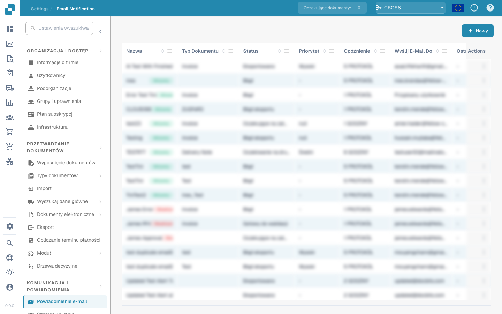

# Pantalla de Validación



## Descripción General

<figure><figcaption></figcaption></figure>

### Origen del Documento (Document Origin)


DocBits Origin Setting Explained: Country Standards for Dates & Number Formats


### **Botón Guardar:**

<figure><figcaption></figcaption></figure>

* **Botón Guardar:**
  * **Propósito:** Guarda el estado actual del documento o script en el que se está trabajando.
  * **Caso de Uso:** Después de realizar cambios o anotaciones en un documento, use este botón para asegurar que todas las modificaciones se guarden.

### **Agregar Reglas Especiales:**

<figure><figcaption></figcaption></figure>

<figure><figcaption></figcaption></figure>

* **Agregar Reglas Especiales / Agregar Script en DocBits:**
  * **Propósito:** Permite a los usuarios implementar reglas o scripts específicos que personalizan cómo se procesan los documentos.
  * **Caso de Uso:** Use esta función para automatizar tareas como la extracción de datos o la validación de formatos, mejorando la eficiencia del flujo de trabajo.


Vea aquí agregar [Script en DocBits](../../../administration-and-setup/settings/global-settings/document-types/script/scripting-in-docbits/)


### **Campos Difusos:**

<figure><figcaption></figcaption></figure>

* **Campos Difusos:**
  * **Propósito:** Ayuda a identificar y corregir campos donde los datos pueden no coincidir perfectamente pero son lo suficientemente cercanos.
  * **Caso de Uso:** Útil en procesos de validación de datos donde no siempre son posibles coincidencias exactas, como nombres o direcciones ligeramente mal escritos.

### **Campos Requeridos:**

<figure><figcaption></figcaption></figure>

Hay campos que son necesarios para una edición posterior, estos se pueden editar en la configuración.

Use el consejo de herramienta para averiguar si:

* Es un campo obligatorio (requerido)
* Se requiere validación
* Baja confianza
* Desajuste del monto total de impuestos

**Campos Requeridos:**

* **Propósito:** Identifica campos obligatorios dentro de los documentos que deben completarse o corregirse antes de un procesamiento posterior.
* **Caso de Uso:** Asegura que los datos esenciales se capturen con precisión, manteniendo la integridad de los datos y el cumplimiento de las reglas comerciales.

## Tabla extraída (líneas de detalle)

<figure><figcaption>
La tabla extraída debajo de los campos de cabecera
</figcaption></figure>

Debajo de los campos de cabecera, DocBits muestra la tabla de líneas de detalle del documento: una fila por línea de factura y una columna por cada [columna de tabla](../../../administration-and-setup/settings/global-settings/document-types/table-columns.md) configurada para el tipo de documento. Cuando un tipo de documento tiene varias tablas (por ejemplo, artículos y cargos), cada tabla tiene su propia pestaña encima de la cuadrícula.

### De dónde procede la tabla

Encima de la cuadrícula hay una pestaña por cada ruta de extracción que la organización tiene activada:

| Pestaña | Significado |
|---|---|
| **Tabla extraída** (*Extracted table*) | Extracción basada en reglas (ajuste *Extracción de tablas*). En un proveedor con tabla entrenada, estas filas proceden de las reglas guardadas y se extraen de la misma manera en todos los documentos de ese proveedor; en un proveedor sin entrenar, la pestaña puede estar vacía. |
| **Tabla extraída por IA** (*AI Extracted table*) | La extracción de tablas por IA (ajuste *Extracción de tablas por IA*). Se rellena cuando el proveedor no tiene reglas guardadas, y en las columnas marcadas como *Usar IA* incluso cuando existen reglas. Un tooltip *AI table not found* en la pestaña significa que la IA no devolvió nada para este documento. |
| **Tablas de PO** (*PO Tables*) | Solo en el constructor de diseños: las líneas de la orden de compra usadas para la coincidencia. |

Si no aparece ninguna de las pestañas, ambos ajustes de tabla están desactivados para la organización (Configuración → Procesamiento de documentos → Clasificación y extracción). El nivel de IA que lee la tabla se establece por organización y se puede sobrescribir por proveedor; consulte [Modelo de IA específico del proveedor](supplier-specific-ai-model-for-field-and-table-extraction.md).

### Trabajar en la tabla

* **Editar una celda**: haga clic en ella y escriba. Las columnas de importe, número y fecha se validan mientras escribe.
* **Agregar nueva fila de tabla**: añade una fila vacía al final. Úselo cuando no se haya reconocido una línea.
* **Eliminar una fila**: el icono de la papelera al final de la fila.
* **Agregar columnas mapeadas vacías**: muestra las columnas configuradas que la IA dejó vacías, para que pueda rellenarlas a mano.
* **Restaurar columna de tabla**: recupera una columna que quitó de la vista en este documento.
* **Eliminar tabla**: borra todas las filas de esta tabla en este documento. La configuración no se toca.
* **Agregar nueva columna de tabla** (administradores): el mismo cuadro de diálogo que en la configuración de columnas de tabla, sin salir del documento.
* **Etiquetas** (solo tabla AI): indicaciones breves en texto para la IA, por ejemplo *"la última columna es el importe neto"*. Consulte [Etiquetas de la tabla AI](../ai-table/ai-table-tags.md).
* **Aplicar** / **Guardar** / **Eliminar** junto a las etiquetas: *Aplicar* vuelve a ejecutar la tabla AI para este documento con las etiquetas y los cambios de columnas que haya hecho, sin guardar nada (si el documento tiene líneas coincidentes con una PO, DocBits avisa de que las coincidencias se eliminan); *Guardar reglas* guarda la asignación de columnas y las etiquetas actuales para este proveedor; *Eliminar reglas* las elimina y vuelve a ejecutar la extracción por IA para este documento.
* **Exportar**: descarga la tabla como archivo CSV.
* **Ir a la vista de extracción de tablas**: abre el entrenamiento de tablas para este documento. Úselo cuando el mismo proveedor salga mal una y otra vez: dibuje la tabla una vez, asigne las columnas y haga clic en *Guardar reglas*; a partir de entonces las filas aparecen en la pestaña *Tabla extraída*. Consulte [Entrenamiento de Campos de Línea / Tabla de Entrenamiento](../../../administration-and-setup/setup/document-training/training-line-fields-table-training/README.md).


Si la tabla la extrajo la IA y abre el entrenamiento de tablas, DocBits pregunta *Table is already extracted by AI. Do you want to train manually?* Después de guardar las reglas, la tabla AI deja de usarse para este proveedor.


### Volver a extraer la tabla

* **Mismo documento, tabla AI:** añada o cambie etiquetas y haga clic en **Aplicar**; la tabla AI se reconstruye solo para este documento. Para descartar también las etiquetas y el formato guardados del proveedor, haga clic en **Eliminar** (*Eliminar reglas*): DocBits confirma *Rules has been deleted successfully* y vuelve a ejecutar la extracción por IA.
* **Mismo documento, reglas entrenadas:** abra *Ir a la vista de extracción de tablas*, corrija la tabla y haga clic en *Guardar y volver a extraer*.
* **Todo el documento de nuevo (cabecera y tabla):** Panel → menú del documento → *Reiniciar*. Es necesario después de que un administrador cambie las columnas de tabla o los ajustes de extracción.

### Qué bloquea la aprobación

La tabla se comprueba al guardar o aprobar. Una celda en rojo o un mensaje debajo de la tabla significa una de estas situaciones:

| Mensaje | Causa | Qué hacer |
|---|---|---|
| Columna obligatoria vacía | Una columna marcada como *Obligatoria* no tiene valor en esta fila. | Rellene la celda o pregunte a un administrador si la columna debe ser obligatoria. |
| *Line total does not match quantity x unit price (expected …, got …)* | `cantidad × precio unitario + cargos − descuento` difiere del total de línea en más de 0,02. A menudo, uno de los cuatro valores se leyó en la columna equivocada. | Corrija el valor que está mal respecto al documento; si una columna como *Cargos* se rellena sistemáticamente con el valor equivocado, avise a su administrador (consulte [Solución de problemas](../../../administration-and-setup/settings/global-settings/document-types/table-columns.md#troubleshooting)). |
| *Line items add up to … but the net total is …* | La suma de los totales de línea difiere del importe neto de la cabecera. | Compruebe si falta una fila o hay una duplicada, o si un importe de cabecera se leyó mal. |
| *Line Item Table is missing Mandatory column for PO* | La coincidencia de PO necesita número de artículo, precio unitario, cantidad e importe total; una de esas columnas está oculta. | Administrador: vuelva a mostrar la columna en Columnas de tabla. |

Un administrador puede desactivar todas las comprobaciones de tabla de un tipo de documento con *Omitir validación de tabla* (*Skip table validation*, en Tipos de documentos → Más ajustes); las discrepancias de línea y las columnas obligatorias vacías dejan entonces de notificarse.

Más información sobre las comprobaciones: [Comprobaciones Automáticas en la Pantalla de Validación](automatic-checks-on-the-validation-screen.md) y [Solución de problemas de extracción de tablas](../../../overview-and-basics/faq/document-processing/table-extraction-troubleshoot.md).

### **Lupa:**

<figure><figcaption></figcaption></figure>

* **Lupa:**
  * **Propósito:** Proporciona una vista ampliada de un área seleccionada del documento.
  * **Caso de Uso:** Ayuda a examinar detalles finos o texto pequeño en documentos, asegurando precisión en la entrada o revisión de datos.

<figure><figcaption></figcaption></figure>

### **Abrir nueva ventana:**

<figure><figcaption></figcaption></figure>

* **Abrir Nueva Ventana:**
  * **Propósito:** Abre una nueva ventana para la comparación de documentos lado a lado o multitarea.
  * **Caso de Uso:** Útil al comparar dos documentos o al referenciar información adicional sin salir del documento actual.

### **Atajos de teclado:**

<figure><figcaption></figcaption></figure>

* **Atajos de Teclado:**
  * **Propósito:** Permite a los usuarios realizar acciones rápidamente usando combinaciones de teclado.
  * **Caso de Uso:** Mejora la velocidad y eficiencia en la navegación y procesamiento de documentos al minimizar la dependencia de la navegación con el ratón.

<figure><figcaption></figcaption></figure>

### **Tareas:**

<figure><figcaption></figcaption></figure>

Para compartir información interna, puede crear tareas y asignarlas a un empleado o grupo específico dentro de la empresa.

* **Tareas:**
  * **Propósito:** Permite a los usuarios crear tareas relacionadas con documentos y asignarlas a miembros del equipo.
  * **Caso de Uso:** Facilita la colaboración y gestión de tareas dentro de los equipos, asegurando que todos conozcan sus responsabilidades.

<figure><figcaption></figcaption></figure>

### **Modo de anotación:**

<figure><figcaption></figcaption></figure>

<figure><figcaption></figcaption></figure>


DocBits Annotation Mode Tutorial: Add Notes in Validation & Download With/Without Annotations


You can leave annotations on a document. This can be helpful to leave information for other users who further edit this document.

* **Modo de Anotación:**
  * **Propósito:** Permite a los usuarios dejar notas o anotaciones directamente en el documento.
  * **Caso de Uso:** Útil para proporcionar comentarios, instrucciones o notas importantes a otros miembros del equipo que trabajarán en el documento más tarde.

### **Combinar:**

<figure><figcaption></figcaption></figure>

Los documentos se pueden combinar aquí, por ejemplo, si faltaba una página de una factura, estas páginas se pueden combinar más tarde de esta manera sin tener que eliminar o volver a cargar todo el documento.

* **Combinar Documentos:**
  * **Propósito:** Combina múltiples documentos en un solo archivo.
  * **Caso de Uso:** Útil en escenarios donde partes de un documento se escanean por separado y necesitan ser consolidadas.

### **Vista OCR:**

<figure><figcaption></figcaption></figure>

En la vista OCR, el texto se filtra automáticamente del documento. Esto se utiliza para reconocer características relevantes, como el código postal, número de contrato, número de factura y la clasificación de un documento.

* **Vista OCR:**
  * **Propósito:** Reconoce automáticamente el texto dentro de los documentos utilizando tecnología de Reconocimiento Óptico de Caracteres.
  * **Caso de Uso:** Optimiza el proceso de digitalización de textos impresos o manuscritos, haciéndolos buscables y editables.

<figure><figcaption></figcaption></figure>

### **Crear ticket:**

<figure><figcaption></figcaption></figure>

A diferencia de las tareas que se transmiten internamente dentro de la empresa, este ticket de soporte es importante para notificarnos y crear inmediatamente un ticket en caso de errores y/o discrepancias. Esto facilita mucho el proceso porque puede enviar inmediatamente el error con el documento correspondiente. También existe la opción de establecer prioridad, tomar una captura de pantalla del documento o cargar una.

* **Crear Ticket:**
  * **Propósito:** Permite a los usuarios reportar problemas o discrepancias creando un ticket de soporte.
  * **Caso de Uso:** Esencial para la rápida resolución de problemas y errores, ayudando a mantener la integridad y el buen funcionamiento del sistema.

<figure><figcaption></figcaption></figure>

### **Registros de scripts de documentos:**

<figure><figcaption></figcaption></figure>

Los scripts se pueden crear en la configuración bajo Tipos de Documentos; esta información se mostrará aquí.

* **Registros de Scripts de Documentos:**
  * **Propósito:** Muestra registros relacionados con scripts que se han implementado para diferentes tipos de documentos.
  * **Caso de Uso:** Útil para rastrear y depurar acciones de scripts en documentos, ayudando a los usuarios a comprender los procesos automatizados y corregir cualquier problema.

<figure><figcaption></figcaption></figure>

### **Más configuraciones:**

<figure><figcaption></figcaption></figure>

### **Flujo de Documento:**

Allí encontrará el flujo del documento

* **Propósito:** Muestra la secuencia y progresión del procesamiento de documentos dentro del sistema.
* **Caso de Uso:** Ayuda a rastrear el estado del documento a través de diferentes etapas, asegurando que se sigan todos los pasos de procesamiento necesarios.

### **Ir a la plantilla de diseño:**

* Con esta opción será redirigido y podrá editar su diseño o usar la plantilla predeterminada
* **Ir a la Plantilla de Diseño:**
  * **Propósito:** Redirige a los usuarios a un editor de diseño donde pueden modificar plantillas existentes o aplicar una predeterminada.
  * **Caso de Uso:** Permite la personalización de los diseños de documentos para satisfacer necesidades o preferencias comerciales específicas, mejorando la alineación visual y funcional del documento con los estándares de la empresa.

### Utilizar E-Texto si Está Disponible

* **Propósito:** Permite que DocBits utilice e-texto para todos los documentos de un proveedor específico si está disponible, mejorando la precisión de la extracción.
* **Caso de Uso:** Mejora la extracción de texto aprovechando el texto incrustado en lugar de OCR, lo que puede llevar a resultados más precisos para este proveedor.

### [Modelo de IA Basado en Proveedor](supplier-specific-ai-model-for-field-and-table-extraction.md)

* **Propósito:** Permite la selección entre tres modelos de IA diferentes para optimizar los resultados de extracción para un proveedor específico.
* **Caso de Uso:** Asegura una mejor precisión de extracción al elegir el modelo de IA más adecuado para la estructura y contenido del documento de cada proveedor.
