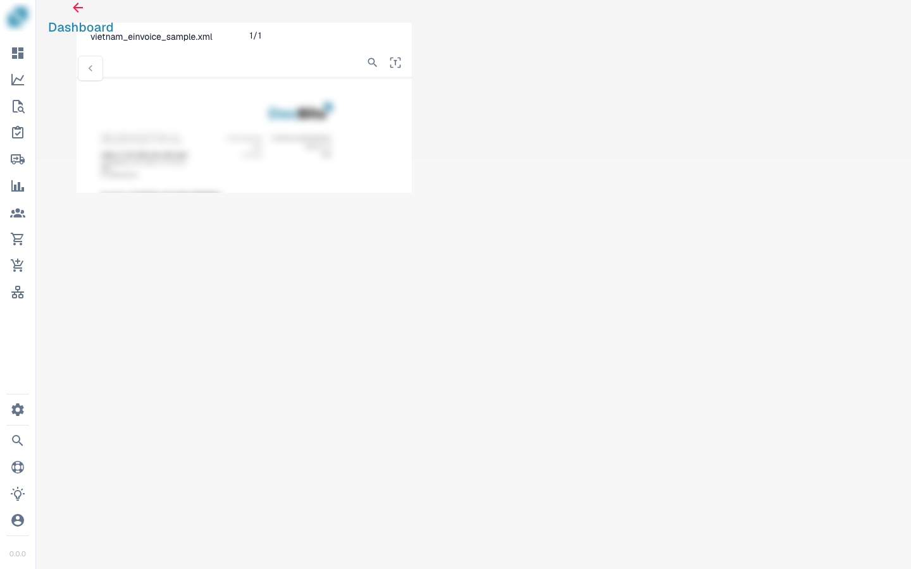

# Validierungsbildschirm


dfg


## Übersicht

<figure><figcaption></figcaption></figure>

### Dokumentursprung (Document Origin)


DocBits Origin Setting Explained: Country Standards for Dates & Number Formats


### **Speichern-Button:**

<figure><figcaption></figcaption></figure>

* **Speichern-Button:**
  * **Zweck:** Speichert den aktuellen Zustand des Dokuments oder Skripts, an dem gearbeitet wird.
  * **Anwendungsfall:** Nach Änderungen oder Anmerkungen an einem Dokument verwenden Sie diesen Button, um sicherzustellen, dass alle Änderungen gespeichert werden.

### **Spezielle Regeln hinzufügen:**

<figure><figcaption></figcaption></figure>

<figure><figcaption></figcaption></figure>

* **Spezielle Regeln hinzufügen / Skript in DocBits hinzufügen:**
  * **Zweck:** Ermöglicht es Benutzern, spezifische Regeln oder Skripte zu implementieren, die anpassen, wie Dokumente verarbeitet werden.
  * **Anwendungsfall:** Verwenden Sie diese Funktion, um Aufgaben wie die Datenextraktion oder Formatvalidierung zu automatisieren und die Workflow-Effizienz zu steigern.


Siehe hier [Scripting in DocBits](../../../administration-and-setup/settings/global-settings/document-types/script/scripting-in-docbits/)


### **Unscharfe Felder:**

<figure><figcaption></figcaption></figure>

* **Unscharfe Felder:**
  * **Zweck:** Hilft bei der Identifizierung und Korrektur von Feldern, bei denen die Daten möglicherweise nicht perfekt übereinstimmen, aber nah genug sind.
  * **Anwendungsfall:** Nützlich in Datenvalidierungsprozessen, bei denen exakte Übereinstimmungen nicht immer möglich sind, wie z.B. leicht falsch geschriebene Namen oder Adressen.

### **Erforderliche Felder:**

<figure><figcaption></figcaption></figure>

Es gibt Felder, die für die weitere Bearbeitung erforderlich sind; diese können in den Einstellungen bearbeitet werden.

Verwenden Sie den Tooltip, um herauszufinden, ob:

* Ist es ein Pflichtfeld (erforderlich)
* Validierung erforderlich
* Geringes Vertrauen
* Volle Steuerbetragsabweichung

**Erforderliche Felder:**

* **Zweck:** Identifiziert Pflichtfelder innerhalb von Dokumenten, die ausgefüllt oder korrigiert werden müssen, bevor eine weitere Verarbeitung erfolgt.
* **Anwendungsfall:** Stellt sicher, dass wesentliche Daten genau erfasst werden, um die Datenintegrität und die Einhaltung von Geschäftsregeln zu gewährleisten.

## Extrahierte Tabelle (Positionen)

<figure><figcaption>
Die extrahierte Tabelle unterhalb der Kopffelder
</figcaption></figure>

Unterhalb der Kopffelder zeigt DocBits die Positionstabelle des Dokuments: eine Zeile pro Rechnungsposition, eine Spalte pro [Tabellenspalte](../../../admin-section/settings/global-settings/document-types/table-columns.md), die für den Dokumenttyp konfiguriert ist. Hat ein Dokumenttyp mehrere Tabellen (zum Beispiel Positionen und Zuschläge), hat jede Tabelle einen eigenen Tab über dem Raster.

### Woher die Tabelle stammt

Über dem Raster gibt es einen Tab pro Extraktionspfad, den die Organisation eingeschaltet hat:

| Tab | Bedeutung |
|---|---|
| **Extrahierte Tabelle** | Regelbasierte Extraktion (Einstellung *Tabelle Extraktion*). Bei einem Lieferanten mit trainierter Tabelle stammen diese Zeilen aus den gespeicherten Regeln und werden auf jedem Dokument dieses Lieferanten auf dieselbe Weise extrahiert; bei einem nicht trainierten Lieferanten kann der Tab leer sein. |
| **KI Extrahierte Tabelle** | Die KI-Tabellenextraktion (Einstellung *AI-Tabellen-Extraktion*). Wird gefüllt, wenn der Lieferant keine gespeicherten Regeln hat, sowie für Spalten mit *KI nutzen*, auch wenn Regeln existieren. Ein Tooltip *AI table not found* am Tab bedeutet, dass die KI für dieses Dokument nichts geliefert hat. |
| **PO-Tabellen** | Nur im Layout-Builder: die Bestellpositionen, die für den Abgleich verwendet werden. |

Erscheint keiner der beiden Tabs, sind beide Tabelleneinstellungen für die Organisation ausgeschaltet (Einstellungen → Dokumentenverarbeitung → Klassifizierung und Extraktion). Welche KI-Stufe die Tabelle liest, wird pro Organisation festgelegt und kann pro Lieferant überschrieben werden, siehe [Lieferantenspezifisches KI-Modell](supplier-specific-ai-model-for-field-and-table-extraction.md).

### Arbeiten in der Tabelle

* **Zelle bearbeiten**: Klicken Sie in die Zelle und tippen Sie. Betrags-, Zahlen- und Datumsspalten werden während der Eingabe validiert.
* **Neue Tabellenzeile hinzufügen**: hängt eine leere Zeile am Ende an. Verwenden Sie sie, wenn eine Position nicht erkannt wurde.
* **Zeile löschen**: das Papierkorbsymbol am Ende der Zeile.
* **Leere gemappte Spalten hinzufügen**: zeigt die konfigurierten Spalten, die die KI leer gelassen hat, damit Sie sie von Hand füllen können.
* **Tabellenspalte wiederherstellen**: holt eine Spalte zurück, die Sie für dieses Dokument aus der Ansicht entfernt haben.
* **Tabelle löschen**: leert alle Zeilen dieser Tabelle auf diesem Dokument. Die Konfiguration bleibt unberührt.
* **Neue Tabellenspalte hinzufügen** (Administratoren): derselbe Dialog wie in den Tabellenspalten-Einstellungen, ohne das Dokument zu verlassen.
* **Tags** (nur KI-Tabelle): kurze Texthinweise für die KI, zum Beispiel *„die letzte Spalte ist der Nettobetrag“*. Siehe [KI-Tabellen-Tags](../ai-table/ai-table-tags.md).
* **Anwenden** / **Speichern** / **Löschen** neben den Tags: *Anwenden* führt die KI-Tabelle für dieses Dokument mit Ihren Tags und Spaltenänderungen erneut aus, ohne etwas zu speichern (hat das Dokument mit Bestellungen abgeglichene Positionen, warnt DocBits, dass die Zuordnungen entfernt werden); *Regeln speichern* speichert die aktuelle Spaltenzuordnung und die Tags für diesen Lieferanten; *Regeln löschen* entfernt sie und führt die KI-Extraktion für dieses Dokument erneut aus.
* **Exportieren**: lädt die Tabelle als CSV-Datei herunter.
* **Zur Ansicht der Tabellenextraktion wechseln**: öffnet das Tabellentraining für dieses Dokument. Verwenden Sie es, wenn derselbe Lieferant immer wieder falsch herauskommt: Zeichnen Sie die Tabelle einmal ein, ordnen Sie die Spalten zu und klicken Sie auf *Regeln speichern*; ab dann erscheinen die Zeilen im Tab *Extrahierte Tabelle*. Siehe [Schulung Linienfelder/Tabelle Schulung](../../../administration-and-setup/setup/document-training/training-line-fields-table-training/README.md).


Wurde die Tabelle von der KI extrahiert und Sie öffnen das Tabellentraining, fragt DocBits *Table is already extracted by AI. Do you want to train manually?* (Die Tabelle wurde bereits von der KI extrahiert. Möchten Sie manuell trainieren?). Nachdem Sie Regeln gespeichert haben, wird die KI-Tabelle für diesen Lieferanten nicht mehr verwendet.


### Die Tabelle erneut extrahieren

* **Gleiches Dokument, KI-Tabelle:** Fügen Sie Tags hinzu oder ändern Sie sie und klicken Sie auf **Anwenden**; die KI-Tabelle wird nur für dieses Dokument neu aufgebaut. Um auch die gespeicherten Tags und Formatierungen des Lieferanten zu verwerfen, klicken Sie auf **Löschen** (*Regeln löschen*): DocBits bestätigt *Rules has been deleted successfully* (Regeln wurden erfolgreich gelöscht) und führt die KI-Extraktion erneut aus.
* **Gleiches Dokument, trainierte Regeln:** Öffnen Sie *Zur Ansicht der Tabellenextraktion wechseln*, korrigieren Sie die Tabelle und klicken Sie auf *Speichern und erneut extrahieren*.
* **Gesamtes Dokument erneut (Kopf und Tabelle):** Dashboard → Dokumentmenü → *Neustart*. Erforderlich, nachdem ein Administrator die Tabellenspalten oder die Extraktionseinstellungen geändert hat.

### Was die Freigabe blockiert

Die Tabelle wird beim Speichern oder Freigeben geprüft. Eine rote Zelle oder eine Meldung unter der Tabelle bedeutet eine der folgenden Ursachen:

| Meldung | Ursache | Was zu tun ist |
|---|---|---|
| Erforderliche Spalte leer | Eine Spalte mit *Erforderlich* hat in dieser Zeile keinen Wert. | Füllen Sie die Zelle, oder fragen Sie einen Administrator, ob die Spalte erforderlich sein muss. |
| *Line total does not match quantity x unit price (expected …, got …)* | `Menge × Einzelpreis + Zuschläge − Rabatt` weicht um mehr als 0,02 von der Positionssumme ab. Oft wurde einer der vier Werte in die falsche Spalte gelesen. | Korrigieren Sie den Wert, der laut Dokument falsch ist; wird eine Spalte wie *Charges* durchgehend mit dem falschen Wert gefüllt, informieren Sie Ihren Administrator (siehe [Fehlerbehebung](../../../admin-section/settings/global-settings/document-types/table-columns.md#fehlerbehebung)). |
| *Line items add up to … but the net total is …* | Die Summe der Positionssummen weicht vom Nettobetrag im Kopf ab. | Prüfen Sie auf eine fehlende oder doppelte Zeile oder einen falsch gelesenen Kopfbetrag. |
| *Line Item Table is missing Mandatory column for PO* | Der Bestellabgleich benötigt Artikelnummer, Einzelpreis, Menge und Gesamtbetrag; eine davon ist versteckt. | Administrator: Verstecken der Spalte unter Tabellenspalten aufheben. |

Ein Administrator kann alle Tabellenprüfungen für einen Dokumenttyp mit *Tabellenvalidierung überspringen* (Dokumenttypen → Weitere Einstellungen) abschalten; Positionsabweichungen und leere erforderliche Spalten werden dann nicht mehr gemeldet.

Mehr zu den Prüfungen: [Automatische Überprüfungen im Validierungsbildschirm](automatic-checks-on-the-validation-screen.md) und [Tabellenauszug Fehlerbehebung](../../../overview-and-basics/faq/document-processing/table-extraction-troubleshoot.md).

### **Lupe:**

<figure><figcaption></figcaption></figure>

* **Lupe:**
  * **Zweck:** Bietet eine vergrößerte Ansicht eines ausgewählten Bereichs des Dokuments.
  * **Anwendungsfall:** Hilft beim Untersuchen feiner Details oder kleiner Texte in Dokumenten, um Genauigkeit bei der Dateneingabe oder -überprüfung zu gewährleisten.

<figure><figcaption></figcaption></figure>

### **Neues Fenster öffnen:**

<figure><figcaption></figcaption></figure>

* **Neues Fenster öffnen:**
  * **Zweck:** Öffnet ein neues Fenster für den Vergleich von Dokumenten nebeneinander oder für Multitasking.
  * **Anwendungsfall:** Nützlich beim Vergleich von zwei Dokumenten oder beim Nachschlagen zusätzlicher Informationen, ohne das aktuelle Dokument zu verlassen.

### **Tastenkombinationen:**

<figure><figcaption></figcaption></figure>

* **Tastenkombinationen:**
  * **Zweck:** Ermöglicht es Benutzern, Aktionen schnell mit Tastenkombinationen auszuführen.
  * **Anwendungsfall:** Erhöht die Geschwindigkeit und Effizienz bei der Dokumentennavigation und -verarbeitung, indem die Abhängigkeit von der Mausnavigation minimiert wird.

<figure><figcaption></figcaption></figure>

### **Aufgaben:**

<figure><figcaption></figcaption></figure>

Um interne Informationen zu teilen, können Sie Aufgaben erstellen und sie einem bestimmten Mitarbeiter oder einer Gruppe innerhalb des Unternehmens zuweisen.

* **Aufgaben:**
  * **Zweck:** Ermöglicht es Benutzern, auf Dokumente bezogene Aufgaben zu erstellen und sie Teammitgliedern zuzuweisen.
  * **Anwendungsfall:** Erleichtert die Zusammenarbeit und das Aufgabenmanagement innerhalb von Teams, sodass jeder seine Verantwortlichkeiten kennt.

<figure><figcaption></figcaption></figure>

### **Anmerkungsmodus:**

<figure><figcaption></figcaption></figure>

<figure><figcaption></figcaption></figure>


DocBits Annotation Mode erklärt: Dokumente direkt im Validation Screen annotieren


Sie können Anmerkungen zu einem Dokument hinterlassen. Dies kann hilfreich sein, um Informationen für andere Benutzer zu hinterlassen, die dieses Dokument weiter bearbeiten.

* **Anmerkungsmodus:**
  * **Zweck:** Ermöglicht es Benutzern, Notizen oder Anmerkungen direkt im Dokument zu hinterlassen.
  * **Anwendungsfall:** Nützlich, um Feedback, Anweisungen oder wichtige Notizen für andere Teammitglieder bereitzustellen, die später am Dokument arbeiten.

### **Zusammenführen:**

<figure><figcaption></figcaption></figure>

Dokumente können hier zusammengeführt werden, zum Beispiel wenn eine Seite einer Rechnung fehlte, können diese Seiten später auf diese Weise zusammengeführt werden, ohne dass das gesamte Dokument gelöscht oder erneut hochgeladen werden muss.

* **Dokumente zusammenführen:**
  * **Zweck:** Kombiniert mehrere Dokumente zu einer einzigen Datei.
  * **Anwendungsfall:** Praktisch in Szenarien, in denen Teile eines Dokuments separat gescannt wurden und konsolidiert werden müssen.

### **OCR-Ansicht:**

<figure><figcaption></figcaption></figure>

In der OCR-Ansicht wird der Text automatisch aus dem Dokument gefiltert. Dies wird verwendet, um relevante Merkmale zu erkennen, wie z.B. die Postleitzahl, Vertragsnummer, Rechnungsnummer und die Sortierung eines Dokuments.

* **OCR-Ansicht:**
  * **Zweck:** Erkennt automatisch Text innerhalb von Dokumenten mit Hilfe der optischen Zeichenerkennungstechnologie.
  * **Anwendungsfall:** Vereinfacht den Prozess der Digitalisierung von gedruckten oder handgeschriebenen Texten, sodass sie durchsuchbar und bearbeitbar werden.

<figure><figcaption></figcaption></figure>

### **Ticket erstellen:**

<figure><figcaption></figcaption></figure>

Im Gegensatz zu Aufgaben, die intern innerhalb des Unternehmens weitergegeben werden, ist dieses Support-Ticket wichtig, um uns zu benachrichtigen und sofort ein Ticket im Falle von Fehlern und/oder Unstimmigkeiten zu erstellen. Dies erleichtert den Prozess erheblich, da Sie den Fehler sofort mit dem entsprechenden Dokument senden können. Es gibt auch die Möglichkeit, die Priorität festzulegen, einen Screenshot des Dokuments zu machen oder einen hochzuladen.

* **Ticket erstellen:**
  * **Zweck:** Ermöglicht es Benutzern, Probleme oder Unstimmigkeiten zu melden, indem sie ein Support-Ticket erstellen.
  * **Anwendungsfall:** Wesentlich für die schnelle Lösung von Problemen und Fehlern, um die Integrität und das reibungslose Funktionieren des Systems zu gewährleisten.

<figure><figcaption></figcaption></figure>

### **Dokumentenskriptprotokolle:**

<figure><figcaption></figcaption></figure>

Skripte können in den Einstellungen unter Dokumenttypen erstellt werden; diese Informationen werden dann hier angezeigt.

* **Dokumentenskriptprotokolle:**
  * **Zweck:** Zeigt Protokolle zu Skripten an, die für verschiedene Dokumenttypen implementiert wurden.
  * **Anwendungsfall:** Nützlich zur Verfolgung und Fehlerbehebung von Skriptaktionen auf Dokumenten, um Benutzern zu helfen, die automatisierten Prozesse zu verstehen und eventuelle Probleme zu beheben.

<figure><figcaption></figcaption></figure>

### **Weitere Einstellungen:**

<figure><figcaption></figcaption></figure>

### **Dokumenten-Flow:**

Dort finden Sie den Fluss des Dokuments

* **Zweck:** Zeigt die Sequenz und den Fortschritt der Dokumentenverarbeitung innerhalb des Systems.
* **Anwendungsfall:** Hilft bei der Verfolgung des Dokumentenstatus durch verschiedene Phasen, um sicherzustellen, dass alle notwendigen Verarbeitungsschritte eingehalten werden.

### **Zum Layout-Template gehen:**

* Mit dieser Option werden Sie weitergeleitet und können Ihr Layout bearbeiten oder das Standard-Template verwenden
* **Zum Layout-Template gehen:**
  * **Zweck:** Leitet Benutzer zu einem Layout-Editor weiter, in dem sie bestehende Templates bearbeiten oder ein Standard-Template anwenden können.
  * **Anwendungsfall:** Ermöglicht die Anpassung von Dokumentlayouts, um spezifische Geschäftsanforderungen oder Präferenzen zu erfüllen und die visuelle und funktionale Ausrichtung des Dokuments an Unternehmensstandards zu verbessern.

### Verwenden Sie E-Text, wenn verfügbar

* **Zweck:** Ermöglicht DocBits die Verwendung von E-Text für alle Dokumente eines bestimmten Lieferanten, wenn verfügbar, um die Extraktionsgenauigkeit zu verbessern.
* **Anwendungsfall:** Verbessert die Textextraktion, indem eingebetteter Text anstelle von OCR genutzt wird, was zu präziseren Ergebnissen für diesen Lieferanten führen kann.

### [Lieferantenbasiertes KI-Modell](supplier-specific-ai-model-for-field-and-table-extraction.md)

* **Zweck:** Ermöglicht die Auswahl zwischen drei verschiedenen KI-Modellen, um die Extraktionsergebnisse für einen bestimmten Lieferanten zu optimieren.
* **Anwendungsfall:** Stellt eine bessere Extraktionsgenauigkeit sicher, indem das am besten geeignete KI-Modell für die Dokumentenstruktur und den Inhalt jedes Lieferanten ausgewählt wird.
