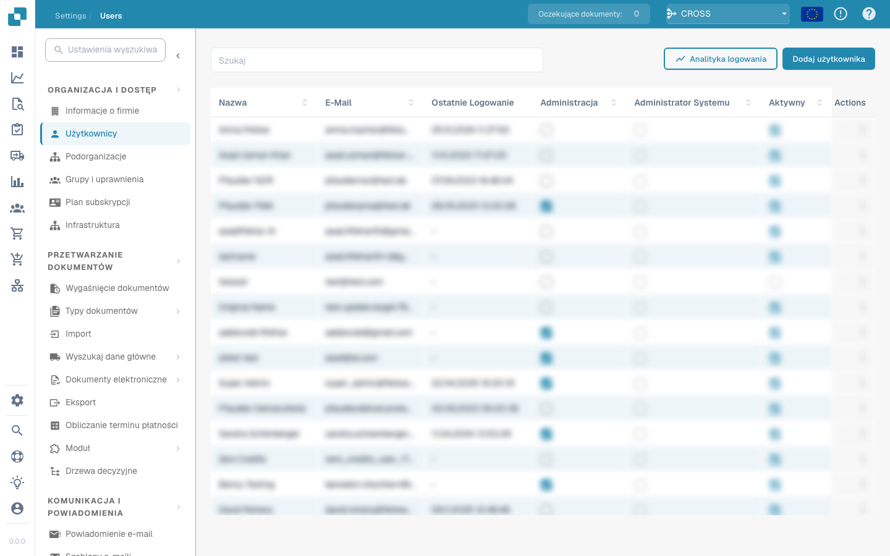

# Validatiescherm



## Overzicht

<figure><figcaption></figcaption></figure>

### Document Oorsprong (Document Origin)


DocBits Origin Setting Explained: Country Standards for Dates & Number Formats


### **Opslaan knop:**

<figure><figcaption></figcaption></figure>

* **Opslaan knop:**
  * **Doel:** Slaat de huidige staat van het document of script waar aan gewerkt wordt op.
  * **Gebruiksscenario:** Na het aanbrengen van wijzigingen of annotaties in een document, gebruik deze knop om ervoor te zorgen dat alle aanpassingen zijn opgeslagen.

### **Speciale regels toevoegen:**

<figure><figcaption></figcaption></figure>

<figure><figcaption></figcaption></figure>

* **Speciale regels toevoegen / Script in DocBits toevoegen:**
  * **Doel:** Stelt gebruikers in staat om specifieke regels of scripts te implementeren die aanpassen hoe documenten worden verwerkt.
  * **Gebruiksscenario:** Gebruik deze functie om taken te automatiseren zoals gegevensextractie of formatvalidatie, wat de efficiëntie van de workflow verbetert.


Zie hier toevoegen [Script in DocBits](../../../administration-and-setup/settings/global-settings/document-types/script/scripting-in-docbits/)


### **Vage velden:**

<figure><figcaption></figcaption></figure>

* **Vage velden:**
  * **Doel:** Helpt bij het identificeren en corrigeren van velden waar de gegevens mogelijk niet perfect overeenkomen, maar dicht genoeg zijn.
  * **Gebruiksscenario:** Nuttig in gegevensvalidatieprocessen waar exacte overeenkomsten niet altijd mogelijk zijn, zoals licht verkeerd gespelde namen of adressen.

### **Verplichte velden:**

<figure><figcaption></figcaption></figure>

Er zijn velden die vereist zijn voor verdere bewerking, deze kunnen in de instellingen worden bewerkt.

Gebruik de tooltips om te achterhalen of:

* Is het een verplicht veld (vereist)
* Validatie vereist
* Lage betrouwbaarheid
* Volledig belastingbedrag mismatch

**Verplichte velden:**

* **Doel:** Identificeert verplichte velden binnen documenten die moeten worden ingevuld of gecorrigeerd voordat verdere verwerking plaatsvindt.
* **Gebruiksscenario:** Zorgt ervoor dat essentiële gegevens nauwkeurig worden vastgelegd, waardoor de integriteit van de gegevens en de naleving van bedrijfsregels behouden blijven.

<figure><figcaption></figcaption></figure>

## Geëxtraheerde tabel (regelitems)

<figure><figcaption>
De geëxtraheerde tabel onder de koptekstvelden
</figcaption></figure>

Onder de koptekstvelden toont DocBits de regelitemtabel van het document: één rij per factuurregel, één kolom per [tabelkolom](../../../administration-and-setup/settings/global-settings/document-types/table-columns/README.md) die voor het documenttype is geconfigureerd. Wanneer een documenttype meerdere tabellen heeft (bijvoorbeeld artikelen en kosten), heeft elke tabel een eigen tabblad boven het raster.

### Waar de tabel vandaan komt

Boven het raster staat één tabblad per extractiepad dat de organisatie heeft ingeschakeld:

| Tabblad | Betekenis |
|---|---|
| **Geëxtraheerde tabel** | Regelgebaseerde extractie (instelling *Tabel extractie*). Voor een leverancier met een getrainde tabel komen deze rijen uit de opgeslagen regels en worden ze op elk document van die leverancier op dezelfde manier geëxtraheerd; voor een niet-getrainde leverancier kan het tabblad leeg zijn. |
| **AI Geëxtraheerde tabel** | De AI-tabelextractie (instelling *AI-tabel extractie*). Wordt gevuld wanneer de leverancier geen opgeslagen regels heeft, en voor kolommen met *AI gebruiken* ook wanneer er regels bestaan. Een tooltip *AI table not found* op het tabblad betekent dat de AI voor dit document niets heeft teruggegeven. |
| **PO-tabellen** | Alleen in de layout builder: de inkooporderregels die voor de matching worden gebruikt. |

Als geen van beide tabbladen verschijnt, zijn beide tabelinstellingen voor de organisatie uitgeschakeld (Instellingen → Documentverwerking → Classificatie en extractie). Welke AI-tier de tabel leest, wordt per organisatie ingesteld en kan per leverancier worden overschreven, zie [Leverancierspecifiek AI-model](supplier-specific-ai-model-for-field-and-table-extraction.md).

### Werken in de tabel

* **Een cel bewerken**: klik in de cel en typ. Bedrag-, getal- en datumkolommen worden tijdens het typen gevalideerd.
* **Nieuwe tabelrij toevoegen**: voegt onderaan een lege rij toe. Gebruik dit wanneer een regel niet is herkend.
* **Een rij verwijderen**: het prullenbakpictogram aan het einde van de rij.
* **Lege gekoppelde kolommen toevoegen**: toont de geconfigureerde kolommen die de AI leeg heeft gelaten, zodat u ze handmatig kunt invullen.
* **Tabelkolom herstellen**: haalt een kolom terug die u voor dit document uit de weergave hebt verwijderd.
* **Tabel verwijderen**: wist alle rijen van deze tabel op dit document. De configuratie blijft onaangeroerd.
* **Nieuwe tabelkolom toevoegen** (beheerders): hetzelfde dialoogvenster als in de tabelkolominstellingen, zonder het document te verlaten.
* **Tags** (alleen AI-tabel): korte tekstaanwijzingen voor de AI, bijvoorbeeld *"de laatste kolom is het nettobedrag"*. Zie [AI Tabel Tags](../ai-table/ai-table-tags.md).
* **Toepassen** / **Opslaan** / **Verwijderen** naast de tags: *Toepassen* voert de AI-tabel voor dit document opnieuw uit met de tags en kolomwijzigingen die u hebt gemaakt, zonder iets op te slaan (als het document PO-gematchte regels heeft, waarschuwt DocBits dat de matches worden verwijderd); *Regels opslaan* slaat de huidige kolomkoppeling en tags voor deze leverancier op; *Regels verwijderen* verwijdert ze en voert de AI-extractie voor dit document opnieuw uit.
* **Exporteren**: downloadt de tabel als CSV-bestand.
* **Ga naar tabelextractieweergave**: opent de tabeltraining voor dit document. Gebruik dit wanneer dezelfde leverancier steeds verkeerd uitkomt: teken de tabel eenmalig, koppel de kolommen en klik op *Regels opslaan*; vanaf dan verschijnen de rijen in het tabblad *Geëxtraheerde tabel*. Zie [Training Line Fields / Tabeltraining](../../../administration-and-setup/setup/document-training/training-line-fields-table-training/README.md).


Als de tabel door de AI is geëxtraheerd en u de tabeltraining opent, vraagt DocBits *Table is already extracted by AI. Do you want to train manually?* Nadat u regels hebt opgeslagen, wordt de AI-tabel voor deze leverancier niet meer gebruikt.


### De tabel opnieuw extraheren

* **Hetzelfde document, AI-tabel:** voeg tags toe of wijzig ze en klik op **Toepassen**; de AI-tabel wordt alleen voor dit document opnieuw opgebouwd. Om ook de opgeslagen tags en opmaak van de leverancier te verwijderen, klikt u op **Verwijderen** (*Regels verwijderen*): DocBits bevestigt *Rules has been deleted successfully* en voert de AI-extractie opnieuw uit.
* **Hetzelfde document, getrainde regels:** open *Ga naar tabelextractieweergave*, corrigeer de tabel en klik op *Opslaan en opnieuw extraheren*.
* **Het hele document opnieuw (koptekst en tabel):** Dashboard → documentmenu → *Opnieuw starten*. Nodig nadat een beheerder de tabelkolommen of de extractie-instellingen heeft gewijzigd.

### Wat de goedkeuring blokkeert

De tabel wordt gecontroleerd wanneer u opslaat of goedkeurt. Een rode cel of een melding onder de tabel betekent een van de volgende:

| Melding | Oorzaak | Wat te doen |
|---|---|---|
| Verplichte kolom leeg | Een kolom met *Verplicht* heeft in deze rij geen waarde. | Vul de cel in, of vraag een beheerder of de kolom verplicht moet zijn. |
| *Line total does not match quantity x unit price (expected …, got …)* | `hoeveelheid × eenheidsprijs + kosten − korting` wijkt meer dan 0,02 af van het regeltotaal. Vaak is een van de vier waarden in de verkeerde kolom gelezen. | Corrigeer de waarde die niet klopt met het document; als een kolom zoals *Kosten* steeds met de verkeerde waarde wordt gevuld, meld dit dan bij uw beheerder (zie [Probleemoplossing](../../../administration-and-setup/settings/global-settings/document-types/table-columns/troubleshooting-1.md)). |
| *Line items add up to … but the net total is …* | De som van de regeltotalen wijkt af van het nettobedrag in de koptekst. | Controleer op een ontbrekende of dubbele rij, of een verkeerd gelezen kopbedrag. |
| *Line Item Table is missing Mandatory column for PO* | PO-matching heeft artikelnummer, eenheidsprijs, hoeveelheid en totaalbedrag nodig; een daarvan is verborgen. | Beheerder: maak de kolom weer zichtbaar onder Tabelkolommen. |

Een beheerder kan alle tabelcontroles voor een documenttype uitschakelen met *Tabelvalidatie overslaan* (Documenttypen → Meer instellingen); regelafwijkingen en lege verplichte kolommen worden dan niet meer gemeld.

Meer over de controles: [Automatische controles op het validatiescherm](automatic-checks-on-the-validation-screen.md) en [Tabel Extractie Probleemoplossing](../../../overview-and-basics/faq/document-processing/table-extraction-troubleshoot.md).

### **Vergrootglas:**

<figure><figcaption></figcaption></figure>

* **Vergrootglas:**
  * **Doel:** Biedt een ingezoomd overzicht van een geselecteerd gebied van het document.
  * **Gebruiksscenario:** Helpt bij het onderzoeken van fijne details of kleine tekst in documenten, waardoor de nauwkeurigheid bij gegevensinvoer of -beoordeling wordt gewaarborgd.

<figure><figcaption></figcaption></figure>

### **Open nieuw venster:**

<figure><figcaption></figcaption></figure>

* **Open nieuw venster:**
  * **Doel:** Opent een nieuw venster voor zij-aan-zij documentvergelijking of multitasking.
  * **Gebruiksscenario:** Nuttig bij het vergelijken van twee documenten of wanneer aanvullende informatie moet worden geraadpleegd zonder het huidige document te verlaten.

### **Sneltoetsen:**

<figure><figcaption></figcaption></figure>

* **Sneltoetsen:**
  * **Doel:** Stelt gebruikers in staat om acties snel uit te voeren met behulp van toetsencombinaties.
  * **Gebruiksscenario:** Verhoogt de snelheid en efficiëntie in documentnavigatie en -verwerking door de afhankelijkheid van muisnavigatie te minimaliseren.

<figure><figcaption>
Keyboard
</figcaption></figure>

### **Taken:**

<figure><figcaption></figcaption></figure>

Om interne informatie te delen, kunt u taken aanmaken en deze toewijzen aan een specifieke werknemer of groep binnen het bedrijf.

* **Taken:**
  * **Doel:** Stelt gebruikers in staat om taken te creëren die verband houden met documenten en deze aan teamleden toe te wijzen.
  * **Gebruiksscenario:** Vergemakkelijkt samenwerking en taakbeheer binnen teams, zodat iedereen op de hoogte is van zijn verantwoordelijkheden.

<figure><figcaption></figcaption></figure>

### **Annotatiemodus:**

<figure><figcaption></figcaption></figure>

<figure><figcaption></figcaption></figure>

U kunt annotaties op een document achterlaten. Dit kan nuttig zijn om informatie achter te laten voor andere gebruikers die dit document verder bewerken.

* **Annotatiemodus:**
  * **Doel:** Laat gebruikers notities of annotaties direct op het document achterlaten.
  * **Gebruiksscenario:** Nuttig voor het geven van feedback, instructies of belangrijke notities aan andere teamleden die later aan het document zullen werken.

### **Samenvoegen:**

<figure><figcaption></figcaption></figure>

Documenten kunnen hier worden samengevoegd, bijvoorbeeld als een pagina van een factuur ontbrak, kunnen deze pagina's later op deze manier worden samengevoegd zonder dat het hele document hoeft te worden verwijderd of opnieuw geüpload.

* **Documenten samenvoegen:**
  * **Doel:** Combineert meerdere documenten tot één bestand.
  * **Gebruiksscenario:** Handig in scenario's waarin delen van een document afzonderlijk zijn gescand en moeten worden samengevoegd.

### **OCR-weergave:**

<figure><figcaption></figcaption></figure>

In de OCR-weergave wordt de tekst automatisch gefilterd uit het document. Dit wordt gebruikt om relevante kenmerken te herkennen, zoals de postcode, contractnummer, factuurnummer en de sortering van een document.

* **OCR-weergave:**
  * **Doel:** Herkent automatisch tekst binnen documenten met behulp van Optical Character Recognition-technologie.
  * **Gebruiksscenario:** Vereenvoudigt het proces van het digitaliseren van gedrukte of handgeschreven teksten, waardoor ze doorzoekbaar en bewerkbaar worden.

<figure><figcaption>
OCR
</figcaption></figure>

### **Ticket aanmaken:**

<figure><figcaption></figcaption></figure>

In tegenstelling tot taken die intern binnen het bedrijf worden doorgegeven, is dit ondersteuningsticket belangrijk om ons te informeren en onmiddellijk een ticket aan te maken in geval van fouten en/of discrepanties. Dit maakt het proces veel gemakkelijker omdat u de bug onmiddellijk met het bijbehorende document kunt verzenden. Er is ook de optie om prioriteit in te stellen, een screenshot van het document te maken of er een te uploaden.

* **Ticket aanmaken:**
  * **Doel:** Stelt gebruikers in staat om problemen of discrepanties te melden door een ondersteuningsticket aan te maken.
  * **Gebruiksscenario:** Essentieel voor een snelle oplossing van problemen en bugs, wat helpt om de integriteit en soepele werking van het systeem te behouden.

<figure><figcaption></figcaption></figure>

### **Document scriptlogs:**

<figure><figcaption></figcaption></figure>

Scripts kunnen worden aangemaakt in de instellingen onder Documenttypes; deze informatie wordt hier vervolgens weergegeven.

* **Document scriptlogs:**
  * **Doel:** Toont logs die verband houden met scripts die zijn geïmplementeerd voor verschillende documenttypes.
  * **Gebruiksscenario:** Nuttig voor het volgen en debuggen van scriptacties op documenten, wat gebruikers helpt de geautomatiseerde processen te begrijpen en eventuele problemen te corrigeren.

<figure><figcaption></figcaption></figure>

### **Meer instellingen:**

<figure><figcaption></figcaption></figure>

### **Documentflow:**

Daar vindt u de flow van het document.

* **Doel:** Toont de volgorde en voortgang van documentverwerking binnen het systeem.
* **Gebruiksscenario:** Helpt bij het volgen van de documentstatus door verschillende fasen, en zorgt ervoor dat alle noodzakelijke verwerkingsstappen worden gevolgd.

### **Ga naar lay-outsjabloon:**

* Met deze optie wordt u doorgestuurd en kunt u uw lay-out bewerken of het standaard sjabloon gebruiken.
* **Ga naar lay-outsjabloon:**
  * **Doel:** Verwijst gebruikers naar een lay-outeditor waar ze bestaande sjablonen kunnen wijzigen of een standaard sjabloon kunnen toepassen.
  * **Gebruiksscenario:** Maakt aanpassing van documentlay-outs mogelijk om te voldoen aan specifieke zakelijke behoeften of voorkeuren, waardoor de visuele en functionele afstemming van het document op de bedrijfsnormen wordt verbeterd.

### Gebruik E-Text indien Beschikbaar

* **Doel:** Stelt DocBits in staat om e-text te gebruiken voor alle documenten van een specifieke leverancier indien beschikbaar, wat de extractie-accuraatheid verbetert.
* **Gebruikscase:** Verbetert de tekstextractie door gebruik te maken van ingebedde tekst in plaats van OCR, wat kan leiden tot nauwkeurigere resultaten voor deze leverancier.

### [Leverancier-gebaseerd AI Model](supplier-specific-ai-model-for-field-and-table-extraction.md)

* **Doel:** Maakt selectie mogelijk tussen drie verschillende AI-modellen om de extractieresultaten voor een specifieke leverancier te optimaliseren.
* **Gebruikscase:** Zorgt voor een betere extractie-accuraatheid door het meest geschikte AI-model te kiezen voor de documentstructuur en inhoud van elke leverancier.
