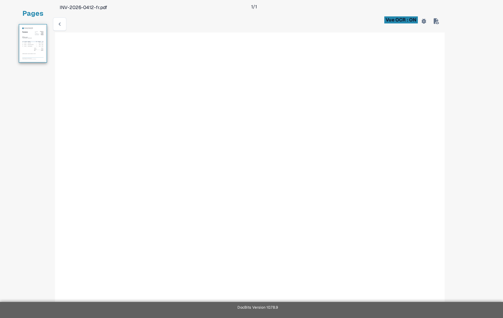

# Dépannage

Si une valeur manque sur l'écran de validation, vérifiez d'abord si le texte est visible dans le document et si DocBits l'a reconnu. Cela permet de distinguer un problème de lecture d'un problème de champ ou de règle.

1. Ouvrez le document concerné dans **Validation**.
2. Comparez le document original avec la **Vue OCR**. Vérifiez la même page et la même zone où la valeur devrait apparaître.
3. Si le texte est absent de la Vue OCR, suivez [Texte manquant dans l'extraction OCR](missing-text-in-ocr-extraction.md).
4. Si le texte est présent dans la Vue OCR mais que le champ reste vide, demandez à un administrateur de vérifier la configuration des champs du type de document. Indiquez le type de document, le nom du champ, la page et un exemple de test sécurisé.

<figure><figcaption>
Vue OCR actuelle de l'environnement Sandbox en français pour une facture synthétique Test A. L'exemple sert de repère ; il ne montre pas une extraction échouée.
</figcaption></figure>

N'incluez pas de documents clients ni de données personnelles dans une capture d'écran destinée au support. La [présentation de l'écran de validation](../README.md) explique les principales commandes si vous découvrez cet écran.
