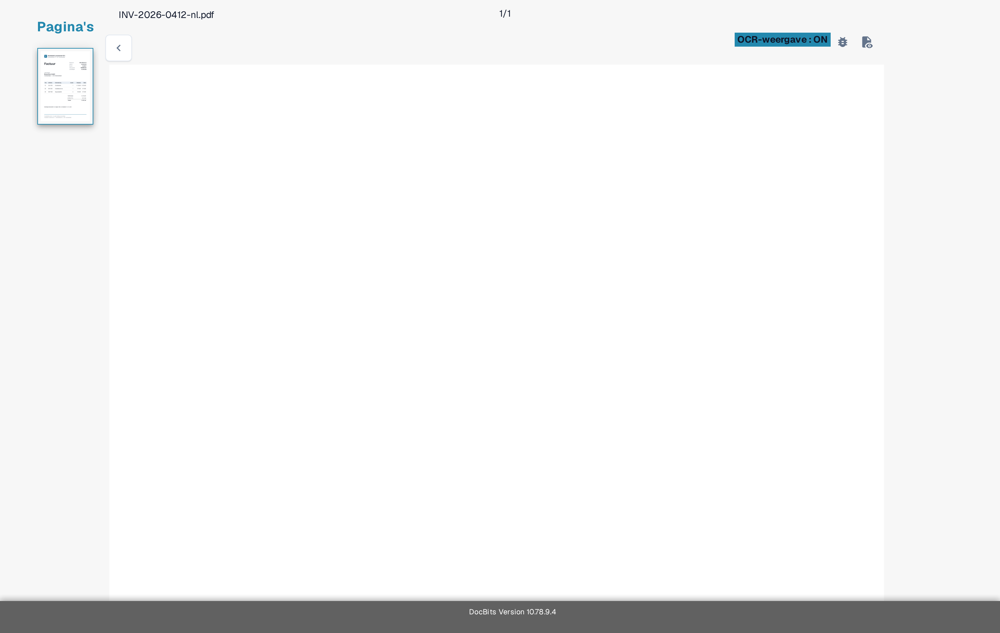

# Probleemoplossing

Als een waarde ontbreekt op het validatiescherm, controleer dan eerst of de tekst zichtbaar is in het document en of DocBits deze heeft herkend. Zo onderscheidt u een leesprobleem van een veld- of regelprobleem.

1. Open het betreffende document in **Validatie**.
2. Vergelijk het originele document met de **OCR-weergave**. Controleer dezelfde pagina en hetzelfde gebied waar de waarde zou moeten verschijnen.
3. Als de tekst ontbreekt in de OCR-weergave, volg [Ontbrekend Tekst in OCR Extractie](missing-text-in-ocr-extraction.md).
4. Als de tekst wel in de OCR-weergave staat maar het veld leeg blijft, vraag een beheerder om de veldconfiguratie van het documenttype te controleren. Vermeld het documenttype, de veldnaam, de pagina en een veilig testvoorbeeld.

<figure><figcaption>
Huidige Nederlandse Sandbox OCR-weergave van een synthetische factuur van Test A. Het voorbeeld dient ter oriëntatie; het toont geen mislukte extractie.
</figcaption></figure>

Neem geen klantdocumenten of persoonsgegevens op in een support-screenshot. Het [overzicht van het validatiescherm](../README.md) legt de belangrijkste bedieningselementen uit als u dit scherm nog niet kent.
