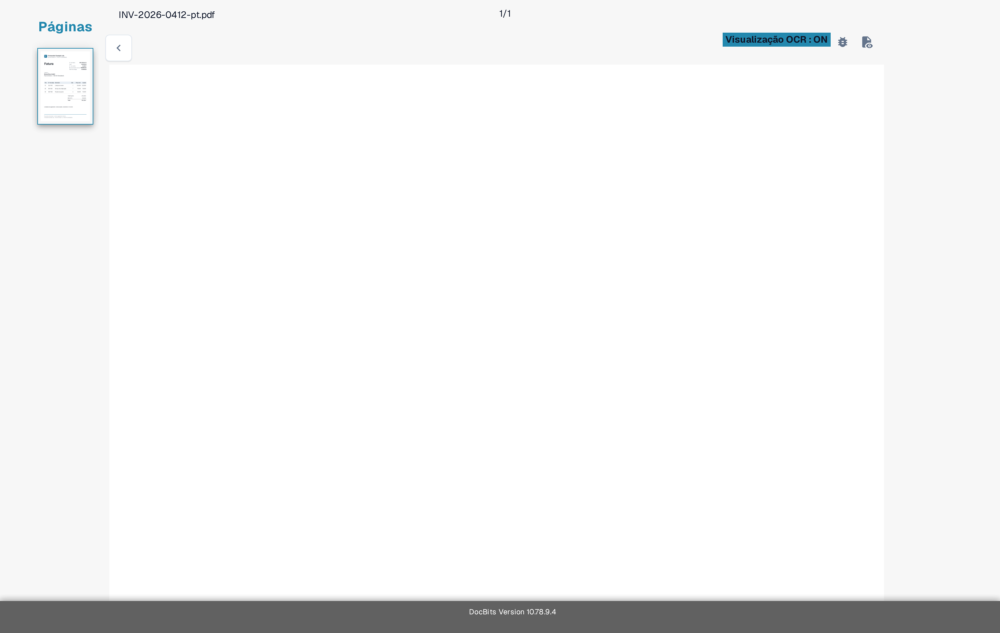

# Solução de Problemas

Se um valor estiver ausente na tela de validação, verifique primeiro se o texto está visível no documento e se o DocBits o reconheceu. Isso ajuda a distinguir um problema de leitura de um problema de campo ou de regra.

1. Abra o documento afetado na **Validação de Campo**.
2. Compare o documento original com a **Visualização OCR**. Verifique a mesma página e a mesma área onde o valor deveria aparecer.
3. Se o texto estiver ausente na Visualização OCR, siga [Texto Ausente na Extração de OCR](missing-text-in-ocr-extraction.md).
4. Se o texto estiver presente na Visualização OCR mas o campo continuar vazio, peça a um administrador para verificar a configuração dos campos do tipo de documento. Informe o tipo de documento, o nome do campo, a página e um exemplo de teste seguro.

<figure><figcaption>
Visualização OCR atual da Sandbox em português para uma fatura sintética do Test A. O exemplo serve apenas como orientação; ele não mostra uma extração com falha.
</figcaption></figure>

Não inclua documentos de clientes nem dados pessoais em uma captura de tela destinada ao suporte. A [Visão geral da Tela de Validação](../README.md) explica os controles principais caso você não conheça esta tela.
