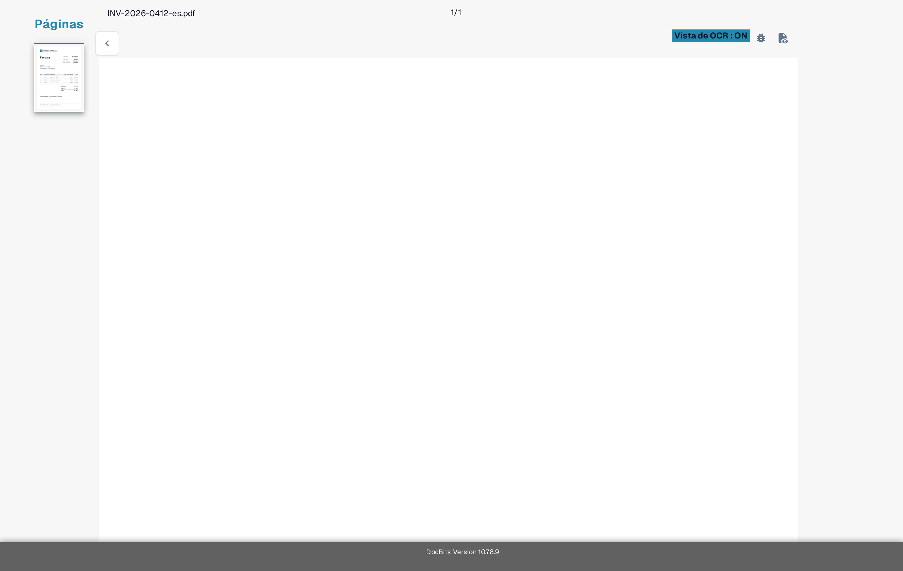

# Solución de problemas

Si falta un valor en la pantalla de validación, compruebe primero si el texto es visible en el documento y si DocBits lo reconoció. Esto le ayuda a distinguir un problema de lectura de un problema de campo o de regla.

1. Abra el documento afectado en **Validación**.
2. Compare el documento original con la **Vista de OCR**. Revise la misma página y la misma zona donde debería aparecer el valor.
3. Si el texto falta en la Vista de OCR, siga [Texto faltante en la extracción de OCR](missing-text-in-ocr-extraction.md).
4. Si el texto está en la Vista de OCR pero el campo sigue vacío, pida a un administrador que revise la configuración de campos del tipo de documento. Incluya el tipo de documento, el nombre del campo, la página y un ejemplo de prueba seguro.

<figure><figcaption>Vista de OCR actual de Sandbox en español de una factura sintética de Test A. El ejemplo es solo orientativo; no muestra una extracción fallida.</figcaption></figure>

No incluya documentos de clientes ni datos personales en una captura de pantalla de soporte. La [Descripción de la pantalla de validación](../README.md) explica los controles principales si es nuevo en esta pantalla.
