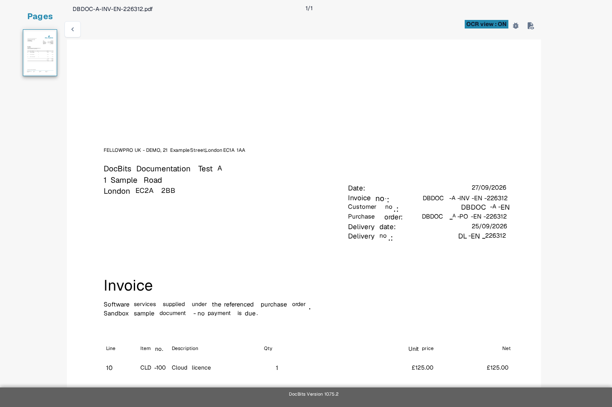

# Troubleshooting

If a value is missing on the validation screen, first check whether the text is visible in the document and whether DocBits recognised it. This helps you tell a reading problem from a field or rule problem.

1. Open the affected document in **Validation**.
2. Compare the original document with **OCR view**. Check the same page and the same area where the value should appear.
3. If the text is missing from OCR view, follow [Missing Text in OCR Extraction](missing-text-in-ocr-extraction.md).
4. If the text is present in OCR view but the field stays empty, ask an administrator to check the document type's field setup. Include the document type, field name, page and a safe test example.

<figure><figcaption>Current English Sandbox OCR view of a synthetic Test A invoice. The sample is for orientation; it does not show a failed extraction.</figcaption></figure>

Do not include customer documents or personal data in a support screenshot. The [Validation Screen overview](../README.md) explains the main controls if you are new to this screen.
