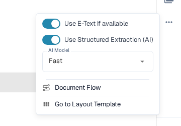
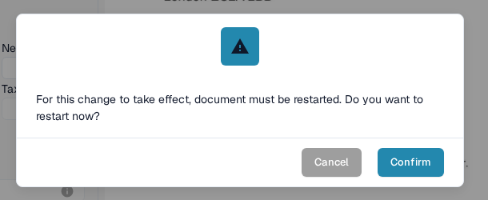
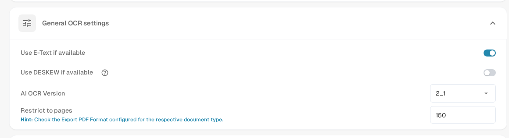

# Missing Text in OCR Extraction

If text is visible on a document but a field cannot be extracted, first check whether DocBits recognized that text. A scanned image and a PDF's embedded text can produce different results. Do not change an extraction rule until you know which text is available.

## Check the OCR view

1. Open the document in **Field Validation**.
2. In the toolbar on the right, select the **OCR View** icon. The OCR view opens in a separate browser tab.
3. Look for the missing word or number in the recognized text overlay. If it is absent, field extraction cannot select it from that text layer. If it is present, check the field mapping instead.

<figure><figcaption>
Compare the text on the document with the words shown in OCR View. This example shows recognized text, not a failed extraction.
</figcaption></figure>

## Try OCR instead of embedded E-Text for one supplier

When **Use E-Text if available** is enabled, DocBits can use text already embedded in the PDF. Text that exists only inside an image may be missing from that layer. For a supplier whose documents have this problem:

1. Open one of that supplier's documents in **Field Validation**.
2. Select **More options** (three dots) in the toolbar on the right.
3. Turn off **Use E-Text if available**.
4. Read the restart prompt and select **Confirm** to save the change and reprocess the document. Select **Cancel** to leave the setting unchanged.
5. Open **OCR View** again after processing and check whether the missing text appears.

<figure><figcaption>
The supplier E-Text switch is in More options on the validation screen.
</figcaption></figure>

<figure><figcaption>
Confirming the supplier setting restarts processing of the open document.
</figcaption></figure>

## Change the organization default

An administrator can open **Settings → Document Processing → OCR Settings → General OCR settings** and turn off **Use E-Text if available** for the organization. This changes the default for later processing; check and reprocess already affected documents separately. See [OCR Settings](https://docs.docbits.com/administration-and-setup/settings/document-processing/ocr-settings) for the other OCR controls.

<figure><figcaption>
Use the organization setting when the issue affects documents from multiple suppliers.
</figcaption></figure>

If the text is still absent after reprocessing, review the scan quality and contact your DocBits administrator or support with the document ID and the page number. Do not send a sensitive document in a public support request.
