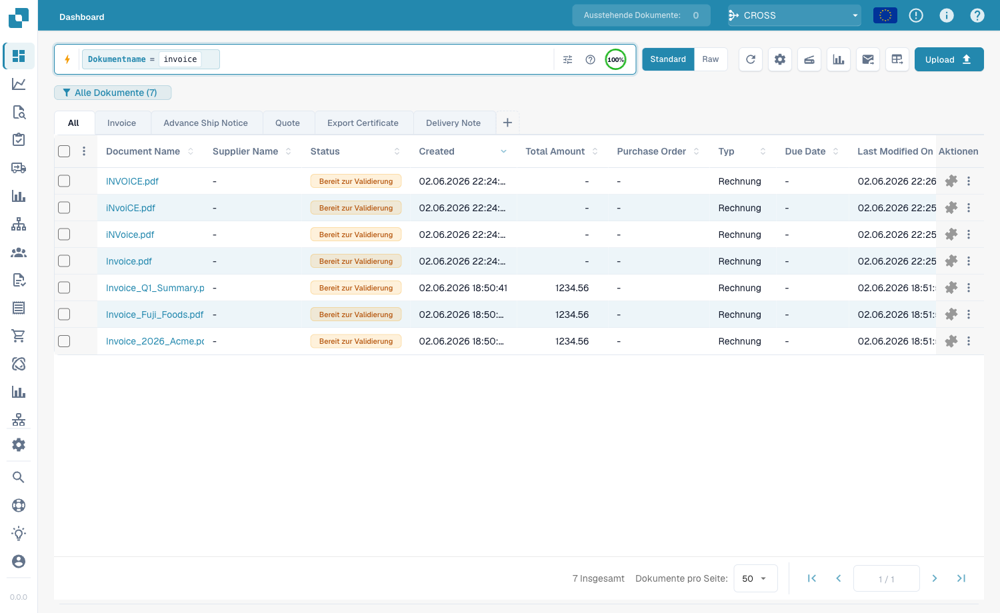
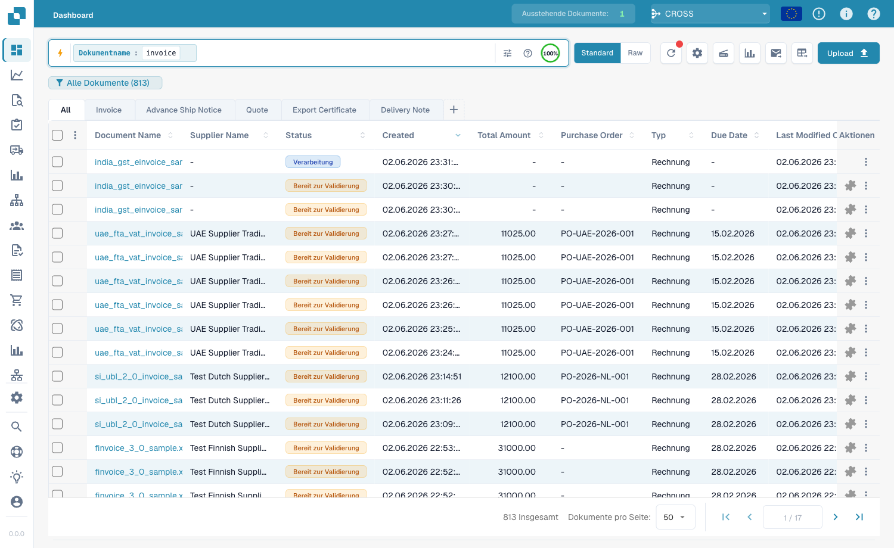
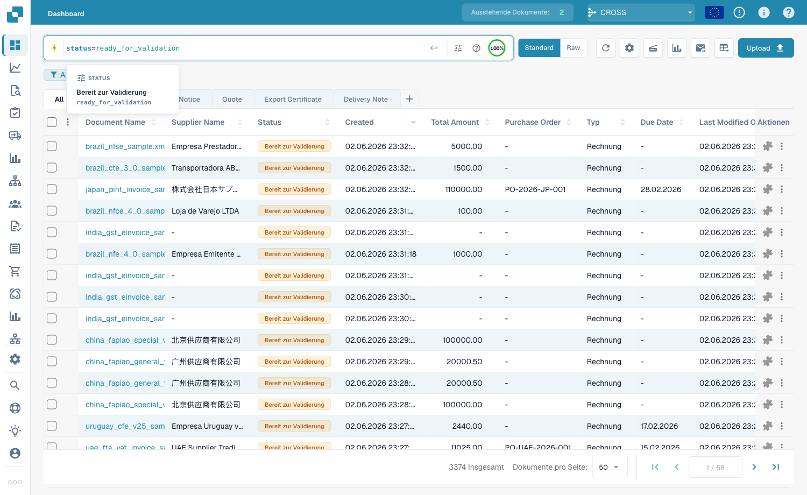
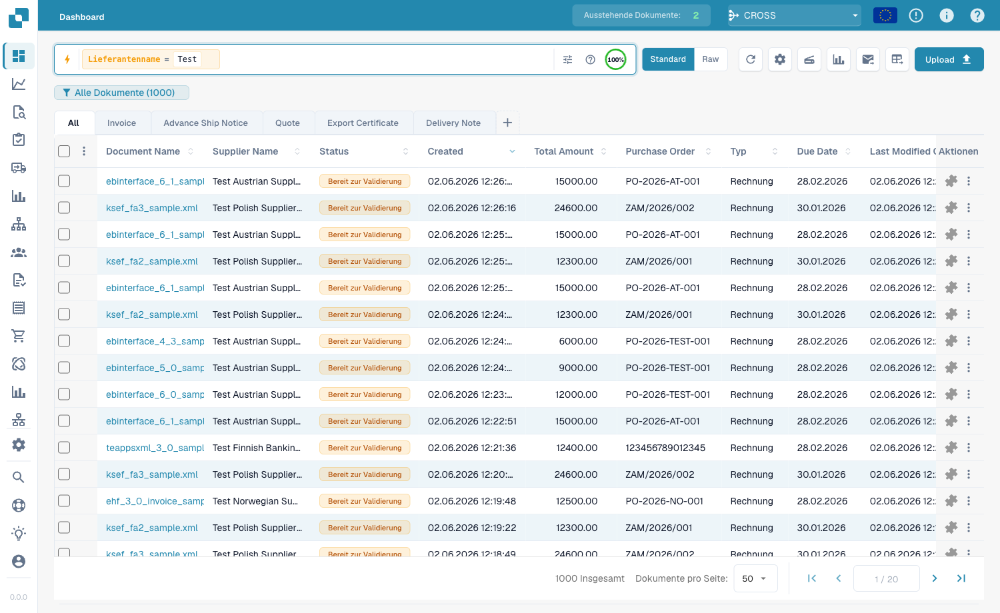
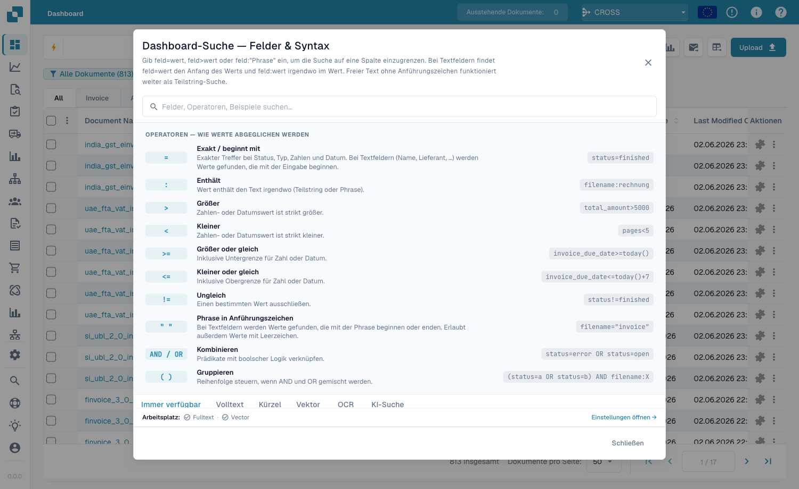
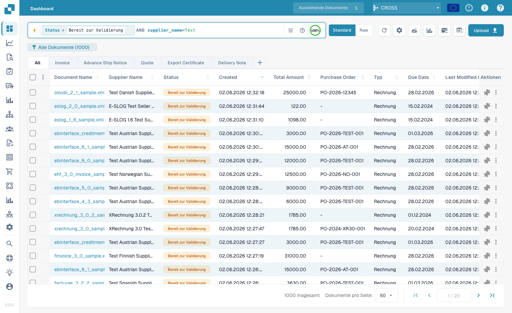
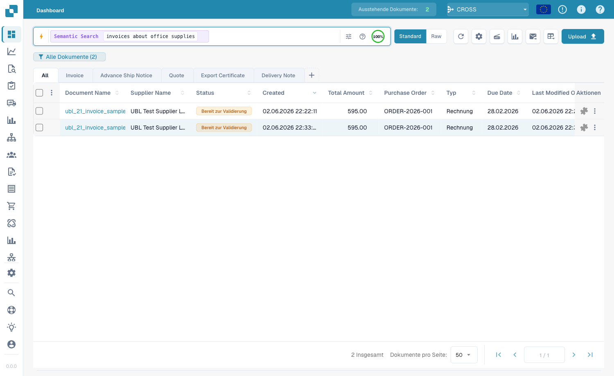
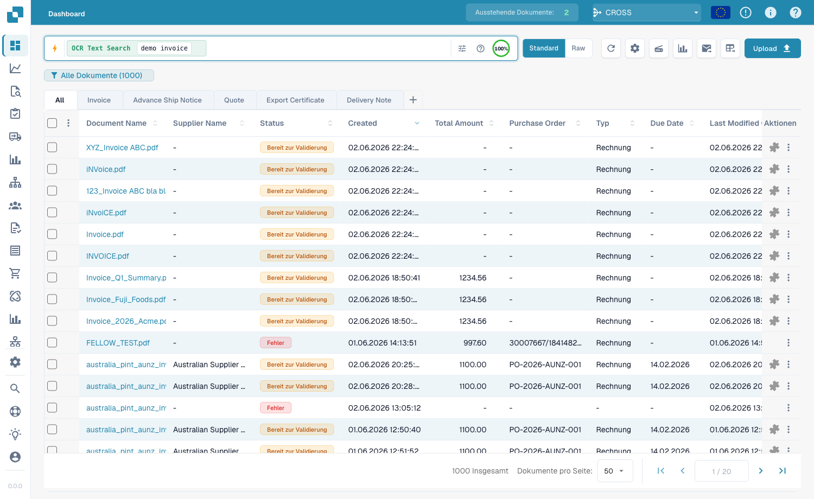
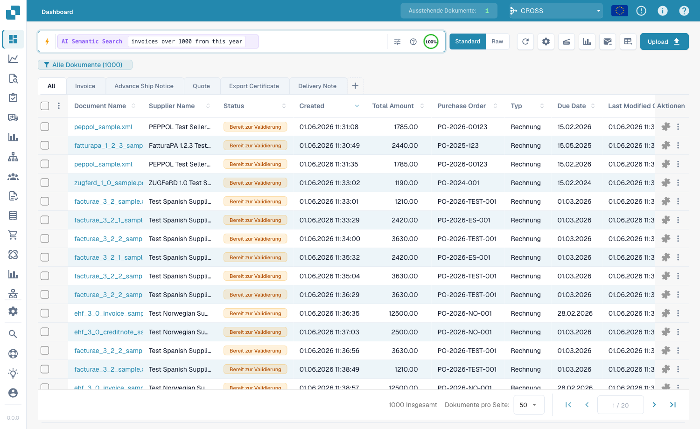

# Schnellsuche

Die **Schnellsuche** oben im Dashboard ist der schnellste Weg, Dokumente zu
finden. Du tippst, wonach du suchst — einen Namen, einen Status, einen Betrag,
ein Datum — und die Dokumentenliste filtert sofort.

Diese Anleitung ist so aufgebaut, wie die Suche selbst funktioniert:

1. **Standardfelder** — die Spalten, die jedes Dokument hat (Dokumentname,
   Status, Datum). Immer verfügbar.
2. **Volltextfelder** — extrahierte Inhalte (Lieferant, Bestellnummer,
   Rechnungsnummer, Beträge, Positionen). Verfügbar, wenn die Volltextsuche
   aktiviert ist.
3. **Operatoren, Kürzel & Rezepte** — die vollständige Referenz, wenn du sicher
   bist.

> Du musst dir nichts merken: Klicke in die Suchleiste und wähle Feld und Wert
> aus der Liste — die Schnellsuche baut die Abfrage für dich. Die Beispiele
> unten zeigen zusätzlich die Tippform zum direkten Kopieren.

---

## Teil 1 — Standardfelder

Standardfelder sind die eigenen Spalten des Dokuments. Sie sind **immer
verfügbar**, egal ob die Volltextsuche aktiviert ist oder nicht.

### Dokumente nach Name finden

Der Dokumentname ist die häufigste Suche. Es gibt drei Arten, ihn zu treffen —
alle **ohne Beachtung der Groß-/Kleinschreibung**:

#### `=` → beginnt mit

```
filename=invoice
```

Findet Dokumente, deren Name mit „invoice" **beginnt**. Da Groß-/Kleinschreibung
ignoriert wird, treffen alle diese auf `filename=invoice` zu:

```
Invoice.pdf   iNVoice.pdf   iNvoiCE.pdf   INVOICE.pdf
Invoice.xml   iNVoice.xml   iNvoiCE.edi   …
```

Es trifft **nicht** auf `XYZ_Invoice.pdf` zu (dort steht „invoice" in der Mitte
— dafür nutzt du `:`).

<figure><figcaption><p><code>filename=invoice</code> — nur Namen, die mit „invoice" <strong>beginnen</strong>, in jeder Schreibweise (<code>INVOICE.pdf</code>, <code>iNvoiCE.pdf</code>, <code>iNVoice.pdf</code>, <code>Invoice.pdf</code> treffen alle — 7 Treffer).</p></figcaption></figure>

#### `:` → enthält (irgendwo)

```
filename:invoice
```

Mit `:` triffst du das Wort **irgendwo** im Namen — `2026_Invoice.pdf`,
`XYZ_Invoice ABC.pdf`, `123_Invoice ABC bla bla.pdf`.

<figure><figcaption><p><code>filename:invoice</code> — trifft „invoice" an beliebiger Stelle im Namen (auch <code>XYZ_Invoice ABC.pdf</code>).</p></figcaption></figure>

#### `="…"` → beginnt *oder* endet mit

```
filename="invoice"
```

Anführungszeichen lassen `=` Namen treffen, die mit dem Wert **beginnen oder
enden** — praktisch für einen Präfix-Code oder eine Dateiendung.

> **Die drei in einer Zeile:** `=` → beginnt mit · `:` → enthält · `="…"` →
> beginnt oder endet mit. Alle ignorieren Groß-/Kleinschreibung.

### Dokumente nach Status finden

```
status=ready_for_validation
```

Status ist eine feste Liste, daher ist `=` ein **exakter** Treffer und die
Leiste bietet beim Tippen von `status=` eine Werteauswahl an.

<figure><figcaption><p><code>status=ready_for_validation</code> — exakter Treffer auf einem Feld mit fester Werteliste.</p></figcaption></figure>

### Dokumente nach Datum finden

```
created_on>2026-05-25
```

Nutze `>`, `<`, `>=`, `<=` für Datumsbereiche. Es gehen auch **relative** Daten:
`today()`, `today()-7` (letzte 7 Tage), `today()+30` (nächste 30 Tage).

---

## Teil 2 — Volltextfelder

Volltextfelder durchsuchen die **extrahierten Inhalte** deiner Dokumente —
Lieferant, Bestellnummer, Rechnungsnummer, Beträge, Positionen. Sie erscheinen
**orange** und sind verfügbar, wenn die **Volltextsuche aktiviert** ist. Die
Trefferregeln sind exakt wie bei Standard-Textfeldern (`=` beginnt-mit,
`:` enthält, `="…"` beginnt-oder-endet).

### Dokumente eines Lieferanten finden

```
supplier_name=Test
```

Beginnt-mit auf dem extrahierten Lieferantennamen; `supplier_name:fuji` trifft
ihn irgendwo; `supplier_name:"Ruiz Foods"` setzt einen Wert mit Leerzeichen in
Anführungszeichen.

<figure><figcaption><p><code>supplier_name=Test</code> — jeder Treffer hat einen Lieferanten, der mit „Test" beginnt.</p></figcaption></figure>

### Nach Betrag finden

```
total_amount>5000
```

Nutze `>`, `<`, `>=`, `<=` oder `between 1000 and 5000` für ein Fenster
(entspricht `total_amount>=1000 AND total_amount<=5000`).

### Finden, was fehlt

```
supplier_name=""
```

`=""` bedeutet „dieses Feld ist **nicht gesetzt**"; `supplier_name!=""` bedeutet
„hat einen beliebigen Lieferanten". Dieselbe Prüfung geht auf jedem Feld, z. B.
`ap_assignment_code=""` für Dokumente ohne AP-Zuordnungscode.

---

## Smart Filter — ein Klick

Oben im Schnellsuche-Dropdown (Klick in die Suchleiste) findest du die **Smart
Filter**: fertige Suchen mit einem Klick. Jeder ist nur ein Kürzel für eine
Abfrage, die du auch selbst tippen könntest:

| Smart Filter | Findet | Entspricht |
|--------------|--------|------------|
| ⚠️ **Überfällig** | Fälligkeitsdatum überschritten | `invoice_due_date<today()` |
| 🕐 **Bald fällig** | Innerhalb der nächsten 7 Tage | `invoice_due_date<=today()+7` |
| 👤 **Mir zugewiesen** | Wartet auf deine Aktion | `assigned_to=<du>` |
| 📅 **Heutiger Eingang** | Heute importiert | `imported_on>=today()` |
| 📋 **Wartet auf Validierung** | Bereit zur Validierung | `status=ready_for_validation` |
| 🧾 **Elektronische Dokumente** | E-Rechnungen (XML, ZUGFeRD, EDI) | `is_edoc=true` |
| ✅ **Voller PO-Abgleich** | Vollständig mit Bestellung abgeglichen | `po_match_status=full_matched` |
| ➗ **Teilweiser PO-Abgleich** | Teilweise mit Bestellung abgeglichen | `po_match_status=partial_matched` |
| 📉 **Unter-PO-Abgleich** | Menge oder Einzelpreis unter der Bestellung | `po_match_status=under_matched` |

Die drei **PO-Abgleich**-Filter und die Volltextfelder erfordern eine
aktivierte Volltextsuche.

---

## Teil 3 — Operatoren, Verknüpfungen, Kürzel

### Die eingebaute Hilfe

Das **Hilfe-Symbol** in der Suchleiste öffnet eine vollständige Referenz aller
Felder, Operatoren und Kürzel deines Arbeitsbereichs — inklusive, welche Felder
Standard und welche Volltext sind.

<figure><figcaption><p>Die eingebaute Hilfe <strong>Dashboard-Suche — Felder &#38; Syntax</strong> listet jeden Operator und wie Werte getroffen werden (z. B. „Exakt / beginnt mit").</p></figcaption></figure>

### Wie `=` je Feldtyp trifft

Jede Text-Trefferprüfung ignoriert die Groß-/Kleinschreibung.

| Feldtyp | Beispiel | `=` bedeutet |
|---------|----------|--------------|
| Text (Name, Lieferant, Bestellnummer) | `filename=invoice` | **beginnt mit** |
| Text, irgendwo | `filename:invoice` | **enthält** |
| Text, Anfang *oder* Ende | `filename="invoice"` | **beginnt oder endet mit** |
| Status / Typ / PO-Abgleich (feste Listen) | `status=finished` | **exakt** |
| Bezeichner (Rechnungsnr., Lieferanten-ID) | `invoice_number=INV-100` | **exakt** |
| Zahl | `total_amount>5000` | Bereich (`> < >= <= between`) |
| Datum | `created_on>2026-01-01` | Bereich + `today()±N` |

### Operatoren

| Operator | Bedeutung |
|----------|-----------|
| `=` | beginnt-mit (Text) / exakt (Liste, Zahl, Datum) |
| `:` | enthält (Text, irgendwo) |
| `="…"` | beginnt-mit oder endet-mit (Text) |
| `!=` | das Gegenteil von `=` |
| `>` `<` `>=` `<=` | größer / kleiner als |
| `between … and …` | inklusiver Bereich |
| `field=""` / `field!=""` | ist leer / ist gesetzt |
| `today()`, `today()-7`, `today()+30` | relative Daten |

### Verknüpfungen

Bedingungen kombinierst du mit **AND** (beide wahr), **OR** (eine genügt),
**NOT** und Klammern `( … )` zur Gruppierung:

```
status=ready_for_validation AND supplier_name=Test
(status=error OR status=failed) AND created_on>today()-1
```

<figure><figcaption><p><code>status=ready_for_validation AND supplier_name=Test</code> — zwei kombinierte Bedingungen.</p></figcaption></figure>

### Kürzel

Kürzere Schreibweisen für dieselben Abfragen — nimm, was sich besser liest:

| Kürzel | Entspricht |
|--------|------------|
| `total_amount gt 5000` | `total_amount>5000` (Wort-Aliasse gt/gte/lt/lte) |
| `due_date > today` | `due_date>today()` (bare today/yesterday/tomorrow) |
| `imported_on this_week` | diese ISO-Woche (auch `last_week`, `this_month`, …) |
| `ap_assignment_code is empty` | `ap_assignment_code=""` |
| `status:open` | `status=ready_for_validation` (open/closed/failed/done) |
| `total_amount not between 100, 200` | `total_amount<100 OR total_amount>200` |
| `status in (finished, error)` | `status=finished OR status=error` |
| `not status=finished` | `status!=finished` |
| `filename contains rechnung` | `filename:rechnung` (contains/starts_with/ends_with) |
| `total_amount > 5k` | `total_amount>5000` (`k`=Tausend, `M`=Million) |
| `overdue` | `invoice_due_date<today() AND status!=finished` |
| `#INV-1234` | `invoice_id:INV-1234` |
| `@User` | `assigned_to:User` |
| `$5000+` | `total_amount>=5000` |

---

## Teil 4 — Erweiterte Suchmodi

Über die Feldsuche hinaus durchsuchen drei Präfix-Modi den Dokumentinhalt selbst.

### Vektor- (semantische) Suche — `vector:`

Trifft nach **Bedeutung**, nicht nach exaktem Text — nützlich für „finde
Dokumente über XYZ". Erfordert das Vektor-Modul; gilt für den Dokumentinhalt.

```
vector: invoices about office supplies
vector: shipping delays with Hamburg port
```

<figure><figcaption><p><code>vector: invoices about office supplies</code> — semantisch verwandte Dokumente, auch ohne genau diese Wörter.</p></figcaption></figure>

### OCR-Textsuche — `ocr:`

Durchsucht den **Seitentext**, den die OCR extrahiert hat — nicht nur die
strukturierten Spalten. Nützlich, wenn der gesuchte Wert im Dokumenttext steht.

```
ocr: Versandkosten
ocr: "purchase order PO-12345"
ocr: Hamburg AND doc_type=INVOICE
ocr: IBAN
```

<figure><figcaption><p><code>ocr: demo invoice</code> — trifft Text, der irgendwo auf den Dokumentseiten steht.</p></figcaption></figure>

### Natürlichsprachige (KI-) Suche — `ai:`

Beschreibe in normaler Sprache, was du suchst; die KI liest deinen Satz und
extrahiert Filter (Lieferant, Daten, Beträge) in eine strukturierte Abfrage.
Anders als Vector **baut sie eine Abfrage**, statt ähnliche Dokumente zu finden.

```
ai: invoices from Ruiz over 1000 last quarter
ai: overdue invoices waiting on approval
ai: shipping documents from Hamburg last month
```

<figure><figcaption><p><code>ai: invoices over 1000 from this year</code> — die KI wandelt den Satz automatisch in Filter um.</p></figcaption></figure>

---

### Rezepte

| Du willst… | Tippe das |
|------------|-----------|
| Bereit zur Validierung, voll abgeglichen | `status=ready_for_validation AND po_match_status=full_matched` |
| Dieser Lieferant, diese Woche | `supplier_name=Test AND created_on>today()-7` |
| Hochwertige überfällige Rechnungen | `total_amount>5000 AND invoice_due_date<today()` |
| Zwei Lieferanten auf einmal | `supplier_name=fuji OR supplier_name=acme` |
| Fehlerhafte Dokumente von heute | `(status=error OR status=failed) AND created_on>today()-1` |
| Elektronische Gutschriften | `is_edoc=true AND sub_doc_type=CREDIT_NOTE` |
| Nach Bestellnummer-Präfix | `purchase_order=PO-2026` |

> Orange (Volltext-) Felder und die PO-Abgleich-Smart-Filter erfordern eine
> aktivierte **Volltextsuche**. Ein wörtliches `%` oder `_` im Wert wird als
> normales Zeichen behandelt.
