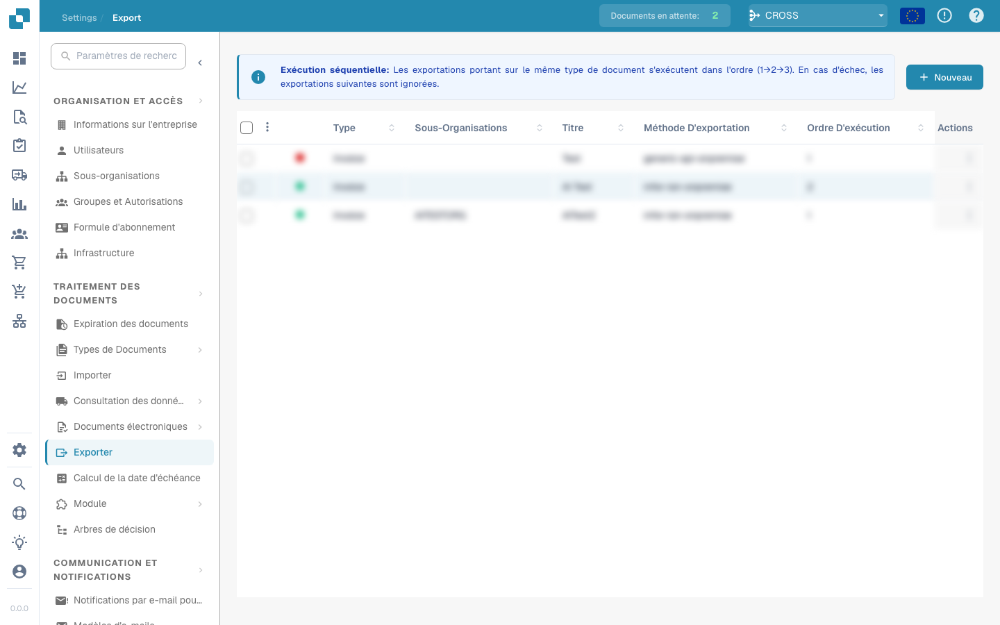

# Exportmodul

## Überblick

Die Export-Seite zeigt alle konfigurierten Export-Setups an, einschließlich der Information, ob sie aktiv oder inaktiv sind. Von hier aus können Benutzer:

* Bestehende Exportkonfigurationen anzeigen und verwalten
* Neue Exportverbindungen erstellen (z. B. zu **Infor**, **Infor & IDM**, **Webhook** oder **SFTP**)
* Bestehende Exportkonfigurationen bearbeiten oder löschen

## Wo Sie es finden

Sie finden es unter: **Settings** → **Document Processing** → **Export**

<figure><figcaption></figcaption></figure>

Ausführliche Anleitungen zur Konfiguration der einzelnen Exporttypen, einschließlich Screenshots und Feldbeschreibungen, finden Sie im vollständigen Leitfaden:

[Leitfaden zur Exportkonfiguration anzeigen](../../administration-and-setup/settings/document-processing/export.md)
