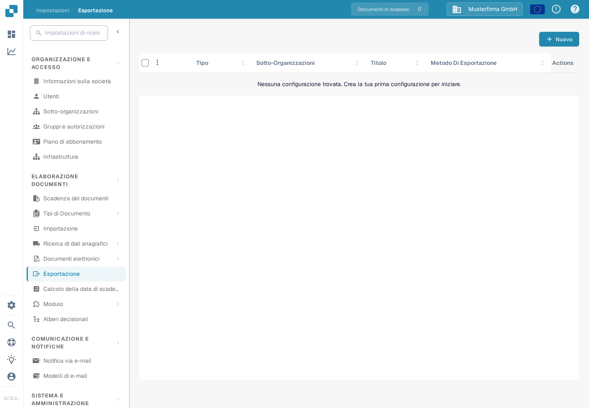
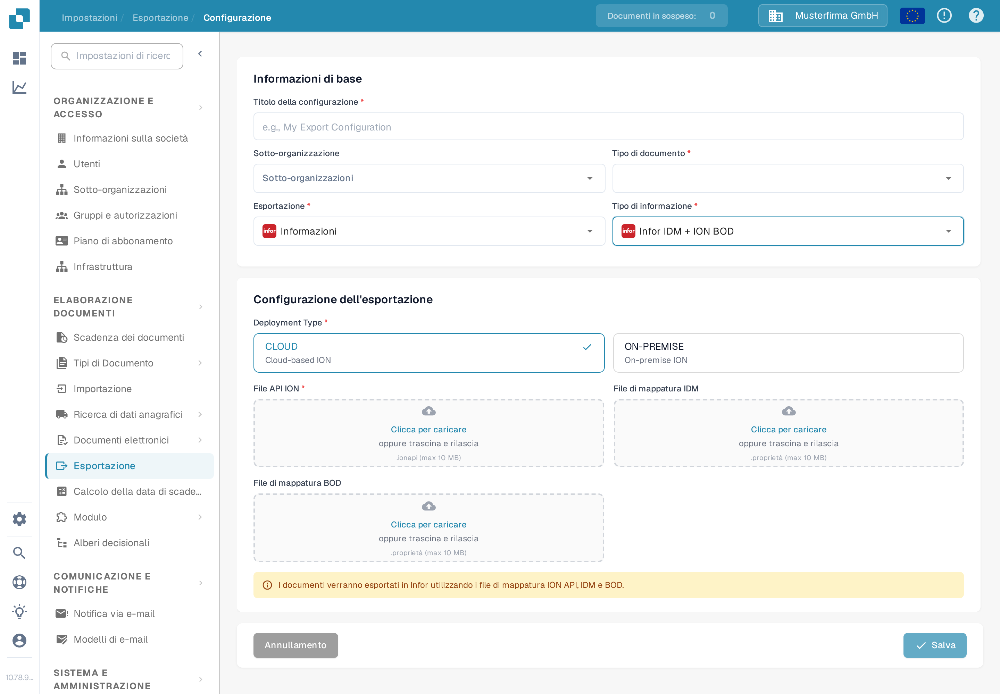

# Creazione di un endpoint API ION per le esportazioni DocBits

Un amministratore Infor configura l'endpoint API Gateway per il **singolo ambiente e organizzazione DocBits**. Le immagini vecchie di questa pagina mostravano un unico tenant Infor storico, un esempio fisso `api.docbits.com` e un modulo di esportazione DocBits più vecchio. Utilizzare l'URL di destinazione, la chiave API e il documento OpenAPI approvati per l'ambiente effettivo. Per questo aggiornamento non è stato collegato alcun tenant Infor né salvato alcun endpoint.

## Prima di iniziare

Raccogliere dall'amministratore di integrazione l'URL dell'API DocBits di destinazione, la chiave API approvata con il nome della sua intestazione, l'URL OpenAPI e gli ambienti Infor e DocBits previsti. Tenere le chiavi e i file `.ionapi` fuori dai ticket, dagli screenshot e dal repository Git. Verificare che un endpoint di prova non possa instradare verso la produzione.

## Configurare Infor API Gateway

1. In **Available APIs**, creare una suite API di tipo **Custom or Non-Infor** per l'ambiente di destinazione. Consultare le [istruzioni di Infor sulla suite API](https://docs.infor.com/inforos/2025.x/en-us/useradminlib_cloud/apigatewayag_cloud/gyy1489512842881.html).
2. Aggiungere alla suite un endpoint con l'**URL dell'endpoint di destinazione** approvato. Selezionare il tipo di autenticazione richiesto da quell'endpoint. Per **API Key**, Infor richiede **Nome chiave** e **Valore chiave**; usare il nome previsto dal contratto dell'API DocBits e la chiave emessa per questa organizzazione. Consultare i [campi dell'endpoint](https://docs.infor.com/inforos/2024.x/en-us/useradminlib_cloud/apigatewayag_cloud/bmg1489588707659.html) di Infor. Non copiare una chiave da un ambiente diverso.
3. Aggiungere l'URL OpenAPI/Swagger dell'ambiente nelle impostazioni **Documentation** dell'endpoint, seguendo le [istruzioni di Infor sulla documentazione](https://docs.infor.com/ionapi/2021-x/en-us/ionapiag_cloud/tzr1489597424134.html). Verificare che l'endpoint compaia nei [metadati dell'API](https://docs.infor.com/ionapi/latest/en-us/ionapiag_cloud/tdr1489674063627.html).
4. Con l'amministratore Infor, verificare l'URL di destinazione, l'autenticazione, il percorso del proxy e una chiamata sicura fuori produzione prima di usare l'endpoint in un flusso di documenti ION. Salvare una suite API non dimostra di per sé che un documento sia stato consegnato.

## Configurare l'esportazione in DocBits

Nell'organizzazione DocBits prevista, aprire **Impostazioni → Esportazione** e selezionare **Nuovo**. L'organizzazione Sandbox di prova in italiano mostrata qui sotto non ha alcuna configurazione salvata.

<figure><figcaption>
Elenco esportazioni in Impostazioni di DocBits in italiano: nessuna configurazione salvata; il pulsante «Nuovo» si trova in alto a destra.
</figcaption></figure>

Immettere un **Titolo della configurazione**, scegliere il **Tipo di documento** e selezionare una **Sotto-organizzazione** solo se necessario. Impostare **Esportazione** sull'opzione la cui etichetta visualizzata è **Informazioni** (l'opzione «Infor» dell'applicazione, il cui testo italiano è attualmente tradotto in modo errato) e **Tipo di informazione** su **Infor IDM + ION BOD**. Il modulo attuale chiede quindi **Deployment Type** (**CLOUD** oppure **ON-PREMISE**), un **File API ION** (`.ionapi`, obbligatorio), un **File di mappatura IDM** (`.properties`) e un **File di mappatura BOD** (`.properties`). Questi file, specifici del tenant, si ottengono dall'amministratore. Lo screenshot lascia volutamente vuoti i campi di caricamento.

<figure><figcaption>
Modulo di esportazione «Infor IDM + ION BOD» nell'interfaccia Sandbox in italiano con le opzioni di distribuzione CLOUD e ON-PREMISE; i campi File API ION, File di mappatura IDM e File di mappatura BOD sono vuoti.
</figcaption></figure>

Dopo che l'amministratore ha convalidato il percorso ION, salvare la configurazione e testare un documento fuori produzione. Verificarne lo stato in DocBits e in Infor ION. Un modulo salvato o una voce nei metadati dell'API non dimostrano un'esportazione riuscita.
