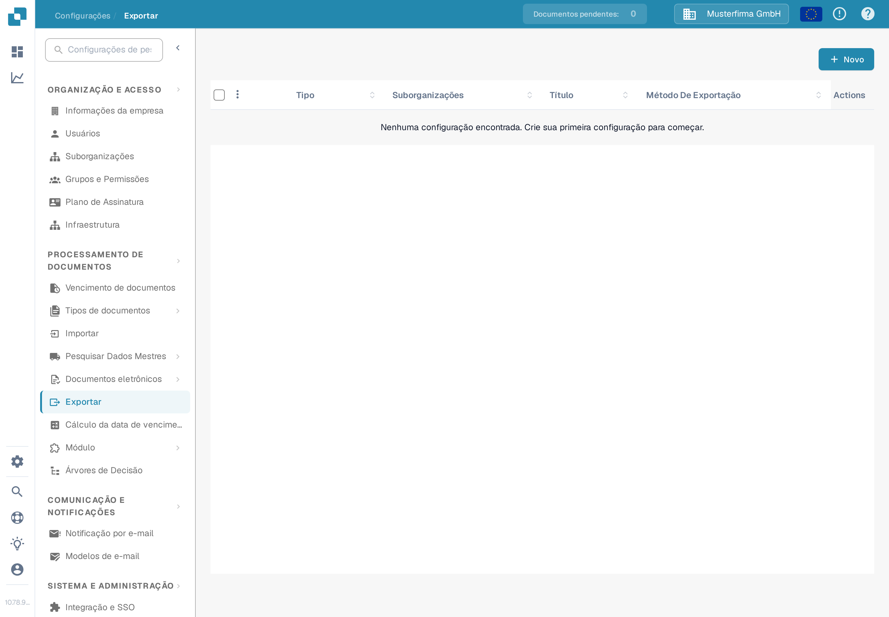
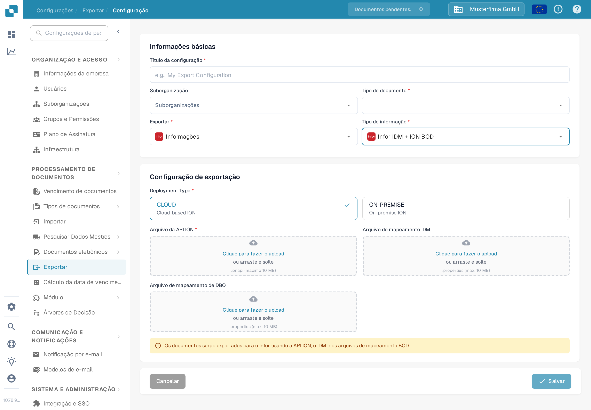

# Criar um endpoint da API ION da Infor para as exportações do DocBits

Um administrador da Infor configura o endpoint do API Gateway para o **ambiente e a organização específicos do DocBits**. As imagens antigas nesta página mostravam um tenant histórico da Infor, um exemplo fixo de `api.docbits.com` e um formulário de exportação mais antigo do DocBits. Use a URL de destino, a chave de API e o documento OpenAPI aprovados para o seu ambiente real. Nenhum tenant da Infor foi conectado nem nenhum endpoint foi salvo para esta atualização.

## Antes de começar

Reúna com o administrador da integração a URL de destino da API do DocBits, a chave de API aprovada e o nome do seu cabeçalho, a URL do OpenAPI e os ambientes pretendidos da Infor e do DocBits. Mantenha as chaves e os arquivos `.ionapi` fora de tickets, capturas de tela e do repositório Git. Confirme que um endpoint de teste não pode encaminhar para produção.

## Configurar o Infor API Gateway

1. Em **Available APIs**, crie um pacote de API **Custom or Non-Infor** para o ambiente de destino. Consulte as [instruções da Infor sobre pacotes de API](https://docs.infor.com/inforos/2025.x/en-us/useradminlib_cloud/apigatewayag_cloud/gyy1489512842881.html).
2. Adicione um endpoint ao pacote com a **Target Endpoint URL** aprovada. Selecione o tipo de autenticação exigido por esse endpoint. Para **API Key**, a Infor pede um **Key Name** e um **Key Value**; use o nome especificado no contrato da API do DocBits e a chave emitida para esta organização. Consulte os [campos do endpoint](https://docs.infor.com/inforos/2024.x/en-us/useradminlib_cloud/apigatewayag_cloud/bmg1489588707659.html) da Infor. Não copie uma chave de outro ambiente.
3. Adicione a URL de OpenAPI/Swagger do ambiente nas configurações de **Documentation** do endpoint, seguindo as [instruções da Infor sobre documentação](https://docs.infor.com/ionapi/2021-x/en-us/ionapiag_cloud/tzr1489597424134.html). Verifique se o endpoint aparece nos [metadados da API](https://docs.infor.com/ionapi/latest/en-us/ionapiag_cloud/tdr1489674063627.html).
4. Junto com o administrador da Infor, verifique a URL de destino, a autenticação, o caminho do proxy e uma chamada segura fora de produção antes de usar o endpoint em um fluxo de documentos ION. Salvar um pacote de API sozinho não prova que um documento foi entregue.

## Configurar a exportação no DocBits

Na organização pretendida do DocBits, abra **Configurações → Exportar** e selecione **Novo**. A organização Sandbox mostrada abaixo não tem nenhuma configuração salva.

<figure><figcaption>
Lista de exportações em Configurações do DocBits em português: nenhuma configuração salva; o botão «Novo» fica no canto superior direito.
</figcaption></figure>

Digite um **Título da configuração**, escolha o **Tipo de documento** e selecione uma **Suborganização** somente se for necessário. Defina **Exportar** como o valor exibido **Informações** (a opção «Infor» no aplicativo; seu rótulo em português está atualmente mal traduzido) e **Tipo de informação** como **Infor IDM + ION BOD**. O formulário atual então pede **Deployment Type** (**CLOUD** ou **ON-PREMISE**), um **Arquivo da API ION** (`.ionapi`, obrigatório), **Arquivo de mapeamento IDM** (`.properties`) e **Arquivo de mapeamento de DBO** (`.properties`). Obtenha esses arquivos específicos do tenant com o administrador. A captura de tela deixa de propósito todos os envios vazios.

<figure><figcaption>
Formulário de exportação «Infor IDM + ION BOD» na interface do Sandbox em português, com as opções de implantação CLOUD e ON-PREMISE; os campos Arquivo da API ION, Arquivo de mapeamento IDM e Arquivo de mapeamento de DBO estão vazios.
</figcaption></figure>

Depois que o administrador validar a rota ION, salve a configuração e teste um documento fora de produção. Verifique seu status no DocBits e no Infor ION. Um formulário salvo ou uma entrada nos metadados da API não prova uma exportação bem-sucedida.
