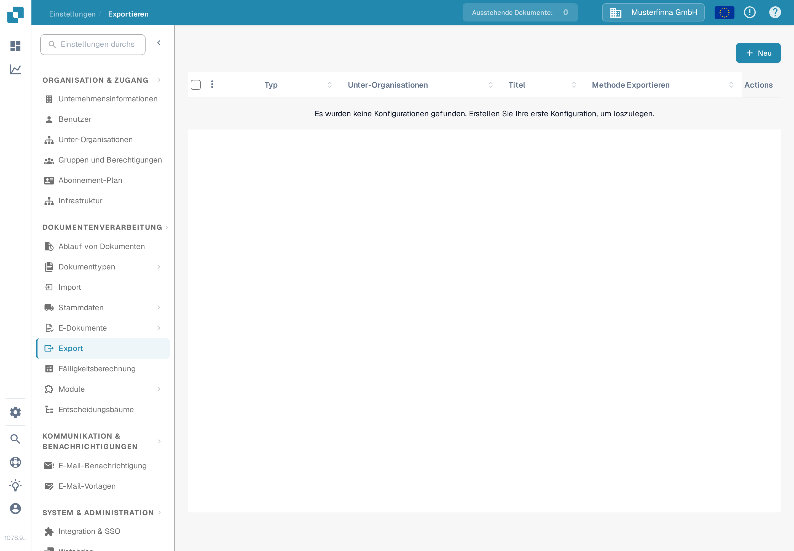
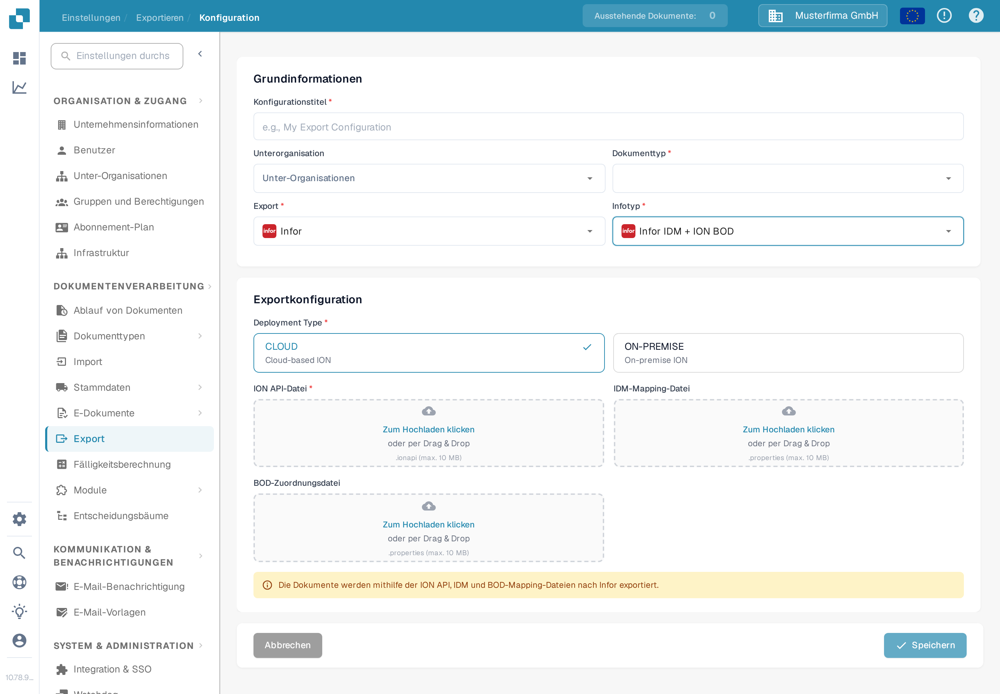

# Erstellen eines Infor-ION-API-Endpunkts für DocBits-Exporte

Ein Infor-Administrator richtet den API-Gateway-Endpunkt für die **bestimmte DocBits-Umgebung und -Organisation** ein. Die alten Bilder auf dieser Seite zeigten einen einzelnen historischen Infor-Tenant, ein festes `api.docbits.com`-Beispiel und ein älteres DocBits-Exportformular. Verwenden Sie die freigegebene Ziel-URL, den freigegebenen API-Schlüssel und das OpenAPI-Dokument für Ihre tatsächliche Umgebung. Für diese Aktualisierung wurde kein Infor-Tenant verbunden und kein Endpunkt gespeichert.

## Vor dem Start

Ermitteln Sie bei Ihrem Integrations-Administrator die Ziel-DocBits-API-URL, den freigegebenen API-Schlüssel samt seinem Header-Namen, die OpenAPI-URL sowie die vorgesehenen Infor- und DocBits-Umgebungen. Bewahren Sie Schlüssel und `.ionapi`-Dateien nicht in Tickets, Screenshots oder dem Git-Repository auf. Stellen Sie sicher, dass ein Test-Endpunkt nicht in die Produktion leiten kann.

## Infor API Gateway konfigurieren

1. Erstellen Sie in **Available APIs** eine API-Suite des Typs **Custom or Non-Infor** für die Zielumgebung. Siehe Infor-Anleitung [API suite instructions](https://docs.infor.com/inforos/2025.x/en-us/useradminlib_cloud/apigatewayag_cloud/gyy1489512842881.html).
2. Fügen Sie der Suite einen Endpunkt mit der freigegebenen **Target Endpoint URL** hinzu. Wählen Sie den Authentifizierungstyp, den dieser Endpunkt verlangt. Bei **API Key** fragt Infor nach **Key Name** und **Key Value**; verwenden Sie den im DocBits-API-Vertrag festgelegten Namen und den für diese Organisation ausgestellten Schlüssel. Siehe Infor-Anleitung [endpoint fields](https://docs.infor.com/inforos/2024.x/en-us/useradminlib_cloud/apigatewayag_cloud/bmg1489588707659.html). Übernehmen Sie keinen Schlüssel aus einer anderen Umgebung.
3. Tragen Sie die OpenAPI-/Swagger-URL der Umgebung unter den **Documentation**-Einstellungen des Endpunkts ein, gemäß Infor-Anleitung [documentation instructions](https://docs.infor.com/ionapi/2021-x/en-us/ionapiag_cloud/tzr1489597424134.html). Prüfen Sie, dass der Endpunkt in den [API metadata](https://docs.infor.com/ionapi/latest/en-us/ionapiag_cloud/tdr1489674063627.html) erscheint.
4. Prüfen Sie gemeinsam mit dem Infor-Administrator die Ziel-URL, Authentifizierung, Proxy-Pfad und einen sicheren Aufruf außerhalb der Produktion, bevor Sie den Endpunkt in einem ION-Dokumentenfluss verwenden. Eine nur gespeicherte API-Suite belegt noch nicht, dass ein Dokument ausgeliefert wurde.

## Export in DocBits konfigurieren

Öffnen Sie in der vorgesehenen DocBits-Organisation **Einstellungen → Export** und wählen Sie **Neu**. Die unten gezeigte deutsche Sandbox-Testorganisation hat keine gespeicherte Konfiguration.

<figure><figcaption>
Exportliste in den deutschen DocBits-Einstellungen: noch keine Konfiguration gespeichert, oben rechts die Schaltfläche „Neu“.
</figcaption></figure>

Geben Sie einen **Konfigurationstitel** ein, wählen Sie den **Dokumenttyp** und wählen Sie eine **Unterorganisation** nur bei Bedarf. Setzen Sie **Export** auf **Infor** und **Infotyp** auf **Infor IDM + ION BOD**. Das aktuelle Formular fragt dann nach **Deployment Type** (**CLOUD** oder **ON-PREMISE**), einer **ION API-Datei** (`.ionapi`, Pflicht), einer **IDM-Mapping-Datei** (`.properties`) und einer **BOD-Zuordnungsdatei** (`.properties`). Diese mandantenspezifischen Dateien erhalten Sie von Ihrem Administrator. Das Bild lässt die Uploads bewusst leer.

<figure><figcaption>
Exportformular „Infor IDM + ION BOD“ in der deutschen Sandbox-Oberfläche mit den Deployment-Optionen CLOUD und ON-PREMISE; die Felder für ION API-, IDM- und BOD-Datei sind leer gelassen.
</figcaption></figure>

Nachdem der Administrator die ION-Route geprüft hat, speichern Sie die Konfiguration und testen Sie ein Dokument außerhalb der Produktion. Prüfen Sie dessen Status in DocBits und in Infor ION. Ein gespeichertes Formular oder ein Eintrag in den API-Metadaten belegt keinen erfolgreichen Export.
