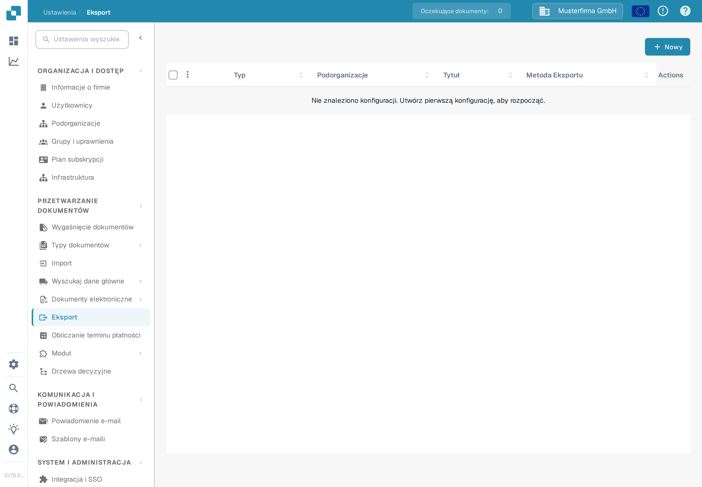
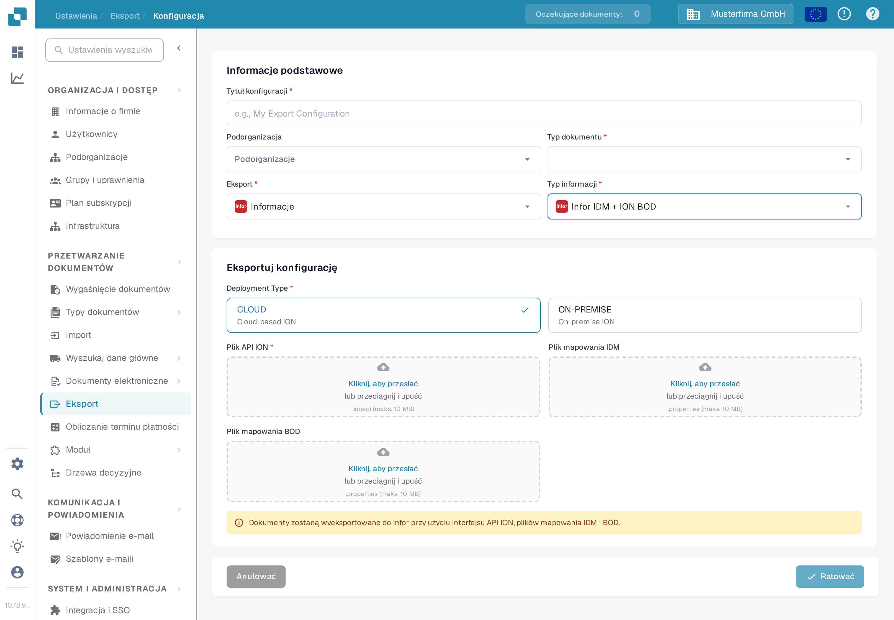

# Tworzenie punktu końcowego Infor ION API dla eksportów DocBits

Administrator Infor konfiguruje punkt końcowy API Gateway dla **konkretnego środowiska i organizacji DocBits**. Stare obrazy na tej stronie pokazywały jednego historycznego tenant Infor, stały przykład `api.docbits.com` oraz starszy formularz eksportu DocBits. Używaj zatwierdzonego docelowego adresu URL, klucza API i dokumentu OpenAPI dla swojego rzeczywistego środowiska. Żaden tenant Infor nie został podłączony ani żaden punkt końcowy nie został zapisany podczas tej aktualizacji.

## Zanim zaczniesz

Zbierz od administratora integracji docelowy adres URL API DocBits, zatwierdzony klucz API i nazwę jego nagłówka, adres URL OpenAPI oraz planowane środowiska Infor i DocBits. Trzymaj klucze i pliki `.ionapi` z dala od zgłoszeń, zrzutów ekranu i repozytorium Git. Upewnij się, że testowy punkt końcowy nie może kierować ruchu do produkcyjnego środowiska.

## Konfigurowanie Infor API Gateway

1. W **Available APIs** utwórz pakiet API typu **Custom or Non-Infor** dla docelowego środowiska. Zobacz [instrukcje Infor dotyczące pakietów API](https://docs.infor.com/inforos/2025.x/en-us/useradminlib_cloud/apigatewayag_cloud/gyy1489512842881.html).
2. Dodaj do pakietu punkt końcowy z zatwierdzonym **Target Endpoint URL**. Wybierz typ uwierzytelniania wymagany przez ten punkt końcowy. Dla **API Key** Infor pyta o **Key Name** i **Key Value**; użyj nazwy określonej w kontrakcie API DocBits oraz klucza wydanego dla tej organizacji. Zobacz [pola punktu końcowego](https://docs.infor.com/inforos/2024.x/en-us/useradminlib_cloud/apigatewayag_cloud/bmg1489588707659.html) Infor. Nie kopiuj klucza z innego środowiska.
3. Dodaj adres URL OpenAPI/Swagger środowiska w ustawieniach **Documentation** punktu końcowego, postępując zgodnie z [instrukcjami Infor dotyczące dokumentacji](https://docs.infor.com/ionapi/2021-x/en-us/ionapiag_cloud/tzr1489597424134.html). Sprawdź, czy punkt końcowy pojawia się w [metadanych API](https://docs.infor.com/ionapi/latest/en-us/ionapiag_cloud/tdr1489674063627.html).
4. Razem z administratorem Infor zweryfikuj docelowy adres URL, uwierzytelnianie, ścieżkę proxy i bezpieczne wywołanie poza środowiskiem produkcyjnym, zanim użyjesz punktu końcowego w przepływie dokumentów ION. Samo zapisanie pakietu API nie dowodzi, że dokument został dostarczony.

## Konfigurowanie eksportu w DocBits

W przeznaczonej organizacji DocBits otwórz **Ustawienia → Eksport** i wybierz **Nowy**. Pokazana poniżej organizacja Sandbox nie ma zapisanej konfiguracji.

<figure><figcaption>
Lista eksportów w Ustawieniach DocBits w języku polskim: brak zapisanej konfiguracji; przycisk „Nowy” znajduje się w prawym górnym rogu.
</figcaption></figure>

Wpisz **Tytuł konfiguracji**, wybierz **Typ dokumentu** i wybierz **Podorganizacja** tylko w razie potrzeby. Ustaw **Eksport** na opcję o wyświetlanej etykiecie **Informacje** (opcja „Infor” w aplikacji; jej polska etykieta jest obecnie błędnie przetłumaczona) oraz **Typ informacji** na **Infor IDM + ION BOD**. Bieżący formularz wymaga wtedy **Deployment Type** (**CLOUD** lub **ON-PREMISE**), **Plik API ION** (`.ionapi`, wymagany), **Plik mapowania IDM** (`.properties`) i **Plik mapowania BOD** (`.properties`). Te zależne od tenanta pliki uzyskujesz od administratora. Zrzut ekranu celowo pozostawia wszystkie pola przesyłania puste.

<figure><figcaption>
Formularz eksportu „Infor IDM + ION BOD” w polskim interfejsie Sandbox z opcjami wdrożenia CLOUD i ON-PREMISE; pola Plik API ION, Plik mapowania IDM i Plik mapowania BOD są puste.
</figcaption></figure>

Po zweryfikowaniu ścieżki ION przez administratora zapisz konfigurację i przetestuj jeden dokument poza środowiskiem produkcyjnym. Sprawdź jego status w DocBits i w Infor ION. Zapisany formularz lub wpis w metadanych API nie dowodzi pomyślnego eksportu.
