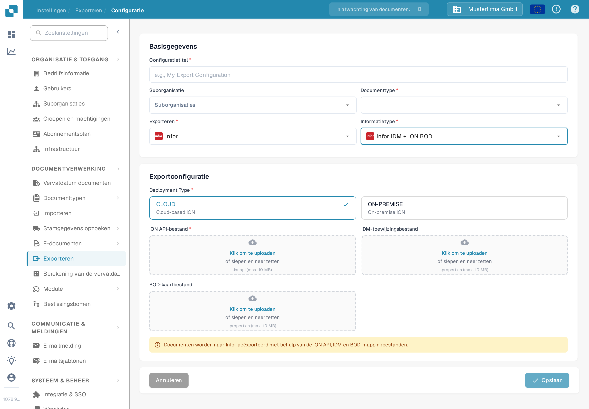

# Een Infor ION API-endpoint maken voor DocBits-exporten

Een Infor-beheerder configureert het API Gateway-endpoint voor de **specifieke DocBits-omgeving en -organisatie**. De oude afbeeldingen op deze pagina toonden één historische Infor-tenant, een vast voorbeeld met `api.docbits.com` en een ouder DocBits-exportformulier. Gebruik de goedgekeurde doel-URL, API-sleutel en OpenAPI-document voor uw eigen omgeving. Er is voor deze update geen Infor-tenant gekoppeld en geen endpoint opgeslagen.

## Voordat u begint

Vraag bij uw integratiebeheerder de URL van de doel-DocBits-API op, de goedgekeurde API-sleutel en de naam van de bijbehorende header, de OpenAPI-URL en de beoogde Infor- en DocBits-omgevingen. Houd sleutels en `.ionapi`-bestanden buiten tickets, screenshots en de Git-repository. Bevestig dat een testendpoint niet naar productie kan routeren.

## Infor API Gateway configureren

1. Maak in **Available APIs** een API-suite van het type **Custom or Non-Infor** voor de doelomgeving. Zie de [instructies van Infor over API-suites](https://docs.infor.com/inforos/2025.x/en-us/useradminlib_cloud/apigatewayag_cloud/gyy1489512842881.html).
2. Voeg aan de suite een endpoint toe met de goedgekeurde **Target Endpoint URL**. Selecteer het authenticatietype dat dat endpoint vereist. Voor **API Key** vraagt Infor om een **Key Name** en **Key Value**; gebruik de naam die het DocBits-API-contract voorschrijft en de sleutel die voor deze organisatie is uitgegeven. Zie de [endpointvelden van Infor](https://docs.infor.com/inforos/2024.x/en-us/useradminlib_cloud/apigatewayag_cloud/bmg1489588707659.html). Kopieer geen sleutel uit een andere omgeving.
3. Voeg de OpenAPI/Swagger-URL van de omgeving toe onder de **Documentation**-instellingen van het endpoint, volgens de [documentatie-instructies van Infor](https://docs.infor.com/ionapi/2021-x/en-us/ionapiag_cloud/tzr1489597424134.html). Controleer of het endpoint verschijnt in de [API-metadata](https://docs.infor.com/ionapi/latest/en-us/ionapiag_cloud/tdr1489674063627.html).
4. Verifieer samen met de Infor-beheerder de doel-URL, authenticatie, proxy-pad en een veilige aanroep buiten productie voordat u het endpoint gebruikt in een ION-documentstroom. Alleen een API-suite opslaan bewijst niet dat een document is afgeleverd.

## Export configureren in DocBits

Open in de beoogde DocBits-organisatie **Instellingen → Exporteren** en kies **Nieuw**. De Nederlandse Sandbox-testorganisatie hieronder heeft geen opgeslagen configuratie.

<figure><figcaption>
Lijst Exporteren in de DocBits-instellingen in het Nederlands: nog geen opgeslagen configuratie; rechtsboven staat de knop «Nieuw».
</figcaption></figure>

Voer een **Configuratietitel** in, kies het **Documenttype** en selecteer alleen indien nodig een **Suborganisatie**. Zet **Exporteren** op **Infor** en **Informatietype** op **Infor IDM + ION BOD**. Het huidige formulier vraagt dan om een **Deployment Type** (**CLOUD** of **ON-PREMISE**), een **ION API-bestand** (`.ionapi`, verplicht), een **IDM-toewijzingsbestand** (`.properties`) en een **BOD-kaartbestand** (`.properties`). Deze op de tenant afgestemde bestanden krijgt u van de beheerder. De screenshot laat de uploadvelden bewust leeg.

<figure><figcaption>
Exportformulier «Infor IDM + ION BOD» in de Nederlandse Sandbox-omgeving met de deploymentopties CLOUD en ON-PREMISE; de velden ION API-bestand, IDM-toewijzingsbestand en BOD-kaartbestand zijn leeg.
</figcaption></figure>

Nadat de beheerder de ION-route heeft gevalideerd, slaat u de configuratie op en test u één document buiten productie. Controleer de status ervan in DocBits en in Infor ION. Een opgeslagen formulier of een API-metadata-item bewijst geen geslaagde export.
