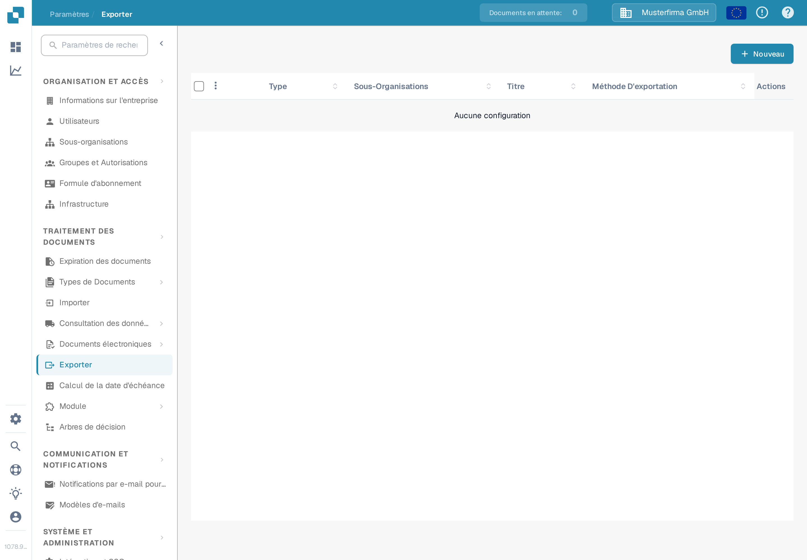
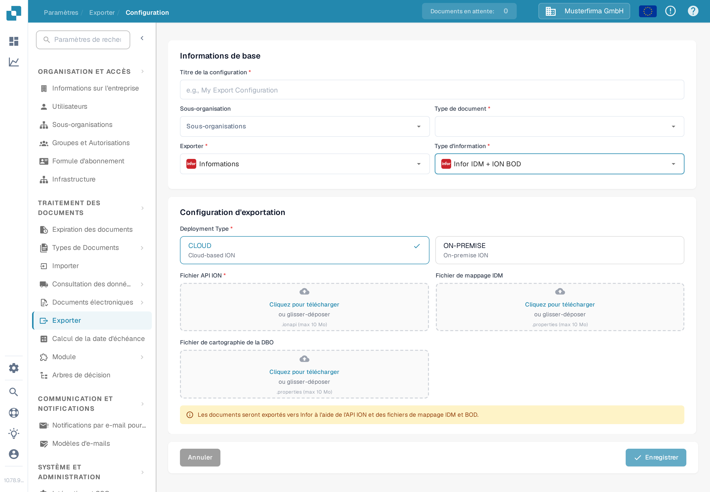

# Création d'un point de terminaison ION API pour les exportations DocBits

Un administrateur Infor configure le point de terminaison API Gateway pour **l'environnement et l'organisation DocBits concernés**. Les anciennes images de cette page montraient un unique tenant Infor historique, un exemple figé `api.docbits.com` et un ancien formulaire d'exportation DocBits. Utilisez l'URL de destination, la clé d'API et le document OpenAPI approuvés pour votre environnement réel. Aucun tenant Infor n'a été connecté et aucun point de terminaison n'a été enregistré pour cette mise à jour.

## Avant de commencer

Rassemblez auprès de votre administrateur d'intégration l'URL de l'API DocBits de destination, la clé d'API approuvée et le nom de son en-tête, l'URL OpenAPI, ainsi que les environnements Infor et DocBits prévus. Gardez les clés et les fichiers `.ionapi` hors des tickets, des captures d'écran et du dépôt Git. Vérifiez qu'un point de terminaison de test ne peut pas router vers la production.

## Configurer Infor API Gateway

1. Dans **Available APIs**, créez une suite d'API de type **Custom or Non-Infor** pour l'environnement de destination. Consultez les [instructions d'Infor sur les suites d'API](https://docs.infor.com/inforos/2025.x/en-us/useradminlib_cloud/apigatewayag_cloud/gyy1489512842881.html).
2. Ajoutez à la suite un point de terminaison avec l'**URL de point de terminaison cible** approuvée. Sélectionnez le type d'authentification exigé par ce point de terminaison. Pour **API Key**, Infor demande un **Nom de la clé** et une **Valeur de la clé** ; utilisez le nom défini par le contrat de l'API DocBits et la clé émise pour cette organisation. Consultez les [champs du point de terminaison](https://docs.infor.com/inforos/2024.x/en-us/useradminlib_cloud/apigatewayag_cloud/bmg1489588707659.html) d'Infor. Ne copiez pas une clé d'un autre environnement.
3. Ajoutez l'URL OpenAPI/Swagger de l'environnement dans les paramètres **Documentation** du point de terminaison, en suivant les [instructions d'Infor sur la documentation](https://docs.infor.com/ionapi/2021-x/en-us/ionapiag_cloud/tzr1489597424134.html). Vérifiez que le point de terminaison apparaît dans les [métadonnées d'API](https://docs.infor.com/ionapi/latest/en-us/ionapiag_cloud/tdr1489674063627.html).
4. Avec l'administrateur Infor, vérifiez l'URL de destination, l'authentification, le chemin du proxy et un appel sûr hors production avant d'utiliser le point de terminaison dans un flux de documents ION. Enregistrer une suite d'API ne prouve pas à lui seul qu'un document a été livré.

## Configurer l'exportation dans DocBits

Dans l'organisation DocBits prévue, ouvrez **Paramètres → Exporter** et sélectionnez **Nouveau**. L'organisation de test Sandbox en français affichée ci-dessous n'a aucune configuration enregistrée.

<figure><figcaption>
Liste d'exportation dans les Paramètres de DocBits en français : aucune configuration enregistrée ; le bouton « Nouveau » se trouve en haut à droite.
</figcaption></figure>

Saisissez un **Titre de la configuration**, choisissez le **Type de document** et sélectionnez une **Sous-organisation** uniquement si nécessaire. Réglez **Exporter** sur l'option dont le libellé affiché est **Informations** (l'option « Infor » de l'application ; son libellé français est actuellement traduit par erreur) et **Type d'information** sur **Infor IDM + ION BOD**. Le formulaire actuel demande alors un **Deployment Type** (**CLOUD** ou **ON-PREMISE**), un **Fichier API ION** (`.ionapi`, obligatoire), un **Fichier de mappage IDM** (`.properties`) et un **Fichier de cartographie de la DBO** (`.properties`). Ces fichiers, spécifiques au tenant, sont fournis par l'administrateur. La capture laisse volontairement les zones d'envoi vides.

<figure><figcaption>
Formulaire d'exportation « Infor IDM + ION BOD » dans l'interface Sandbox en français avec les options de déploiement CLOUD et ON-PREMISE ; les champs Fichier API ION, Fichier de mappage IDM et Fichier de cartographie de la DBO sont vides.
</figcaption></figure>

Une fois que l'administrateur a validé l'acheminement ION, enregistrez la configuration et testez un document hors production. Vérifiez son état dans DocBits et dans Infor ION. Un formulaire enregistré ou une entrée dans les métadonnées d'API ne prouve pas une exportation réussie.
