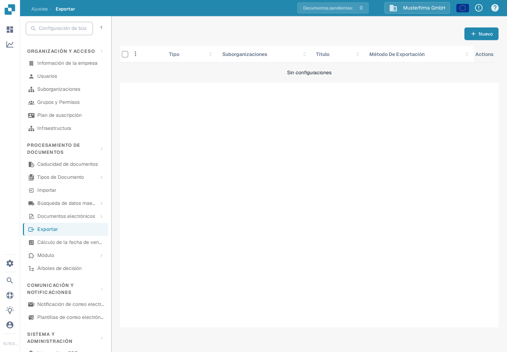
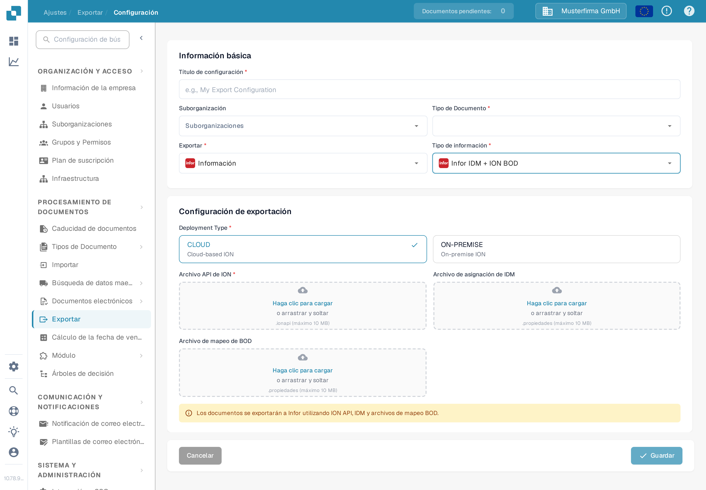

# Creación de un endpoint de la API de ION para exportaciones de DocBits

Un administrador de Infor configura el endpoint de API Gateway para **el entorno y la organización concretos de DocBits**. Las imágenes antiguas de esta página mostraban un único tenant histórico de Infor, un ejemplo fijo de `api.docbits.com` y un formulario de exportación de DocBits más antiguo. Utilice la URL de destino, la clave de API y el documento OpenAPI aprobados para su entorno real. No se conectó ningún tenant de Infor ni se guardó ningún endpoint para esta actualización.

## Antes de empezar

Obtenga de su administrador de integración la URL de la API de DocBits de destino, la clave de API aprobada y el nombre de su cabecera, la URL de OpenAPI y los entornos de Infor y DocBits previstos. Mantenga las claves y los archivos `.ionapi` fuera de tickets, capturas de pantalla y el repositorio de Git. Confirme que un endpoint de prueba no puede enrutar a producción.

## Configurar Infor API Gateway

1. En **Available APIs**, cree una suite de APIs de tipo **Custom or Non-Infor** para el entorno de destino. Consulte las instrucciones de Infor sobre [API suite instructions](https://docs.infor.com/inforos/2025.x/en-us/useradminlib_cloud/apigatewayag_cloud/gyy1489512842881.html).
2. Añada a la suite un endpoint con la **Target Endpoint URL** aprobada. Seleccione el tipo de autenticación que exige ese endpoint. Para **API Key**, Infor solicita **Key Name** y **Key Value**; utilice el nombre definido por el contrato de la API de DocBits y la clave emitida para esta organización. Consulte los [endpoint fields](https://docs.infor.com/inforos/2024.x/en-us/useradminlib_cloud/apigatewayag_cloud/bmg1489588707659.html) de Infor. No copie una clave de un entorno distinto.
3. Añada la URL de OpenAPI/Swagger del entorno en el apartado **Documentation** del endpoint, siguiendo las [documentation instructions](https://docs.infor.com/ionapi/2021-x/en-us/ionapiag_cloud/tzr1489597424134.html) de Infor. Verifique que el endpoint aparece en [API metadata](https://docs.infor.com/ionapi/latest/en-us/ionapiag_cloud/tdr1489674063627.html).
4. Con el administrador de Infor, verifique la URL de destino, la autenticación, la ruta del proxy y una llamada segura fuera de producción antes de usar el endpoint en un flujo de documentos ION. Guardar una suite de APIs por sí solo no demuestra que se entregara un documento.

## Configurar la exportación en DocBits

En la organización de DocBits prevista, abra **Ajustes → Exportar** y seleccione **Nuevo**. La organización de prueba Sandbox en español que se muestra a continuación no tiene ninguna configuración guardada.

<figure><figcaption>
Lista de exportación en Ajustes de DocBits en español: todavía no hay configuración guardada; arriba a la derecha está el botón «Nuevo».
</figcaption></figure>

Introduzca un **Título de configuración**, elija el **Tipo de Documento** y seleccione una **Suborganización** solo si es necesario. Establezca **Exportar** en **Infor** y **Tipo de información** en **Infor IDM + ION BOD**. El formulario actual pregunta entonces por **Deployment Type** (**CLOUD** u **ON-PREMISE**), un **Archivo API de ION** (`.ionapi`, obligatorio), un **Archivo de asignación de IDM** (`.properties`) y un **Archivo de mapeo de BOD** (`.properties`). Estos archivos, específicos del tenant, los obtiene del administrador. La captura deja los campos de carga vacíos a propósito.

<figure><figcaption>
Formulario de exportación «Infor IDM + ION BOD» en la interfaz Sandbox en español con las opciones de despliegue CLOUD y ON-PREMISE; los campos Archivo API de ION, Archivo de asignación de IDM y Archivo de mapeo de BOD están vacíos.
</figcaption></figure>

Después de que el administrador valide la ruta de ION, guarde la configuración y pruebe un documento fuera de producción. Compruebe su estado en DocBits y en Infor ION. Un formulario guardado o una entrada en los metadatos de la API no demuestran una exportación correcta.
