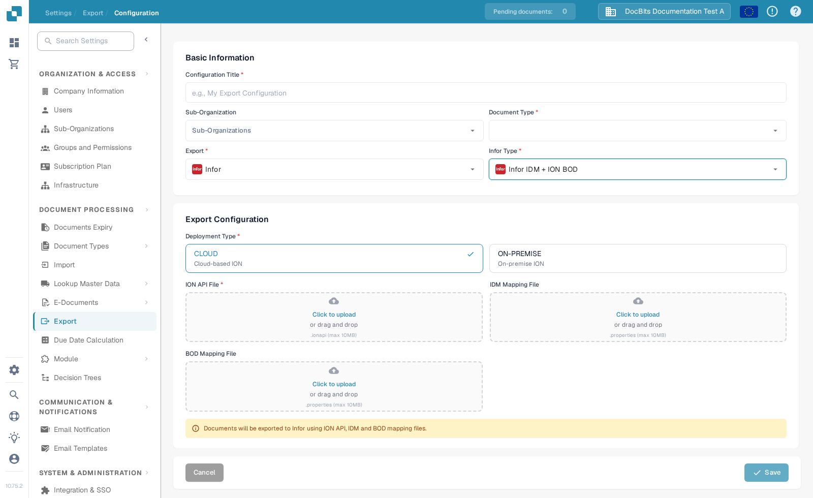

# Obtain an ION API credential file

An `.ionapi` file contains the Infor client ID, client secret and token endpoint details for one authorised application and tenant. It is a **credential file**, not a mapping file. The previous version of this page used five historical screenshots, called the download a mapping file, and required refresh tokens for every app. The correct app type and grant depend on your Infor integration. No Infor tenant or credential was accessed for this update.

## Obtain the file in Infor

Ask an Infor API Gateway administrator to confirm the target tenant, authorised app and DocBits export flow. If a machine-to-machine connection is required, Infor documents creating a **Backend Service** authorised app with the approved **Client Credentials** grant. See the [Infor API Gateway administration guide](https://docs.infor.com/inforos/2025.x/en-us/useradminlib_cloud/apigatewayag_cloud/ionapi_2025.x_apigatewayag_cloud_en-us.pdf). Do not enable **Issue Refresh Tokens** merely because an old screenshot did so; use the settings approved for this app.

In **OS → API Gateway → Authorized Apps**, open the approved app and select **Download Credentials**. Infor says this downloads a `.ionapi` file containing sensitive authentication data; [store it securely](https://docs.infor.com/inforos/latest/en-us/useradminlib_cloud/apigatewayag_cloud/xih1761727483761.html). The `ci` field is the client ID and `cs` is the client secret, according to [Infor's credential reference](https://docs.infor.com/inforos/2025.x/en-us/useradminlib_cloud/apigatewayag_cloud/wxo1761727799964.html). Never paste either value into a screenshot, ticket or repository.

## Use the file in DocBits

Open **Settings → Export** in the intended DocBits organisation and choose **New**. Select the document type, then choose **Infor** as the export and the **Infor Type** that matches the approved ION flow. The example below shows **Infor IDM + ION BOD**. Other Infor types have different fields.

For **Infor IDM + ION BOD**, the current form shows **Deployment Type** (CLOUD or ON-PREMISE), a required **ION API File** (`.ionapi`) and separate **IDM** and **BOD Mapping File** (`.properties`) uploads. Upload the credential only into the correct authorised organisation and environment. The screenshot keeps all file fields blank.

Review the organisation, document type, deployment and files before saving. Test one non-production document and check DocBits and Infor ION results. A downloaded credential or saved form alone does not prove a working export.
