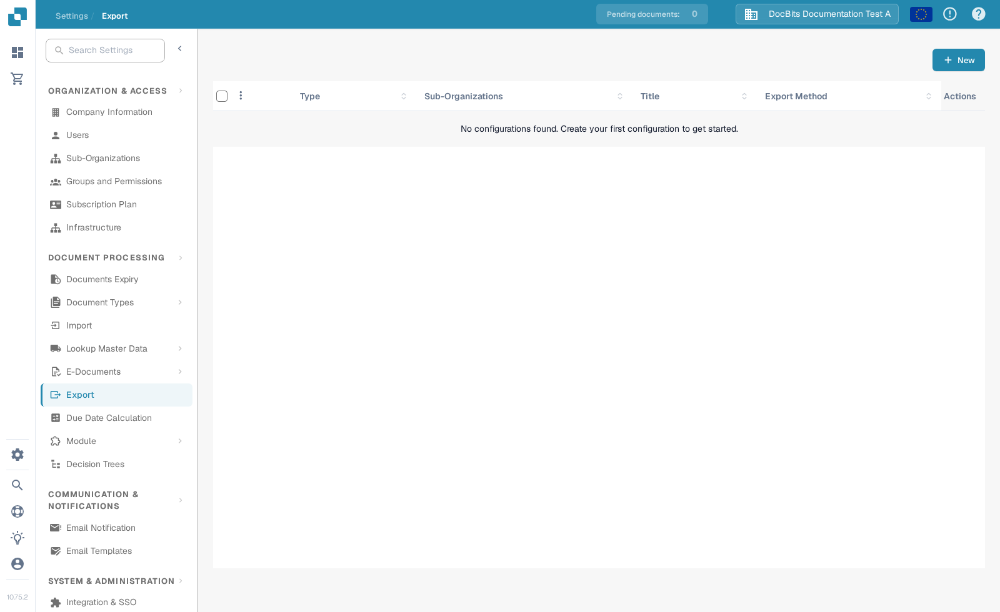
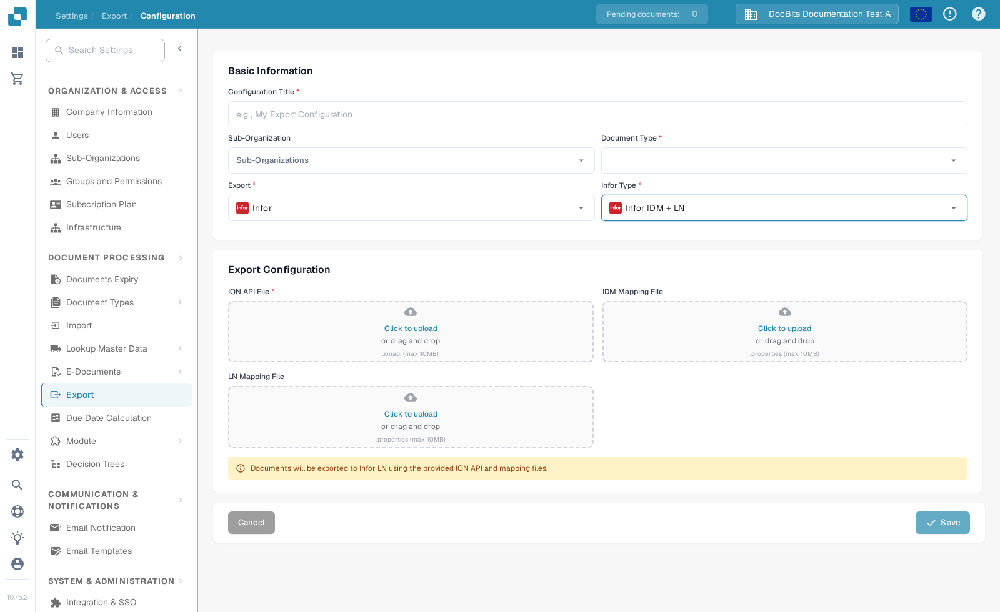

# Export to Infor LN

This guide combines an example Infor ION document flow with the current DocBits export form. The Infor images are historical examples and were not checked in an Infor tenant. Check the connection points, mapping names and BOD permissions with your Infor administrator before activating the flow. No LN export was run for this update.

## Prerequisites

You have created:

* An ION API Endpoint
* An ION API File
* A BOD Mapping File
* An IDM Mapping File

## Import Mapping Files

Before setting up the document flow, ask your Infor administrator to import and approve the mapping files in your Infor OS tenant. The names below are examples; confirm which mapping package applies to your LN company.

In ION Desk → Connect and open Mappings

Click on the Import icon

* From here you need to select the various mapping files you will need which include: SyncCaptDoc\_SyncSuppInv, SyncSupplierInvoice\_LoadSupplierInvoice, and LoadSupplierInvoice\_ProcessSupplierInvoice.
* Once you have imported all the mappings files, make sure to approve each of them by clicking the tick icon within each of their squares on the Mapping dashboard.

## DocBits to LN

The next step is to setup the Data Flow in ION Desk, navigate to the ION Desk application and select Data Flow → + ADD → Document Flow like below

Use this canvas to build the document flow from DocBits to LN.

An LN data flow will look similar to what is shown below (there are multiple paths due to each individual path being meant for a specific document type, for this explanation we will focus on the invoice data flow).

All parts of the chain are dragged and dropped from the top section

In the chain, DocBits and LN are both Applications whereas in between them there are mappings that convert the data into a form that can be understood by the next section of the dataflow and “map” the information so that it goes to where it is needed or meant too.

### DocBits Application

Give it the appropriate name such as “DocBits” then select the plus sign and search for the connection point you created earlier such as DocBits\_Export or similar and click on it.

To create this connection point, go to ION Desk → Connect → Connection Points

Click “+ Add”

Select “IMS via API Gateway” and fill in the following information

The ION API client ID is the `ci` value in your `.ionapi` file. Ask your Infor administrator for the tenant-specific file. It contains credentials, so keep it out of screenshots and Git. See the [Infor explanation of ION API credential fields](https://docs.infor.com/crm/9.4.x/en-us/webclient/upi1639111995644.html).

Switch to the document tab, and add the Sync.CaptureDocument BOD to the DocBits connection point like below.

Then save the connection point by pressing the disk icon in the upper-left corner.

Navigate back to the Dataflow section of ION Desk to access your dataflow. Your DocBits application should look similar to what is shown below.

### Mapping 1

The first mapping node should look as follows

### Mapping 2

The second mapping node should look as follows

### LN Application

Your Infor administrator should provide an LN connection point for the appropriate company. Select it using the “+” action on the LN application node, then verify its document subscriptions.

### BODs

The following configurations should look as follows:

#### First

#### Second

#### Third

The last icon should be empty as it is not carrying any document or information.

Once you have added all necessary nodes to the data flow, press this button to activate the data flow

## Configure export in DocBits

Open **Settings → Export** in the correct DocBits organisation, then select **New**. The English Sandbox test organisation shown below has no saved export configuration.

Under **Basic Information**, enter a **Configuration Title**, select the **Document Type** (for this example, Invoice), and select a **Sub-Organization** only if your setup requires one. Choose **Infor** for **Export**, then choose **Infor IDM + LN** for **Infor Type**. Confirm these values before adding credentials.

The current form asks for an **ION API File** (`.ionapi`, required), **IDM Mapping File** (`.properties`), and **LN Mapping File** (`.properties`). The form in this screenshot is deliberately blank. Use only files supplied by the authorised Infor administrator for this tenant. Do not attach the `.ionapi` file to tickets or include it in the repository.

After the Infor administrator confirms the ION flow and files, save the configuration and test a single non-production invoice. Check the result in DocBits, Infor ION and LN. A saved configuration alone does not show that LN received the invoice.

For the roles of connection points and document flows, see the [Infor ION explanation](https://docs.infor.com/ln/10.8/en-us/lnesolh/lnoshybridng/wxa1699288671147.html). The historical Infor screens above still need comparison with your own tenant.
