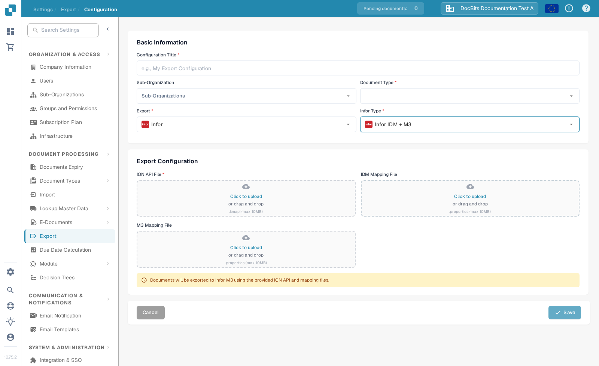

# Configure an Infor M3 export

This page explains the checks that connect a DocBits export configuration to an Infor ION document flow for M3. The previous page contained 38 screenshots from an older Infor tenant, including environment-specific API and mapping settings. They cannot establish the configuration in your tenant, so the current guide links to Infor's instructions and shows the verified English DocBits form. No Infor connection or invoice export was tested for this update.

## Prepare the Infor tenant

Ask the Infor administrator for the approved **ION API endpoint**, a tenant-specific `.ionapi` file, the **IDM mapping** and **M3 mapping** `.properties` files, and the names of the BOD mappings used by this company's invoice flow. The `.ionapi` file contains credentials; keep it out of screenshots, Jira attachments and Git. Its `ci` value is the client ID, as described in [Infor's credential-field reference](https://docs.infor.com/crm/9.4.x/en-us/webclient/upi1639111995644.html).

In ION Desk, the administrator should:

1. Import and approve the mapping versions required by the current tenant. Verify the mapping input and output BOD names instead of reusing names from an old screenshot.
2. Check the DocBits and M3 connection points, their environment-specific logical IDs, document subscriptions and permissions.
3. Build the document flow with the approved mappings and any required filters. Infor explains [connection points, mappings and document flows](https://docs.infor.com/inforos/2024.x/en-us/useradminlib_cloud/iondeskceug_cloud_osm/lnj1556623308383.html).
4. Save, review and [activate the document flow](https://docs.infor.com/depm/2024.x/en-us/depmolh/configuring_ion/jex1510174562552.html) only after the routes have been checked. Activation is distinct from a successful document export.

For a worked historical ION example, see [Export to Infor M3](README.md). Compare every Infor screen there with your tenant before following it.

## Configure export in DocBits

In the intended DocBits organisation, open **Settings → Export** and select **New**. The English Sandbox Test A organisation shown here has no saved export configuration.

Enter a **Configuration Title**, choose the **Document Type** (Invoice for this flow), and select a **Sub-Organization** only if required. Choose **Infor** for **Export** and **Infor IDM + M3** for **Infor Type**. The current form asks for an **ION API File** (`.ionapi`, required), **IDM Mapping File** (`.properties`) and **M3 Mapping File** (`.properties`). Obtain only files for this tenant and review them before saving. The screenshot deliberately leaves all uploads empty.

After the Infor flow is active, test with one non-production invoice. Check its result in DocBits, ION and M3. A saved configuration or activated flow alone does not show that the invoice arrived.
