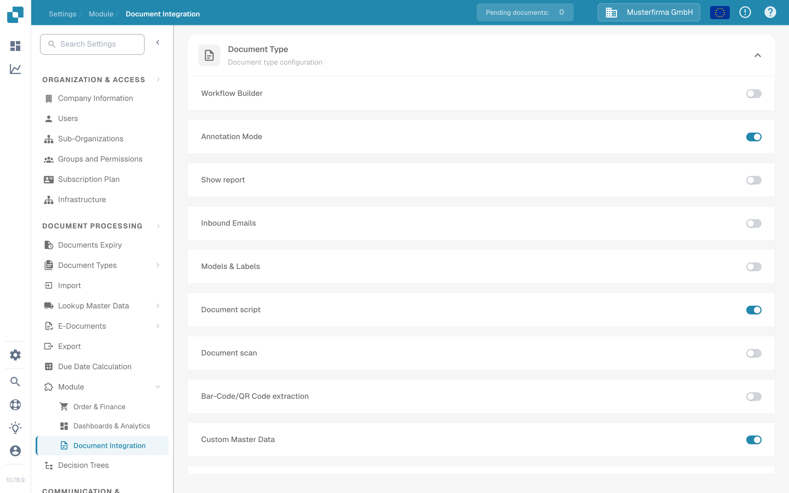
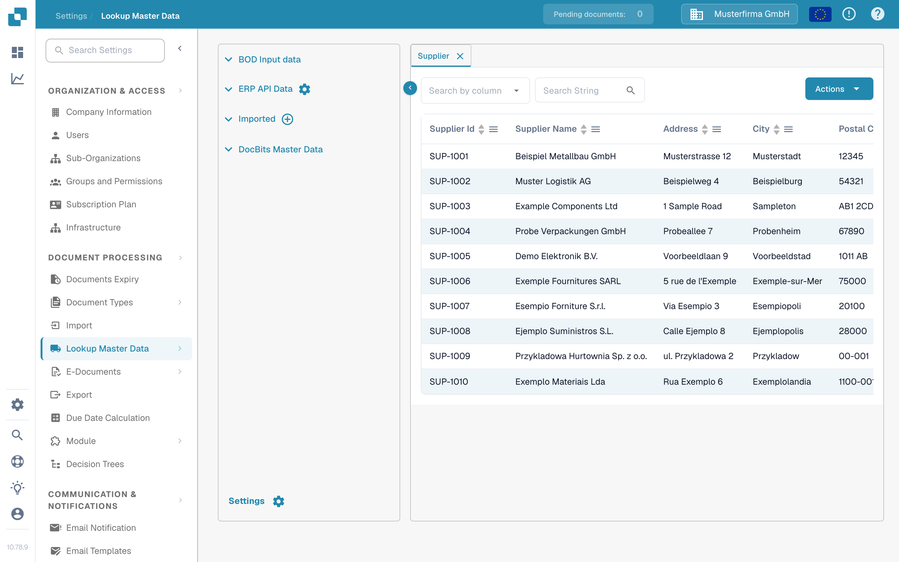
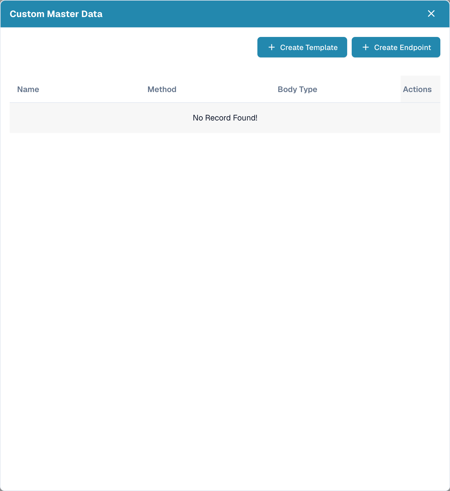
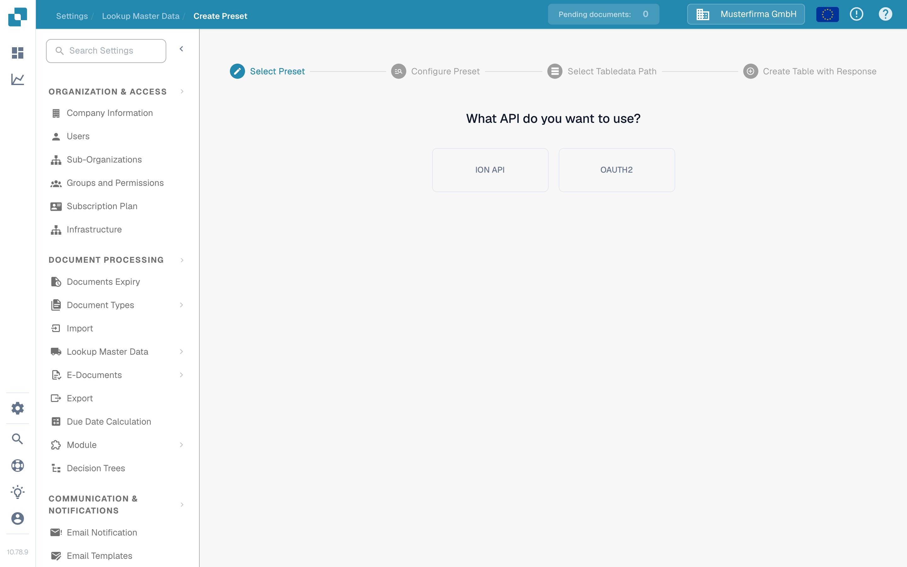
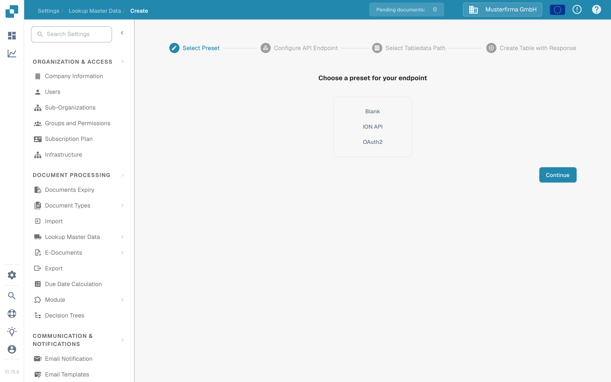
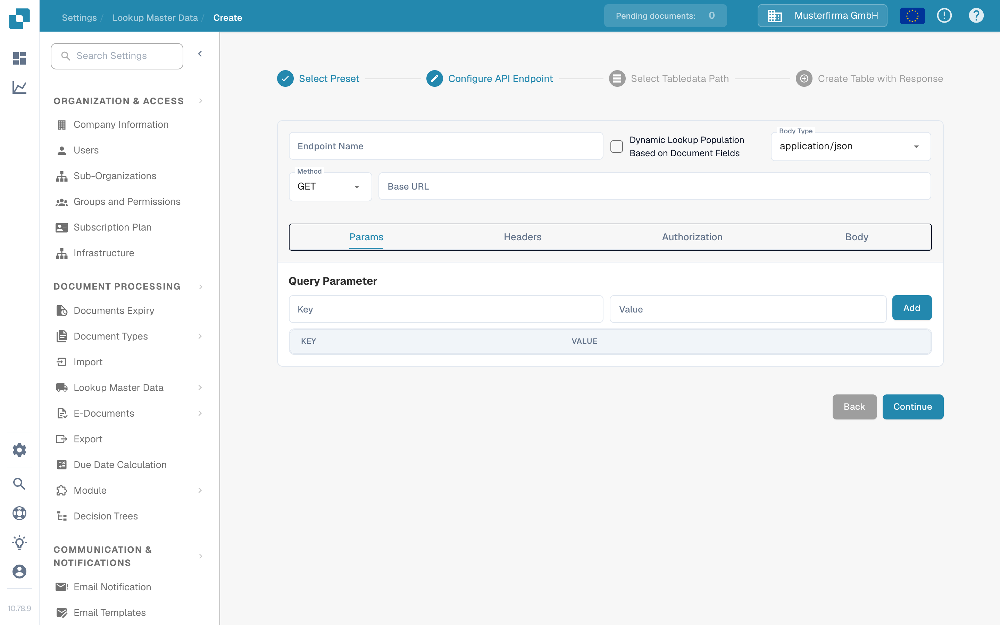

# Custom Master Data

Custom Master Data lets an administrator define a source of reference data for lookups. You can create a reusable template or connect an endpoint. Prepare the API URL, authentication details and a sample response with your integration administrator before you start.

## Enable the module

1. Open **Settings → Module → Document Integration**.
2. Turn on **Custom Master Data**. The blue switch indicates that it is enabled for the current organization.

<figure><figcaption>
Enable Custom Master Data in Document Integration.
</figcaption></figure>

## Open Custom Master Data

1. Open **Settings → Lookup Master Data**.
2. Select the **settings gear next to ERP API Data**. This gear is shown when Custom Master Data is enabled. The plus icon next to **Imported** is for CSV uploads, not for API endpoints.

<figure><figcaption>
Use the ERP API Data gear to open Custom Master Data.
</figcaption></figure>

The dialog lists existing custom data connections. **Create Template** starts a reusable API configuration; **Create Endpoint** starts a connection that can populate a master data table. An existing row offers **Edit**, **Trigger Endpoint** and **Delete**. Use Delete only when the connection is no longer needed.

<figure><figcaption>
Choose a template or endpoint; this test organization has no existing custom connections.
</figcaption></figure>

## Create a template

Select **Create Template**, then choose **ION API** or **OAuth2**. The ION API path asks for an ION authentication JSON file; keep that file private. The next steps configure the preset, identify the path to table data in a sample response, and map response values to columns. Use **Continue** to move through the steps and review the mappings before finishing.

<figure><figcaption>
Choose the API authentication method for a reusable template.
</figcaption></figure>

## Create an endpoint

Select **Create Endpoint**. The first step offers **Blank**, **ION API**, **OAuth2**, and any templates already saved in your organization. Choose the option that matches your integration; **Blank** starts without saved authentication settings.

<figure><figcaption>
Choose how the new endpoint should be configured.
</figcaption></figure>

In **Configure API Endpoint**, enter an endpoint name without spaces, choose the body type and request method, and enter the API URL. **Params**, **Headers**, **Authorization** and **Body** configure the request. The **Dynamic Lookup Population Based on Document Fields** checkbox is for values that depend on the current document. Continue only when the request works: DocBits checks the endpoint response before it moves to the table data path. Then select the response path, map columns in **Create Table with Response**, and finish.

<figure><figcaption>
The endpoint configuration step. This example has no API address or credentials entered.
</figcaption></figure>

The screenshots show the setup screens only. No endpoint was saved or triggered in the test organization because it has no connected example API. For help finding and using master data after setup, see [Master Data Lookup](../../administration-and-setup/settings/document-processing/master-data-lookup.md).
