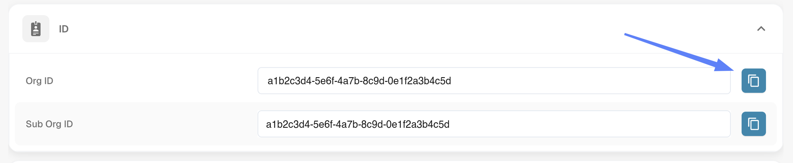
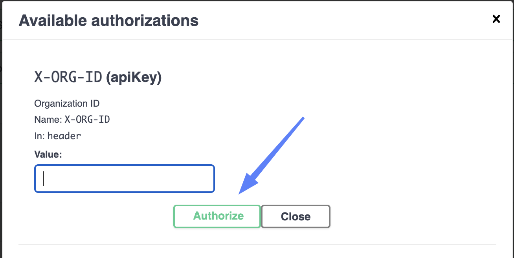
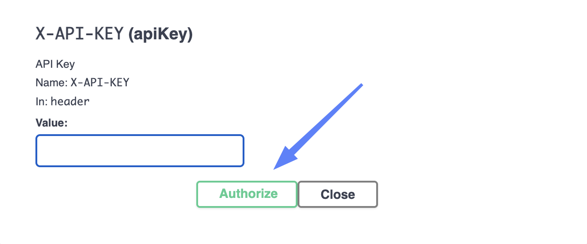
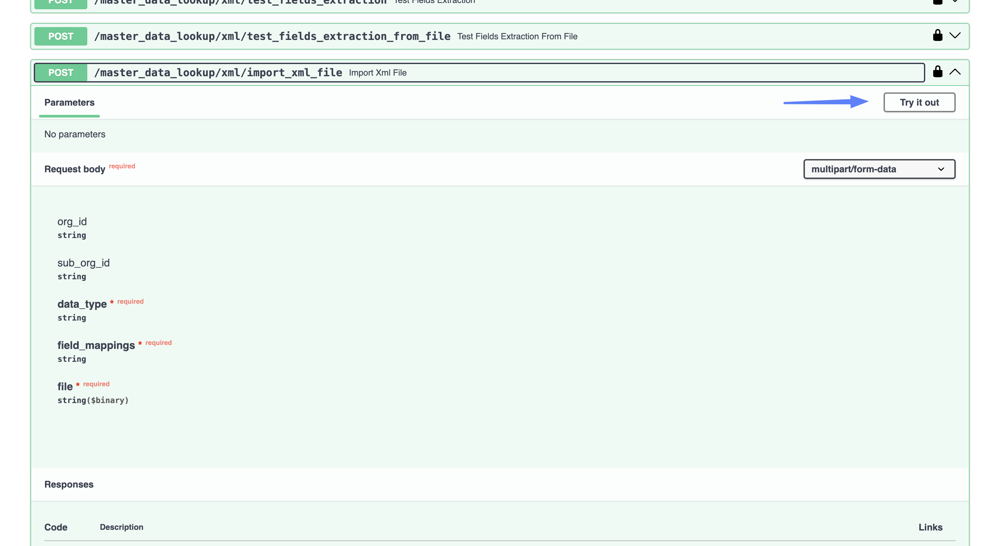
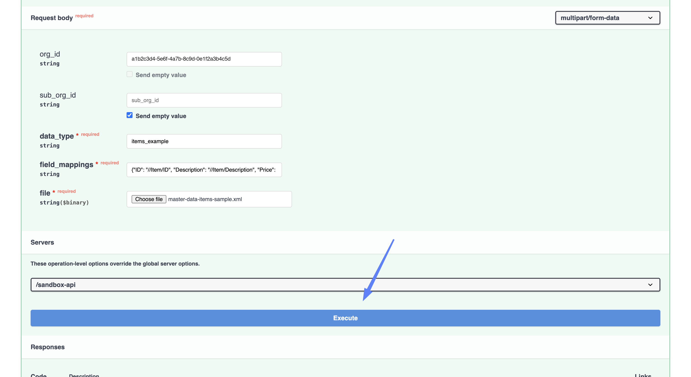
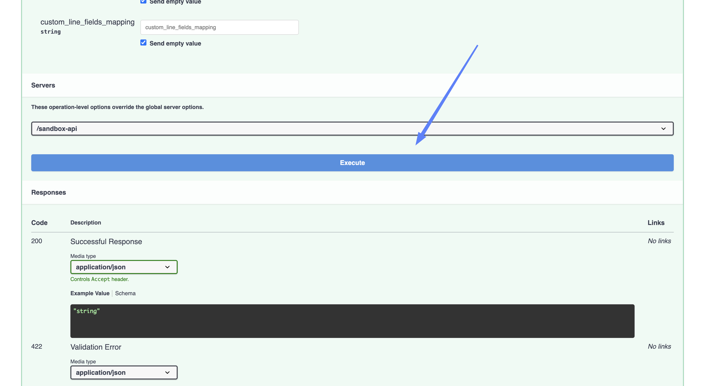

# Import Master Data from XML

Alongside the BOD imports, DocBits can read master data out of **any XML file** into a lookup dataset of your choosing. You tell it which dataset to write to and which XPath each column should be read from, so the XML does not have to follow a BOD format at all.

Use this for master data that does not arrive as a BOD — price lists, cost centres, item attributes, anything your ERP can export as XML.

## Two ways to send the XML

<figure><figcaption><p>Upload a file, or paste the XML</p></figcaption></figure>

| Endpoint | Use it when |
| --- | --- |
| `/master_data_lookup/xml/import_xml_file` | You have the data as an **XML file** and want to upload it. |
| `/master_data_lookup/xml/import_xml_data` | You want to **paste the XML** into the request. Unlike the BOD endpoints, this one takes the XML as plain text — no JSON wrapper. |

Both are described below. Steps 1 and 2 are the same either way.

## Before you start

You will need:

* **An API key.** See [API Key Management](../../../administration-and-setup/settings/global-settings/integration/api-key-management.md) if you do not have one yet.
* **The XML** — as a file or as content you can paste.
* **A data type** — the name of the lookup dataset to write into.
* **Field mappings** — which XPath fills which column.
* **Your Org ID**, from **Settings → Integration & SSO** in the **ID** section.

<figure><figcaption><p>Settings → Integration &#x26; SSO → ID</p></figcaption></figure>

## Step-by-Step Instructions

### 1. Open the API link

Open the API test interface for the environment and region you are working with:

* [Sandbox API (Europe)](https://eu.sandbox.api.docbits.com/docs#/master%20data%20lookup/import_xml_file_master_data_lookup_xml_import_xml_file_post)
* [Sandbox API (United States)](https://us.sandbox.api.docbits.com/docs#/master%20data%20lookup/import_xml_file_master_data_lookup_xml_import_xml_file_post)
* [Production API (Europe)](https://eu.api.docbits.com/docs#/master%20data%20lookup/import_xml_file_master_data_lookup_xml_import_xml_file_post)
* [Production API (United States)](https://us.api.docbits.com/docs#/master%20data%20lookup/import_xml_file_master_data_lookup_xml_import_xml_file_post)

These endpoints sit under **master data lookup** rather than **import**, further down the page.


Use the region your organization is hosted in — the same region you use to log in to DocBits. The European and American environments are separate, so an import sent to the wrong region will not show up in your organization.


### 2. Authorize

Authorizing works exactly as for the BOD imports: click the **lock icon**, paste your **Org ID** into **X-ORG-ID**, paste your API key into **X-API-KEY**, and click **Authorize** on each.

<figure><figcaption><p>X-ORG-ID — paste the Org ID, then Authorize</p></figcaption></figure>

<figure><figcaption><p>X-API-KEY — paste the key, then Authorize</p></figcaption></figure>

### 3. Fill in the fields

<figure><figcaption><p>Try it out unlocks the form</p></figcaption></figure>

Click **Try it out**, then fill in the form.

<figure><figcaption><p>The request body form, filled in</p></figcaption></figure>

| Field | |
| --- | --- |
| **data\_type** | Required. The lookup dataset to write into. It is lower-cased automatically, so `PriceList` and `pricelist` are the same dataset. |
| **field\_mappings** | Required. A JSON object pairing each column with the XPath it is read from. See below. |
| **file** | Required on `import_xml_file`. Click **Choose file** and select your XML. |
| **xml** | Required on `import_xml_data` instead of the file — paste the XML in as plain text. |
| **org\_id** | Your Org ID — the same value you put into **X-ORG-ID** in step 2. |
| **sub\_org\_id** | Only needed if you are importing into a particular sub-organization. |

#### Field mappings

`field_mappings` is a JSON object with one entry per column. Unlike the BOD imports, where the names are fixed to `custom_field_1` … `custom_field_5`, here you choose them:

```json
{
  "ID": "//Item/ID",
  "Description": "//Item/Description",
  "Price": "//Item/UnitPrice"
}
```

The names on the left become the columns in the dataset and are yours to choose. The values on the right must match the structure of the XML you are uploading — for the sample above, `//Item/ID` picks up the `<ID>` element inside each `<Item>`. The two sides are independent: the mapping above reads `<UnitPrice>` into a column called `Price`.


Only **malformed** XPaths are rejected, with a `400` naming the field. An XPath that is valid but matches nothing in your XML passes silently and simply leaves that column empty — so a typo in a path looks like an import that worked but lost a column. If the `ID` path is the one that matches nothing, the import fails instead, reporting that the `ID` column is missing for that record.



**One of the columns must be called `ID`.** It is what identifies a record: importing the same data again updates the row with that ID instead of adding a duplicate. The name is not case-sensitive, so `ID`, `Id` and `id` all work, but a name like `ItemID` does not count — the request is rejected with `ID_FIELD_IS_MISSING` and nothing is written.



**One request imports one record.** Each XPath is read once, so if your XML contains several elements only the first match of each is used. To load a list, send one request per record, or use a CSV import instead.


#### Choosing a data type

`data_type` is the key of the dataset you are writing into. It is lower-cased and trimmed, so `Items` and `items` are the same dataset. Any name that is not already taken creates a dataset of your own — `items_example`, `cost_centres`, `price_list` — and importing into it again updates it.


Some names are not free: they are DocBits' own master data tables, and importing into one writes straight into it.

| Name | |
| --- | --- |
| `purchase_order_header`, `purchase_order_address` | Rejected with `RESERVED_DATASET_NAME`. |
| `supplier`, `supplier_accounts`, `purchase_order`, `receive_delivery`, `receive_delivery_lines`, `costing_element`, `customer_erp_items`, `supplier_item_price`, `supplier_item_number_mapping` | **Accepted, and they overwrite real master data.** Use these only if that is genuinely what you intend. |

For anything else, pick a name of your own.



Check which environment and which organization you are pointing at before you execute. An import writes straight into that organization's master data.


### 4. Execute

Before you execute, check the **Servers** dropdown at the bottom of the form.

<figure><figcaption><p>Check the server, then Execute</p></figcaption></figure>

Click **Execute**. A successful import returns:

```json
{
  "success": true,
  "message": "Record(s) created/updated successfully"
}
```

Unlike the BOD imports, these endpoints report problems with a proper error status rather than a `200` carrying `"success": false` — a **400** means the request was rejected and nothing was written.

### 5. Check that the data arrived

* In DocBits, go to **Settings → Document Processing → Lookup Master Data**.
* Select **Imported** on the left, then open the tab for your data type.
* The columns are the names you used on the left-hand side of `field_mappings`.

<!-- SCREENSHOT: Lookup Master Data with Imported selected and the new dataset open -->
