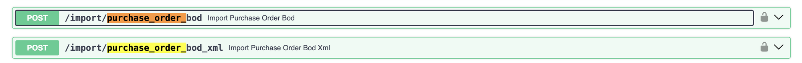
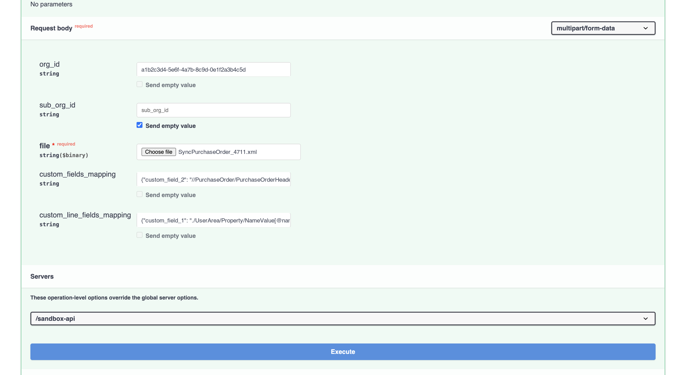
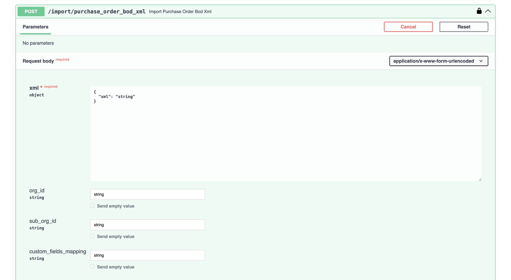
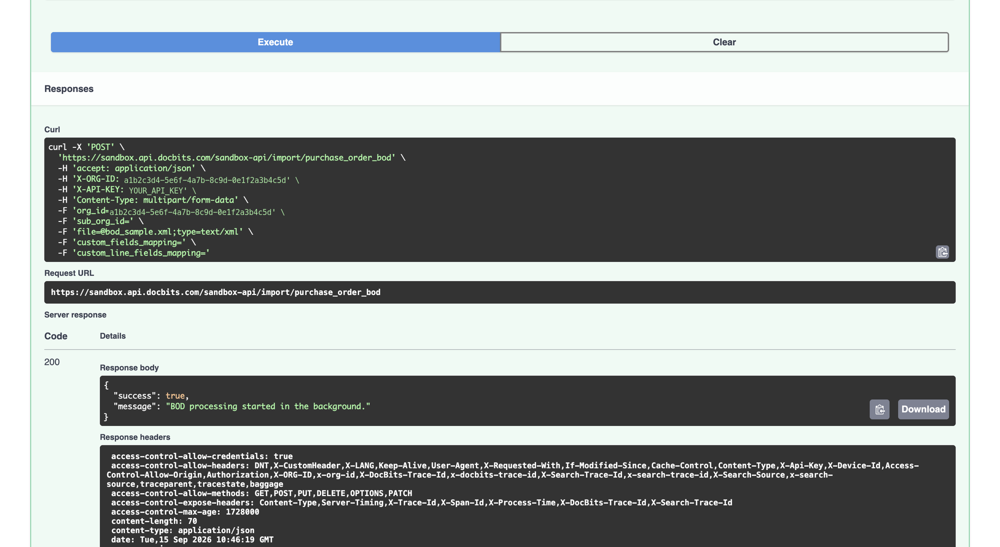

# Import Purchase Orders (Purchase Order BOD)

Purchase orders normally reach DocBits automatically through your ION data flow. This page describes how to send a **Purchase Order BOD** in by hand — useful when you want to re-import an order, load a batch that never arrived, or test a new mapping before switching the automatic flow on.

## Two ways to send the same BOD

There are two endpoints, and they do the same thing. The only difference is how you hand over the BOD:

<figure><figcaption><p>Upload a file, or send the XML in the request</p></figcaption></figure>

| Endpoint | Use it when |
| --- | --- |
| `/import/purchase_order_bod` | You have the BOD as an **XML file** and want to upload it. |
| `/import/purchase_order_bod_xml` | You want to send the **XML content** in the request instead of a file. The BOD has to be wrapped in JSON, so this suits short XML or another system calling the API — for a full BOD by hand, upload the file. |

Both are described below. Steps 1 and 2 are the same either way.

## Before you start

You will need:

* **An API key.** See [API Key Management](../../../administration-and-setup/settings/global-settings/integration/api-key-management.md) if you do not have one yet.
* **The BOD** — a `SyncPurchaseOrder` XML file, or its content.
* **Your Org ID**, if you are importing into an organization other than the one your key belongs to.

To find the Org ID, go to **Settings → Integration & SSO** and open the **ID** section. Click the copy icon next to the field.

<figure><figcaption><p>Settings → Integration &#x26; SSO → ID</p></figcaption></figure>


**Sub Org ID** only matters if your organization is split into sub-organizations. If you are not importing into a particular sub-organization, leave the `sub_org_id` field empty.


## Step-by-Step Instructions

### 1. Open the API link

Open the API test interface for the environment and region you are working with:

* [Sandbox API (Europe)](https://eu.sandbox.api.docbits.com/docs#/import/import_purchase_order_bod_import_purchase_order_bod_post)
* [Sandbox API (United States)](https://us.sandbox.api.docbits.com/docs#/import/import_purchase_order_bod_import_purchase_order_bod_post)
* [Production API (Europe)](https://eu.api.docbits.com/docs#/import/import_purchase_order_bod_import_purchase_order_bod_post)
* [Production API (United States)](https://us.api.docbits.com/docs#/import/import_purchase_order_bod_import_purchase_order_bod_post)

Expand the endpoint you want by clicking on it.


Use the region your organization is hosted in — the same region you use to log in to DocBits. The European and American environments are separate, so an import sent to the wrong region will not show up in your organization.

The addresses without a region prefix — `api.docbits.com` and `sandbox.api.docbits.com` — point to Europe. You will see those in older documentation and in existing configurations; they are the same environment as the `eu.` addresses above.


### 2. Authorize

Everything under **import** is locked until you authorize. There are two things to fill in: your organization and your API key.

* Click the **lock icon** on the right of the endpoint.

<figure><figcaption><p>Click the lock to open the authorization dialog</p></figcaption></figure>

* The **Available authorizations** dialog opens with two entries.
* Paste your **Org ID** into **X-ORG-ID** and click **Authorize**.

<figure><figcaption><p>X-ORG-ID — paste the Org ID, then Authorize</p></figcaption></figure>

* The entry now shows **Authorized** and hides the value.

<figure><figcaption><p>X-ORG-ID is set</p></figcaption></figure>

* Scroll down to **X-API-KEY**, paste your API key and click **Authorize**. In DocBits you find it under **Settings → Integration & SSO** in the **API Key** section, or you can [create a new key](../../../administration-and-setup/settings/global-settings/integration/api-key-management.md#creating-an-api-key).

<figure><figcaption><p>X-API-KEY — paste the key, then Authorize</p></figcaption></figure>

<figure><figcaption><p>X-API-KEY is set</p></figcaption></figure>

* Click **Close**.


Paste the key on its own — do not type `Bearer` in front of it. Both authorizations stay set until you reload the page or click **Logout**.


### 3. Fill in the fields

Click **Try it out**, then fill in the form for the endpoint you chose.

#### Uploading a file — `/import/purchase_order_bod`

<figure><figcaption><p>The request body form, filled in</p></figcaption></figure>

| Field | |
| --- | --- |
| **file** | Required. Click **Choose file** and select your `SyncPurchaseOrder` XML file. |
| **org\_id** | Leave empty — the organization is already set through **X-ORG-ID** in step 2. Fill it in only to import into a different organization, and only one your API key has access to; anything else is refused. |
| **sub\_org\_id** | Only needed if you work with sub-organizations. Leave empty otherwise. |
| **custom\_fields\_mapping** | Optional. Reads extra header fields out of the BOD into the purchase order's custom fields. See [Custom field mappings](#custom-field-mappings) below. |
| **custom\_line\_fields\_mapping** | Optional. The same, for extra fields on the order lines. |


**`string` is a value, not a placeholder.** Swagger fills the optional fields with the word `string`, and it is sent as-is if you leave it there — an import with `org_id` set to `string` will fail.

For every optional field you do not want to use, clear the field. Clearing it enables the **Send empty value** checkbox underneath, which you can then tick. In the screenshot above this has been done for `sub_org_id`.


#### Custom field mappings

Both mapping fields take a JSON object. The **name on the left must be one of DocBits' own custom fields** — `custom_field_1` through `custom_field_5` for purchase orders. Any other name is ignored without warning, so a typo here looks exactly like a mapping that did not work.

The value on the right is the XPath to read from. Write it without namespace prefixes — DocBits adds those itself:

```json
{"custom_field_2": "//PurchaseOrder/PurchaseOrderHeader/UserArea/Property/NameValue[@name='User defined 6']/text()"}
```

Line mappings use the same `custom_field_1` … `custom_field_5` names, but their XPaths are read **relative to each order line**, so they start with `./`:

```json
{"custom_field_1": "./UserArea/Property/NameValue[@name='User defined 1']/text()"}
```

See [Field Mappings](../field-mappings.md) for the mappings used for standard fields.

#### Pasting the XML — `/import/purchase_order_bod_xml`

<figure><figcaption><p>The BOD goes inside a small JSON wrapper</p></figcaption></figure>

This endpoint does not take the BOD as a plain paste. The **xml** field is an object, pre-filled with:

```json
{
  "xml": "string"
}
```

Replace `string` with the content of your BOD, keeping the surrounding quotes and braces:

```json
{
  "xml": "<SyncPurchaseOrder ...>...</SyncPurchaseOrder>"
}
```


The BOD sits inside a JSON string, so every double quote in the XML has to be escaped as `\"` — and a BOD is full of them (`releaseID="9.2"`, `xmlns="..."`). If the result is not valid JSON the request fails with a **422** and nothing is imported.

For a real BOD that is fiddly to do by hand, so prefer **uploading the file**. This endpoint is the better choice when the XML is short, or when another system builds the request and can encode the JSON itself.


The `org_id`, `sub_org_id` and `custom_fields_mapping` fields work exactly as above. This endpoint has no field for line mappings.


Check which environment and which organization you are pointing at before you execute. An import writes straight into that organization's master data.


### 4. Execute

Before you execute, check the **Servers** dropdown at the bottom of the form. It decides which environment the request is actually sent to, and it can differ from the page you opened.

Click **Execute**.

<figure><figcaption><p>Check the server, then Execute</p></figcaption></figure>

**If you uploaded a file**, the response is:

<figure><figcaption><p>The response after a successful upload</p></figcaption></figure>

```json
{
  "success": true,
  "message": "BOD processing started in the background."
}
```


**This means the file was accepted, not that the import has finished.** Uploaded purchase order files are processed in the background so that large orders do not hold up the rest of the system. Give it a moment, then check the result as described below.


**If you pasted the XML**, the import runs immediately and the response is `"BOD processed successfully."` — by the time you see it, the data is in.

If something was wrong with the request, you get `"success": false` together with a message describing the problem. The most common causes are content that is not a `SyncPurchaseOrder` BOD, and an Org ID that your API key has no access to.

### 5. Check that the data arrived

* In DocBits, go to **Settings → Document Processing → Lookup Master Data**.
* Select **BOD Input Data** on the left, then open the **Purchase Order** tab.
* Search for the PO number from your BOD.

<!-- SCREENSHOT F: Lookup Master Data with BOD Input Data selected and the Purchase Order tab open -->

If the order is listed, the import worked and the purchase order is available for PO matching.


DocBits decides what to do with the BOD by reading the type inside it, not by which import endpoint you used. If you send a supplier BOD here by mistake, it is imported as supplier data rather than rejected — so check that the tab you find the data in is the one you expected.

