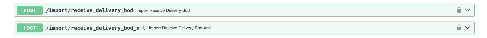
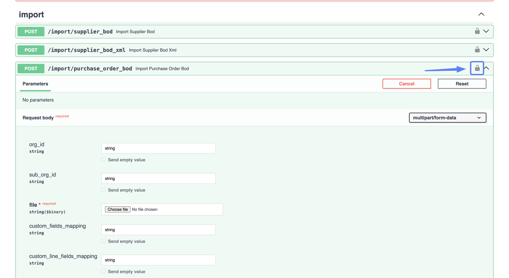
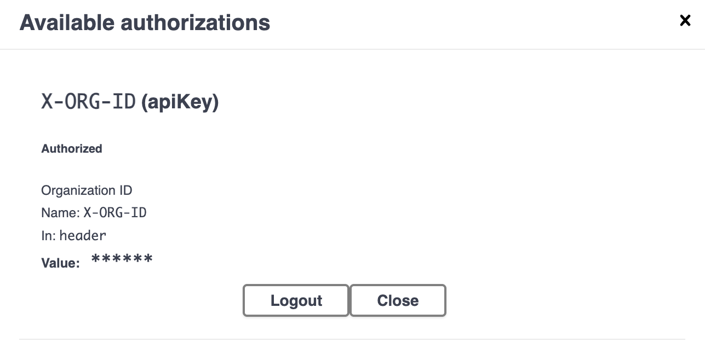
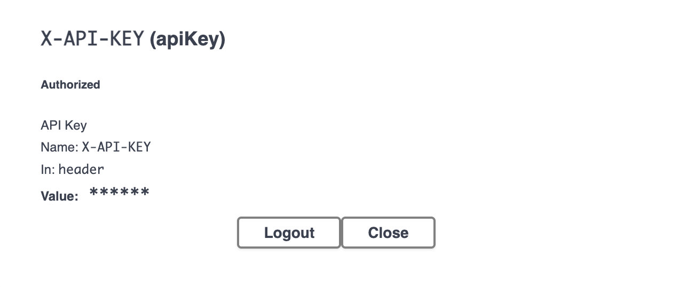
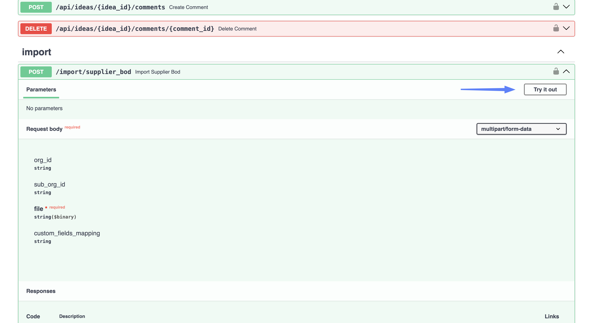
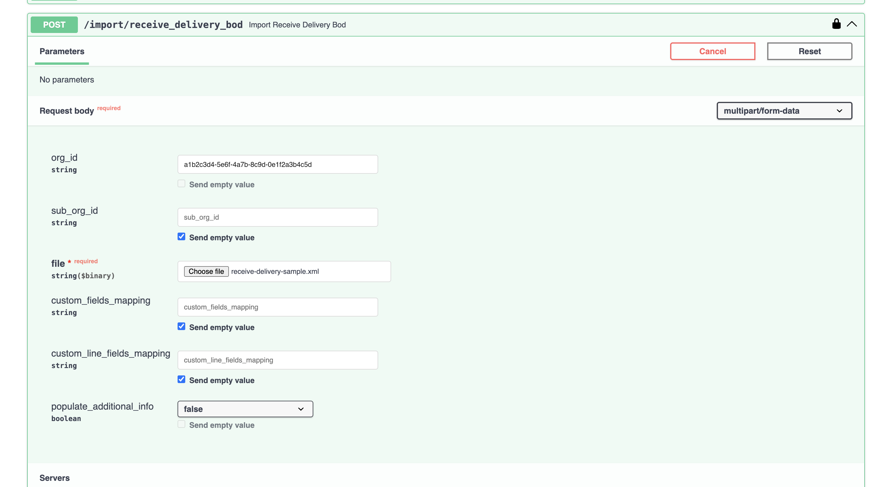
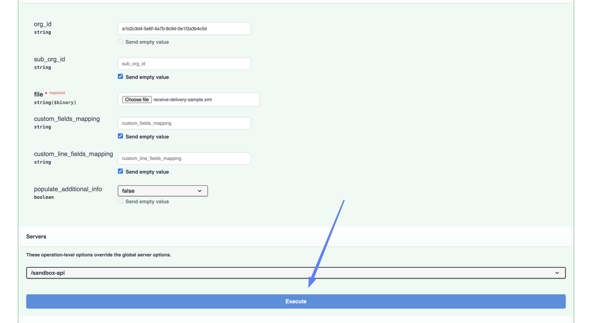
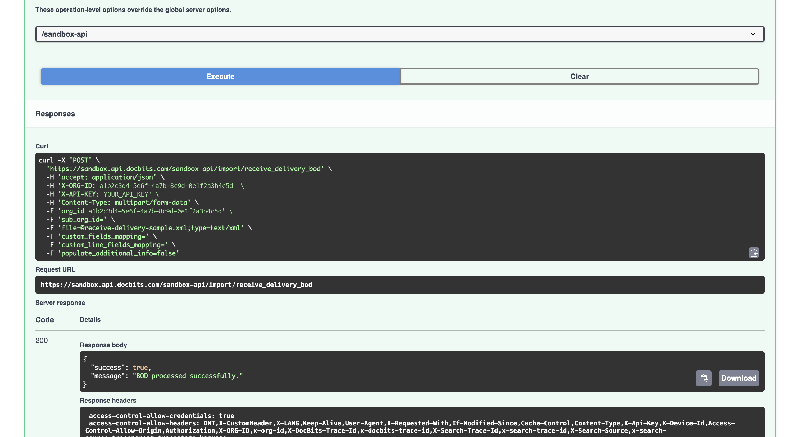

# Import Goods Receipts (Receive Delivery BOD)

Goods receipts normally reach DocBits automatically through your ION data flow. This page describes how to send a **Receive Delivery BOD** in by hand — useful when you want to re-import a receipt, load a batch that never arrived, or test a field mapping before switching the automatic flow on.

## Two ways to send the same BOD

<figure><figcaption><p>Upload a file, or send the XML in the request</p></figcaption></figure>

| Endpoint | Use it when |
| --- | --- |
| `/import/receive_delivery_bod` | You have the BOD as an **XML file** and want to upload it. |
| `/import/receive_delivery_bod_xml` | You want to send the **XML content** in the request instead of a file. The BOD has to be wrapped in JSON, so this suits short XML or another system calling the API — for a full BOD by hand, upload the file. |

Both are described below. Steps 1 and 2 are the same either way.

## Before you start

You will need:

* **An API key.** See [API Key Management](../../../administration-and-setup/settings/global-settings/integration/api-key-management.md) if you do not have one yet.
* **The BOD** — a `SyncReceiveDelivery` XML file, or its content.
* **Your Org ID**, from **Settings → Integration & SSO** in the **ID** section.

<figure><figcaption><p>Settings → Integration &#x26; SSO → ID</p></figcaption></figure>


**Sub Org ID** shows whichever sub-organization is selected in the header. With **CROSS** selected — the view across all sub-organizations — it shows the same value as **Org ID**. Switch to a specific sub-organization first if you need its ID.

If you are not importing into a particular sub-organization, leave the `sub_org_id` field empty.


## Step-by-Step Instructions

### 1. Open the API link

Open the API test interface for the environment and region you are working with:

* [Sandbox API (Europe)](https://eu.sandbox.api.docbits.com/docs#/import/import_receive_delivery_bod_import_receive_delivery_bod_post)
* [Sandbox API (United States)](https://us.sandbox.api.docbits.com/docs#/import/import_receive_delivery_bod_import_receive_delivery_bod_post)
* [Production API (Europe)](https://eu.api.docbits.com/docs#/import/import_receive_delivery_bod_import_receive_delivery_bod_post)
* [Production API (United States)](https://us.api.docbits.com/docs#/import/import_receive_delivery_bod_import_receive_delivery_bod_post)

Expand the endpoint you want by clicking on it.


Use the region your organization is hosted in — the same region you use to log in to DocBits. The European and American environments are separate, so an import sent to the wrong region will not show up in your organization.

The addresses without a region prefix — `api.docbits.com` and `sandbox.api.docbits.com` — point to Europe. You will see those in older documentation and in existing configurations; they are the same environment as the `eu.` addresses above.


### 2. Authorize

Everything under **import** is locked until you authorize. There are two things to fill in: your organization and your API key.

* Click the **lock icon** on the right of the endpoint.

<figure><figcaption><p>Click the lock to open the authorization dialog</p></figcaption></figure>

* The **Available authorizations** dialog opens with two entries.
* Paste your **Org ID** into **X-ORG-ID** and click **Authorize**.

<figure><figcaption><p>X-ORG-ID — paste the Org ID, then Authorize</p></figcaption></figure>

<figure><figcaption><p>X-ORG-ID is set</p></figcaption></figure>

* Scroll down to **X-API-KEY**, paste your API key and click **Authorize**. In DocBits you find it under **Settings → Integration & SSO** in the **API Key** section, or you can [create a new key](../../../administration-and-setup/settings/global-settings/integration/api-key-management.md#creating-an-api-key).

<figure><figcaption><p>X-API-KEY — paste the key, then Authorize</p></figcaption></figure>

<figure><figcaption><p>X-API-KEY is set</p></figcaption></figure>

* Click **Close**.


Paste the key on its own — do not type `Bearer` in front of it. Both authorizations stay set until you reload the page or click **Logout**.


### 3. Fill in the fields

<figure><figcaption><p>Try it out unlocks the form</p></figcaption></figure>

Click **Try it out**, then fill in the form for the endpoint you chose.

#### Uploading a file — `/import/receive_delivery_bod`

<figure><figcaption><p>The request body form, filled in</p></figcaption></figure>

| Field | |
| --- | --- |
| **file** | Required. Click **Choose file** and select your `SyncReceiveDelivery` XML file. |
| **org\_id** | Your Org ID — the same value you put into **X-ORG-ID** in step 2. Setting it here as well makes the request explicit about which organization it is writing to. It must be an organization your API key has access to; anything else is refused. |
| **sub\_org\_id** | Only needed if you are importing into a particular sub-organization. |
| **custom\_fields\_mapping** | Optional. Extra header fields. See [Custom field mappings](#custom-field-mappings) below. |
| **custom\_line\_fields\_mapping** | Optional. The same, for extra fields on the receipt lines. |
| **populate\_additional\_info** | Optional, `false` by default. Set it to `true` to have DocBits fetch additional receipt information from the ERP after the import. Leave it `false` unless you know you need it — it makes the import slower. |


**`string` is a value, not a placeholder.** Swagger fills the optional fields with the word `string`, and it is sent as-is if you leave it there — an import with `org_id` set to `string` will fail.

For every optional field you do not want to use, clear the field. Clearing it enables the **Send empty value** checkbox underneath, which you can then tick.


#### Custom field mappings

Both mapping fields take a JSON object. The **name on the left must be one of DocBits' own custom fields** — `custom_field_1` through `custom_field_10` for goods receipts, twice as many as purchase orders allow. Any other name is ignored without warning, so a typo here looks exactly like a mapping that did not work.

The value on the right is the XPath to read from. Write it without namespace prefixes — DocBits adds those itself:

```json
{"custom_field_2": "//ReceiveDelivery/ReceiveDeliveryHeader/UserArea/Property/NameValue[@name='User defined 6']/text()"}
```

Line mappings use the same `custom_field_1` … `custom_field_10` names, but their XPaths are read **relative to each receipt line**, so they start with `./`:

```json
{"custom_field_1": "./UserArea/Property/NameValue[@name='User defined 1']/text()"}
```

#### Pasting the XML — `/import/receive_delivery_bod_xml`

<!-- SCREENSHOT: the Try it out form of /import/receive_delivery_bod_xml -->

This endpoint does not take the BOD as a plain paste. The **xml** field is an object, pre-filled with `{"xml": "string"}`. Replace `string` with the content of your BOD, keeping the surrounding quotes and braces:

```json
{
  "xml": "<SyncReceiveDelivery ...>...</SyncReceiveDelivery>"
}
```


The BOD sits inside a JSON string, so every double quote in the XML has to be escaped as `\"` — and a BOD is full of them. If the result is not valid JSON the request fails with a **422** and nothing is imported.

For a real BOD that is fiddly to do by hand, so prefer **uploading the file**.


This endpoint takes `org_id`, `sub_org_id` and `populate_additional_info`, but **no field mappings at all** — neither header nor line. If your receipts need custom fields, upload the file instead.


Check which environment and which organization you are pointing at before you execute. An import writes straight into that organization's master data.


### 4. Execute

Before you execute, check the **Servers** dropdown at the bottom of the form. It decides which environment the request is actually sent to, and it can differ from the page you opened.

<figure><figcaption><p>Check the server, then Execute</p></figcaption></figure>

Click **Execute**. A successful import returns:

```json
{
  "success": true,
  "message": "BOD processed successfully."
}
```

<figure><figcaption><p>A successful goods receipt import</p></figcaption></figure>

Receive delivery BODs are processed while you wait, so by the time you see this message the data is in.

If something was wrong with the request, you get `"success": false` together with a message describing the problem.

### 5. Check that the data arrived

* In DocBits, go to **Settings → Document Processing → Lookup Master Data**.
* Select **BOD Input Data** on the left, then open the tab for the data you imported.
* Search for the receipt or the purchase order it belongs to.

<!-- SCREENSHOT: Lookup Master Data with BOD Input Data selected and the goods receipt data shown -->


DocBits decides what to do with the BOD by reading the type inside it, not by which import endpoint you used. If you send a different BOD here by mistake, it is imported as that type rather than rejected — so check that the tab you find the data in is the one you expected.

