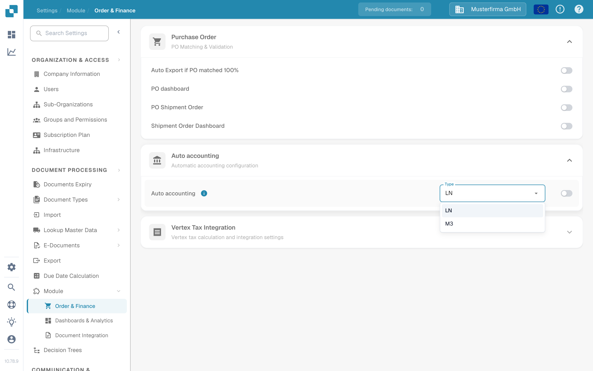

# Auto accounting with Infor LN

Use this guide when an Infor LN administrator wants DocBits to use imported financial master data for auto accounting. The old page showed 48 screens from a particular Infor tenant. Connection-point names, mappings, credentials and endpoint addresses from that tenant are not a reusable configuration.

## Find the setting in DocBits

Open **Settings → Module → Order & Finance → Auto accounting** with an administrator account. The **Type** menu offers **LN** and **M3**. For an LN integration, check that the selected type is **LN**. Enable the switch only after the intended LN company, BOD flow and imported master data have been verified. Changing the type or switch can affect accounting behaviour, so follow your organisation's change process.

The following English screenshots are from the synthetic **DocBits Documentation Test A** Sandbox. In this organisation, **LN** was selected and Auto accounting was **off**. The menu was opened without selecting another value; no setting was saved.

<figure><figcaption>
Locate Auto accounting and check the selected type before enabling it.
</figcaption></figure>

<figure><figcaption>
LN and M3 are the available types in this Sandbox; no choice was changed.
</figcaption></figure>

## Prepare LN and ION

1. Confirm the LN company, accounting entity, DocBits organisation and target environment. Agree with your DocBits administrator which current API operation and field mapping will receive accounts and dimensions. Keep API credentials in the approved secret store, never in a screenshot or Jira attachment.
2. Configure BOD publishing in LN and validate the publishing data setup. Infor documents **BOD Parameters (tcbod0100m000)** and **Validate Publishing Data Setup (tcbod0300m000)** in its [LN BOD publishing guide](https://docs.infor.com/ln/10.7.in/en-us/lnolh/help/tc/onlinemanual/000520.html).
3. Check which nouns your LN release and DocBits receiving operation require. The former example used `Sync.ChartOfAccounts` and `Sync.CodeDefinition` for chart and dimension data. Infor's [Publish Financial Master Data (tfbia0200m000)](https://docs.infor.com/ln/2025.x/en-us/lnolh/tfolh/help/tf/bia/tfbia0200m000.html) lists Chart of Accounts and CodeDefinition options. Some CodeDefinition tabs appear only after the dimension mapping has been specified and approved. Confirm the exact document versions and fields in your tenant before routing them.
4. In **ION Desk → Connect → Connection Points**, connect the LN source to the approved DocBits API destination. In **Data Flows**, route the selected documents, review filters and mapping, then save and activate. Infor distinguishes [saving from activating a flow](https://docs.infor.com/inforos/latest/en-us/useradminlib_cloud/iondeskceug/lsm1436532178755.html).
5. In LN, use a non-sensitive test identifier. In **Publish Financial Master Data**, first use **Count** or **Simulate** to inspect the selection, then **Publish** only under the administrator's approved change. The publishing action is not target-specific: Infor says it delivers to all subscribers. Trace that identifier and any errors in [ION OneView](https://docs.infor.com/inforos/latest/en-us/useradminlib_cloud/iondeskceug/lsm1436532196155.html).

## Confirm the DocBits result

Ask the DocBits administrator to verify the received record, organisation and accounting fields in the current import or API logs. Where the relevant lookup table is exposed, search the same identifier under **Settings → Document Processing → Lookup Master Data**. A successfully activated ION flow does not alone prove that DocBits accepted a record. If a value is absent, compare the source BOD, ION mapping, API response and target organisation before switching on auto accounting.

No LN tenant or live financial BOD transfer was available for an end-to-end test. The new Sandbox images verify only the current DocBits controls. The tenant administrator must validate the final mapping and accounting outcome.
