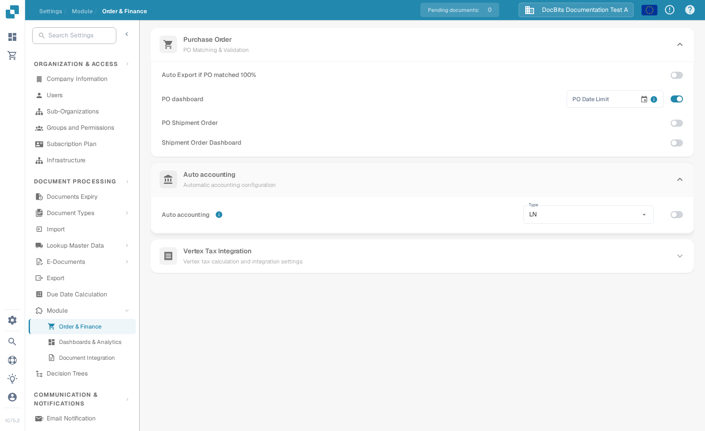

# Auto accounting with Infor M3

Use this guide to plan the master data required for M3 auto accounting in DocBits. An active setting alone does not import accounts or costing elements. Your Infor administrator must confirm the BOD mapping, the DocBits API operation and the result in your own organisation.

## Check the DocBits setting

An administrator can open **Settings → Module → Order & Finance → Auto accounting**. The **Type** menu offers **LN** and **M3**. Choose **M3** only for an M3 integration, and enable the switch after the data flow and required master data have been verified. The screenshots show the English **DocBits Documentation Test A** sandbox. Its switch was **off**, its current Type was **LN**, and opening the menu did not save or change a setting.

<figure><figcaption>
Locate Auto accounting in Order &amp; Finance; this sandbox example is disabled.
</figcaption></figure>

<figure><figcaption>
The Type menu offers LN and M3. No option was selected in this example.
</figcaption></figure>

## Prepare the M3 data flow

1. Agree which M3 company and DocBits organisation will exchange data. Check with your DocBits administrator which current API operation accepts the accounting master data. Avoid copying an endpoint or credential from an older tenant screenshot.
2. In M3, confirm that the required BODs are enabled for the relevant accounting entity. The previous tenant example used `Sync.ChartOfAccounts` and `Sync.CodeDefinition` for accounting dimensions. Confirm the exact noun, version and fields against your M3 configuration and the receiving API contract. Infor describes [enabling BOD publishing](https://docs.infor.com/m3core/2025.x/en-us/useradminlib_cloud/m3cecoreag_cloud/wbr1509377469290.html).
3. In **ION Desk → Connect → Connection Points**, configure the M3 source and an API destination with the approved DocBits operation and service account. In **Data Flows**, route only the approved documents, check filters and field mapping, then save and activate the flow. See the [Infor connection-point list](https://docs.infor.com/inforos/latest/en-us/useradminlib_cloud/iondeskceug/documentflowdesk_connectionpointmasterlist.html) and [data-flow activation instructions](https://docs.infor.com/inforos/latest/en-us/useradminlib_cloud/iondeskceug/lsm1436532178755.html).
4. Publish one non-sensitive test identifier from M3. An initial load may use M3 **EVS006**; the action and table names depend on the installed M3 version. Follow the [Infor initial-load instructions](https://docs.infor.com/m3core/2025.x/en-us/useradminlib_cloud/m3cecoreag_cloud/pbi1544012609638.html). In **ION OneView**, trace the identifier through the flow and inspect the API result using [Infor OneView](https://docs.infor.com/inforos/latest/en-us/useradminlib_cloud/iondeskceug/lsm1436532196155.html).
5. Check the same identifier in DocBits **Settings → Document Processing → Lookup Master Data**. The [M3-to-DocBits API guide](import-from-infor-m3-to-docbits-via-api.md) explains the import checks. Only enable M3 auto accounting when the required records are present and your administrator has validated the mapping.

## Costing elements

The older tenant example exported costing elements from M3 **PPS280** to Excel, reduced columns and uploaded a CSV through an old HTTP API screen. That screenshot sequence is not a safe general import procedure: column names, delimiter, endpoint and authentication need confirmation for the current environment. Use the current [costing-element table guide](table-extraction-for-costing-element.md) to prepare the file and inspect the available DocBits CSV controls. Do not upload a file until the administrator has checked its columns against the target table.

If a BOD reaches ION but no row appears in DocBits, inspect the ION route, API response, organisation, identifier and mapping before enabling the feature. Do not infer success from an activated flow or from existing demo data.

This page replaces 43 screenshots from one older Infor tenant with current DocBits controls and source-linked steps. No Infor tenant or live BOD transfer was available for an end-to-end test; your tenant administrator must validate the final mapping, import and accounting result.
