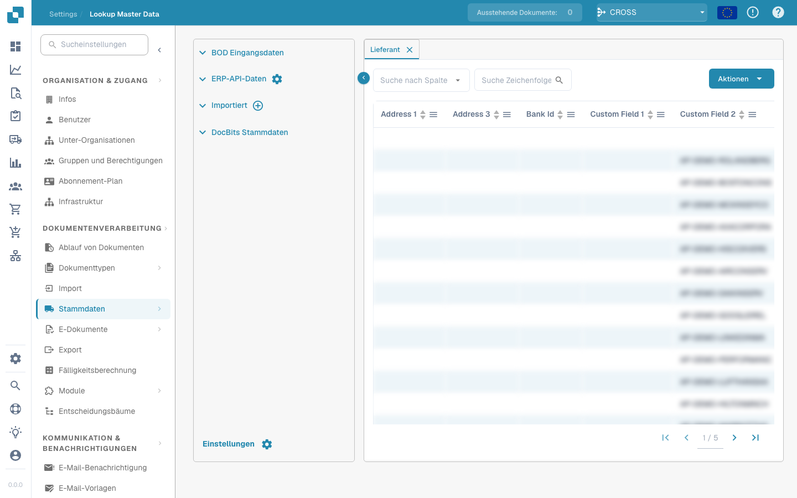
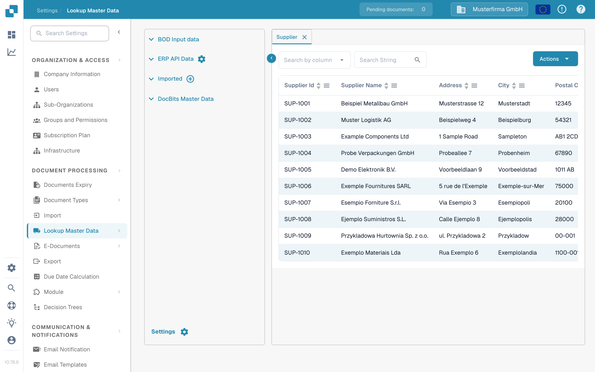

# Start a supplier initial load from Infor M3

Use this procedure only after your Infor administrator has confirmed the company, division, `SupplierPartyMaster` BOD and DocBits ION route. An unrestricted initial load may send every eligible supplier, so agree on a small selection first. The eleven Infor M3 screenshots below are historical examples; compare them with your tenant before running a job. This page update did not run an M3 job or import suppliers into DocBits.

Infor documents the [EVS006 initial-load procedure](https://docs.infor.com/m3core/latest/en-us/useradminlib_cloud/m3cecoreag_cloud/hmo1553266924239.html) and [EVS007 selection and run options](https://docs.infor.com/m3udi/16.x/en-us/m3beud/appfoundhs/spl1567531742751.html). Follow your tenant's approved procedure if labels differ.

* [ ] Open Infor OS and the M3 application with an account authorised for initial loads. Confirm the intended company and division before continuing.

<figure><figcaption></figcaption></figure>

* [ ] Open **Initial Load. Open (EVS006)** using your tenant's program search.

<figure><figcaption>
<em><strong>evs006</strong></em>
</figcaption></figure>

* [ ] In EVS006, create an initial-load definition for **SupplierPartyMaster**. The historical example uses **CIDMAS** as the table. Ask the M3 administrator to confirm that this BOD/table combination is valid in your version and integration.

<figure><figcaption></figcaption></figure>

<figure><figcaption></figcaption></figure>

* [ ] Select **Create** and review the definition before proceeding.

<figure><figcaption></figcaption></figure>

<figure><figcaption></figcaption></figure>

* [ ] Enter a clear **BOD Description**, for example **SupplierPartyMaster initial load for DocBits**.

<figure><figcaption></figcaption></figure>

* [ ] Select **Next** and define an agreed selection where available. Infor recommends selection criteria to avoid triggering too many events.

<figure><figcaption></figcaption></figure>

* [ ] Continue to the run settings. Review the company, division and selection again.

<figure><figcaption></figcaption></figure>

* [ ] On the SupplierPartyMaster definition, choose **Related → Run**. This opens **Initial Load Job. Open (EVS007)**; it is not yet proof that DocBits received the data.

<figure><figcaption></figcaption></figure>

* [ ] Choose **Sync** only if the receiving ION flow expects Sync.SupplierPartyMaster. Confirm filters and target before submitting EVS007. A full initial load can generate many events.

<figure><figcaption></figcaption></figure>

## Verify the result

After an authorised run, check **Related → History** in EVS006 for the processed count and any errors. Then verify the SupplierPartyMaster message in Infor ION and confirm that it reached the configured DocBits organisation. Only then look for one expected supplier in DocBits under **Settings → Lookup Master Data → Supplier**. Use the search control and supplier number or name; do not assume every M3 supplier arrived merely because the job was submitted.

The screenshot shows synthetic Sandbox data already present in Test A. No M3 tenant was connected during this documentation update. If the expected supplier is missing, compare the EVS006 history, ION routing and DocBits organisation before rerunning the load.
