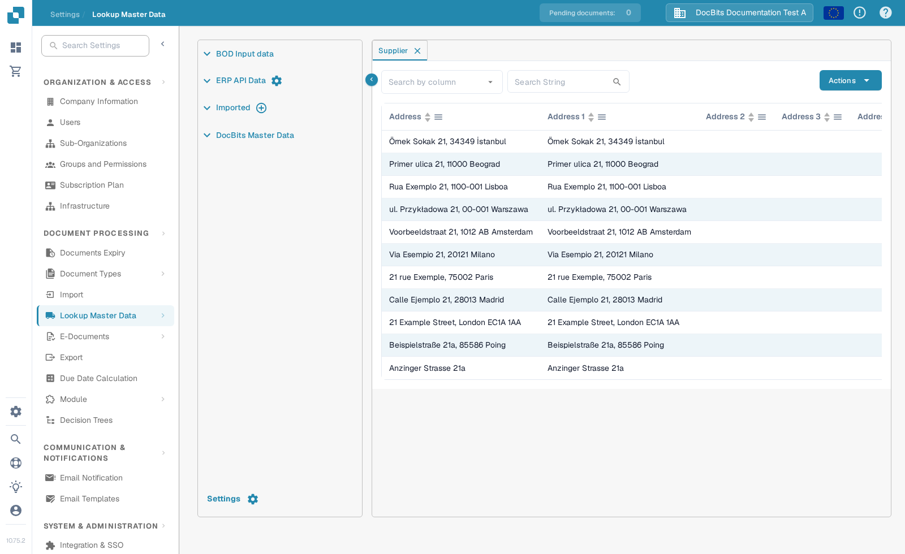
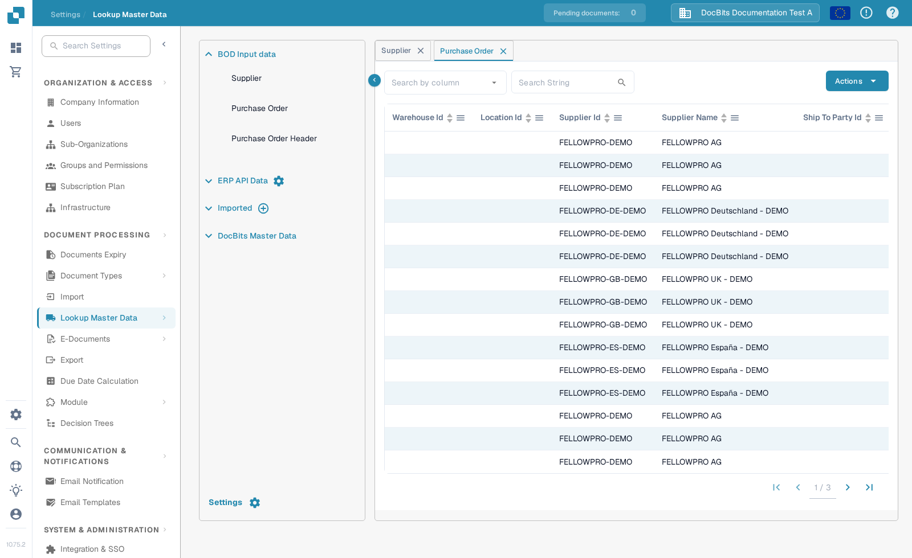

# Import suppliers and purchase orders from Infor M3

This page explains how to plan and check supplier and purchase order master-data imports through M3, ION and the DocBits API. The previous page showed 15 screens from one older Infor tenant and named its tables and connection points as if they applied to every organisation. Confirm the document names, table selection and endpoint in your own M3 and DocBits environments.

## Select the data to send

Agree the source M3 company, destination DocBits organisation and one non-sensitive identifier for each test record. The older tenant used a supplier party master BOD, a remit-to party master BOD and `Sync.PurchaseOrder`. The exact remit-to noun and version depend on the installed integration; inspect your M3 document list rather than copying a name from an old screenshot. The [Supplier BOD](../importing-via-the-api/supplier-bod.md) and [Purchase Order BOD](../importing-via-the-api/purchase-order-bod.md) guides describe the receiving data formats.

Do not add accounting BODs merely because the old connection-point picture contains them. Auto accounting has a separate [M3 setup guide](auto-accounting.md).

## Configure and trace the route

1. In **ION Desk → Connect → Connection Points**, select the M3 source and an API destination for the DocBits operation approved by your administrator. Check the operation, authentication and request mapping against the current API metadata. Infor's [connection-point overview](https://docs.infor.com/inforos/latest/en-us/useradminlib_cloud/iondeskceug/documentflowdesk_connectionpointmasterlist.html) explains the available connections.
2. In **ION Desk → Connect → Data Flows**, route only the selected supplier and purchase order documents. Check the accounting-entity filter and mapping, then save and activate the flow. Infor distinguishes [saving from activating a data flow](https://docs.infor.com/inforos/latest/en-us/useradminlib_cloud/iondeskceug/lsm1436532178755.html). The number of API destinations depends on your own environments; the old four-environment diagram is not a required layout.
3. Publish one approved test BOD from M3. For an initial load, M3 can use **Initial Load. Open (EVS006)**; choose the correct noun and fields for your M3 version. See the [Infor initial-load instructions](https://docs.infor.com/m3core/2025.x/en-us/useradminlib_cloud/m3cecoreag_cloud/pbi1544012609638.html). In [ION OneView](https://docs.infor.com/inforos/latest/en-us/useradminlib_cloud/iondeskceug/lsm1436532196155.html), search the test identifier, check the route and inspect any API error.

## Check the record in DocBits

Open **Settings → Document Processing → Lookup Master Data → BOD Input data**. Choose **Supplier** or **Purchase Order**, set **Search by column**, enter the identifier in **Search String** and select the magnifier. Column headers sort the visible rows; bottom arrows move between pages. **Actions** opens table operations and is not needed for this read-only check. The **×** on a tab closes it. The **Imported** plus button is for CSV, not for receiving an ION BOD.

<figure><figcaption>
Search the supplier identifier in the Supplier tab.
</figcaption></figure>

<figure><figcaption>
Search the purchase order identifier in the Purchase Order tab.
</figcaption></figure>

These English screens were captured in the synthetic **DocBits Documentation Test A** organisation. Existing rows shown there are demo data, not proof of an M3 import. If the test identifier is absent, compare the M3 publication, OneView route, API response and target organisation. The [full M3-to-DocBits API guide](import-from-infor-m3-to-docbits-via-api.md) covers further checks.

No M3 tenant or live BOD transfer was available for an end-to-end test; your integration administrator must validate the final mapping and imported records.
