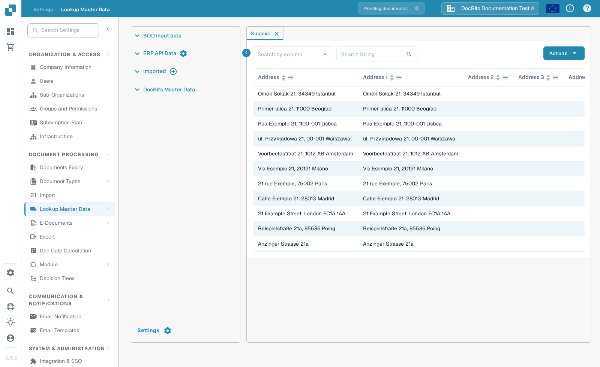

# Suppliers and Purchase Orders from Infor M3

This example connects M3 supplier and purchase-order BODs to DocBits through Infor ION. The fifteen Infor images below are historical tenant examples, not current validation of your M3 setup. Ask the Infor administrator to confirm the BOD names, source tables, company, division, API call names and target environment before running a job. No M3 initial load or DocBits import was executed for this update.

Infor documents how to [start an initial load in EVS006](https://docs.infor.com/m3core/latest/en-us/useradminlib_cloud/m3cecoreag_cloud/hmo1553266924239.html) and [review the EVS007 selection, verb and history](https://docs.infor.com/m3udi/16.x/en-us/m3beud/appfoundhs/spl1567531742751.html). Use a limited selection first; an unrestricted run can generate many events.

## **Connection Point**

You will need to create the DocBits API connection point in order to create the data flow later.

In InforOS, navigate to ION Desk → Connect → Connection Points

Once here, you will need to create a new connection point.

**Select API**

Give the connection point a name and description that describes its nature and its environment. Under the Connection tab, import the service account you created for the environment you are working with.

Next, switch to the Documents tab. You will need to add the following BODs to the connection point, not all are necessary for the supplier and purchase order master data but will be useful when other features such as Auto Accounting need to be implemented.

This historical setup uses Sync.RemitToPartyMasterData, Sync.SupplierPartyMaster and Sync.PurchaseOrder. Confirm the required BODs for your DocBits mapping; the setup can vary by tenant and feature.

* Sync.RemitToPartyMasterData and Sync.SupplierPartyMaster

The configuration for these two BODs should look similar to the following (API Call Name changing for each)

* Sync.PurchaseOrder

The configuration for this BOD should look similar to the following

Once these BODs are configured, you can save the connection point by pressing the icon located right to the back button.

## **Data Flow**

This historical data flow is one possible design; check its routes and receiving organisation in your own tenant.

The multiple DocBits API nodes represent separate environments in this example. Your design may differ; check that test messages cannot reach production.

Four environments are shown only as an example.

### **M3**

The start of the data flow consists of your M3 application

### **Filter**

Configuration of the filter looks as follows

(The accounting entity ID of course being unique to your organization)

### **DocBits API**

Here you will add an application and select the DocBits API(s) you created earlier

### **Files**

The configuration should look as follows

## **M3 BOD Triggering**

Navigate to the Infor M3 application

Once at the main menu, type Command + R to open the command prompt search box. Then type evs006 and search.

In EVS006, define the BOD nouns required for your approved mapping. The historical example uses SupplierPartyMaster, RemitToPartyMaster and PurchaseOrder. Confirm their M3 table names in your version before creating an initial-load definition.

BOD noun: SupplierPartyMaster

Table: CIDMAS

BOD noun: RemitToPartyMaster

Table: CIDMAS

BOD noun: PurchaseOrder

Table: MPHEAD

Use the add action for each approved definition. Check company and division before continuing.

After you have added each of the BODs, right click on the BOD noun of the BOD and select Related → Run

The related **Run** action opens EVS007. Choose **Sync** only when the receiving ION flow expects it. Inspect the selection and filters before the final submission; moving to the next screen is not proof of delivery.

A submission notification confirms that the job was requested. In EVS006 **History**, inspect the processed count and errors. Then check the message and target in Infor ION.

## Verify in DocBits

Open **Settings → Lookup Master Data → BOD Input data → Supplier** in the intended DocBits organisation. Search for one expected supplier number or name. Then open **Purchase Order** and search for a known purchase-order number; check **Purchase Order Header** if your mapping separates header and line data. Compare identifiers and company with the M3 source. A successful EVS007 request alone does not establish that all records arrived.

The Sandbox Test A rows were already present; they are examples of where to inspect data, not evidence of an M3 import. If an expected record is missing, check EVS006 history, ION routing, the BOD mapping and the DocBits organisation before rerunning.
