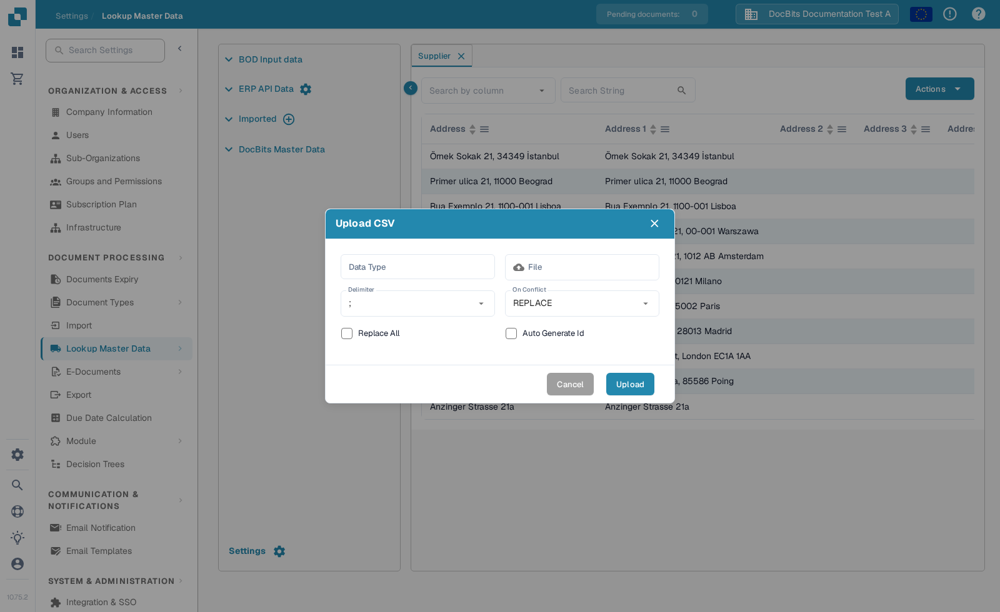

# Import M3 costing elements for table extraction

If DocBits reports **“Costing elements are not properly configured”** when you open a document, ask an administrator to check both the imported costing element data and the table extraction setting. This guide shows where to prepare the data and where to check it in DocBits.

## 1. Prepare the M3 export

1. In your M3 environment, open **PPS280** and select the costing element rows needed by your organisation. The menus and available rows depend on your M3 tenant and permissions.
2. If your M3 screen offers **Tools → Export to Excel**, export the selected rows or all required rows. Check the scope before exporting: the historical dialog shown below has a maximum row count.
3. Keep the original export. Work on a copy so you can check each mapped column against its M3 source.

<figure><figcaption>
Historical M3 example: locate the export action in your own tenant.
</figcaption></figure>

<figure><figcaption>
Historical M3 example: choose the rows and format deliberately.
</figcaption></figure>

## 2. Prepare a CSV for DocBits

Map the export to these column names before saving it as CSV. Check the meaning of each source column with your M3 administrator; the letter positions in an Excel export are not a stable interface.

| DocBits column | Value to check in the M3 export |
| --- | --- |
| `costing_element` | Costing element code |
| `description` | Readable element name |
| `charge_operator` | Charge operator |
| `charge_type` | Charge type |
| `distribution_method` | Distribution method |
| `distribution_type` | Distribution type |
| `charge_sequence_number` | Sequence number, when supplied by your configuration |

Remove unrelated columns from the CSV copy. Review a few rows, including special characters and empty values, before importing. The screenshot below is an **older M3 spreadsheet example**, not a DocBits import template.

<figure><figcaption>
Use the spreadsheet only to identify source data; map its columns by meaning.
</figcaption></figure>

## 3. Import in DocBits

1. Open **Settings → Document Processing → Lookup Master Data**.
2. In **Imported**, select the **plus** button. This opens **Upload CSV**.
3. Enter `costing_element` as **Data Type** and select your CSV under **File**.
4. Set **Delimiter** to the separator used by your file. The current dialog may initially show `;`; do not assume the file uses a comma.
5. Review **On Conflict**, **Replace All** and **Auto Generate Id** with your administrator before uploading. These choices can change existing imported data. **Cancel** closes the dialog without importing; **Upload** starts the import after the CSV and options have been checked.
6. After import, open the new entry under **Imported** and confirm that the expected costing element codes and descriptions are visible.

<figure><figcaption>
The plus button beside Imported opens the CSV upload dialog.
</figcaption></figure>

<figure><figcaption>
Match the delimiter to your file and review the replacement options before uploading.
</figcaption></figure>

## 4. Check the extraction setting

Open **Settings → Document Processing → Classification and Extraction → Extraction** and find **Table extraction for costing element**. Check that the setting is configured for the document type you are testing. Then reopen a suitable document and confirm the original configuration error is gone. If it remains, give your administrator the document type, costing element code and the exact error text.

<figure><figcaption>
The current setting is under Classification and Extraction; screen layout may differ from this historical image.
</figcaption></figure>

The Sandbox screenshots above show the current controls in the synthetic **DocBits Documentation Test A** organisation. No M3 export or CSV was uploaded while preparing this guide, so the import outcome must be checked in your own environment.
