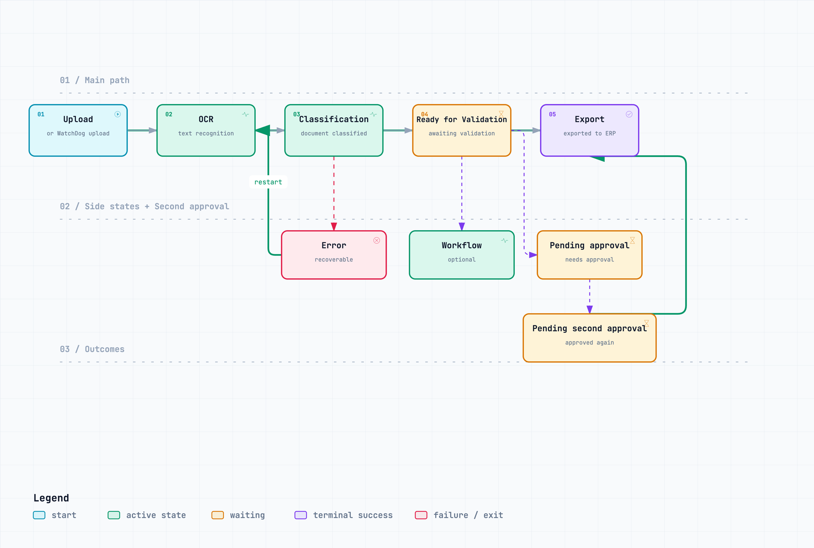
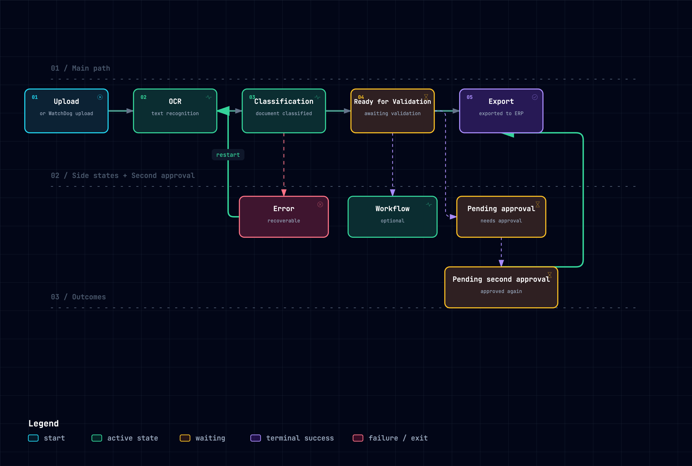

# Document Status Lifecycle

How a document moves through the DocBits statuses, from upload to export, including approvals, optional workflows and errors. See [Document Status](../../end-user-and-partner-section/end-user-section/dashboard/document-status.md) for the full list of statuses.

## Variant 1: SVG

<figure><figcaption>
SVG, follows the operating-system dark mode
</figcaption></figure>

## Variant 2: PNG, theme-aware

<figure><picture><source srcset="../../.gitbook/assets/archify-doc-status-dark.png" media="(prefers-color-scheme: dark)"></picture><figcaption>
PNG with a separate dark-mode file
</figcaption></figure>

## Variant 3: PNG light and dark

<figure><figcaption>
PNG, light theme
</figcaption></figure>

<figure><figcaption>
PNG, dark theme
</figcaption></figure>
