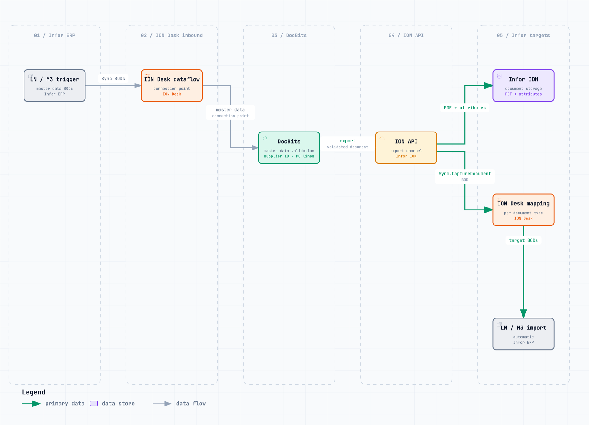
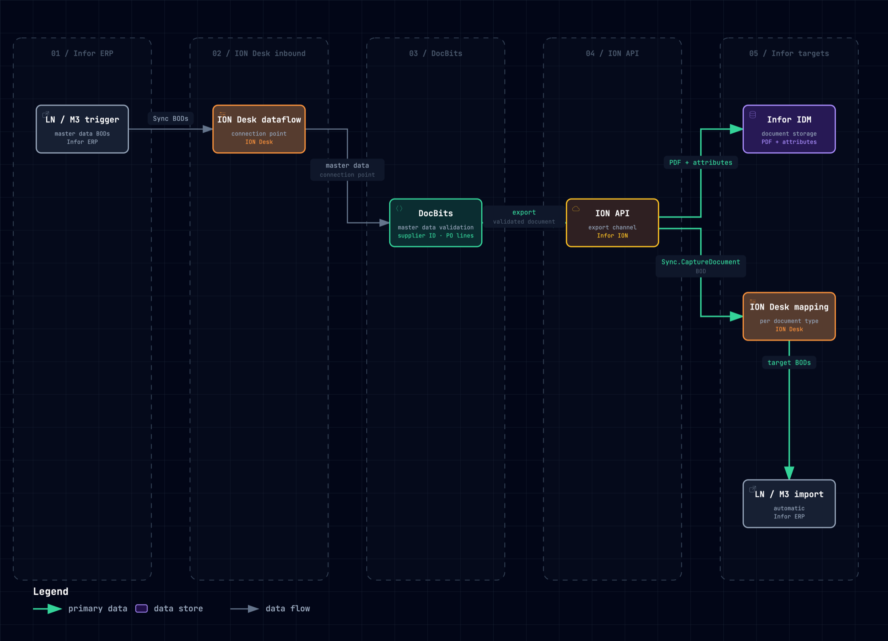

# Infor ERP Data Flow

How master data reaches DocBits from Infor ERP (LN/M3) through ION Desk, and how validated documents go back through ION API to Infor IDM and ION Desk. See [Architecture](../architecture/README.md) for details.

## Variant 1: SVG

<figure><figcaption>
SVG, follows the operating-system dark mode
</figcaption></figure>

## Variant 2: PNG, theme-aware

<figure><picture><source srcset="../../.gitbook/assets/archify-infor-dataflow-dark.png" media="(prefers-color-scheme: dark)"></picture><figcaption>
PNG with a separate dark-mode file
</figcaption></figure>

## Variant 3: PNG light and dark

<figure><figcaption>
PNG, light theme
</figcaption></figure>

<figure><figcaption>
PNG, dark theme
</figcaption></figure>
