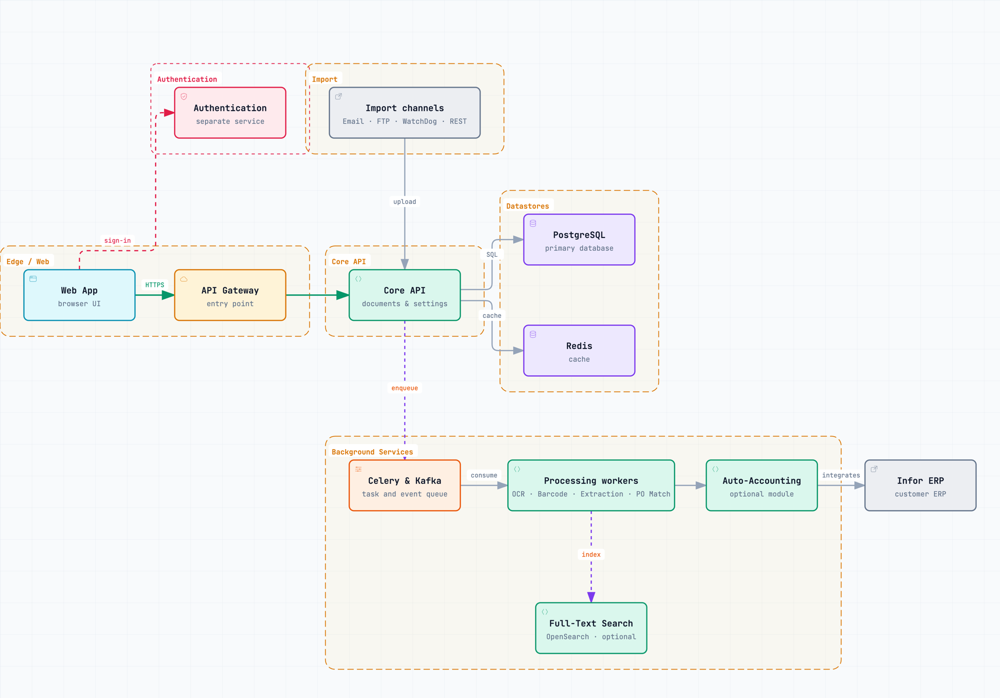
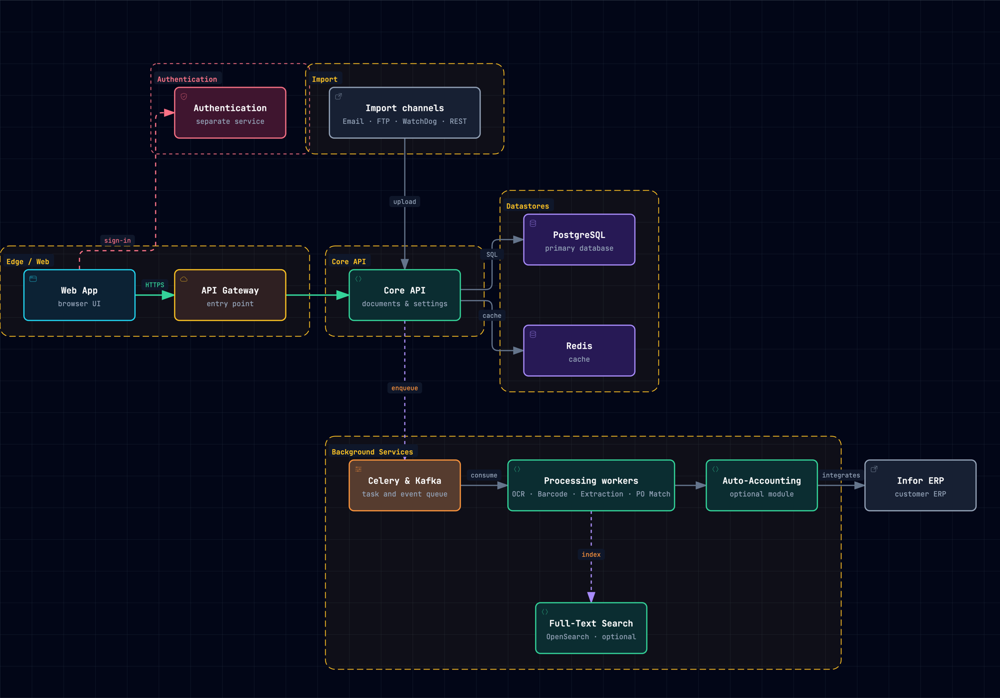

# Platform Architecture

The DocBits platform grouped into layers: Edge / Web, Authentication, Import, Core API, Datastores and Background Services. See [Infrastructure](../../administration-and-setup/settings/infrastructure.md) for the live view in the product.

## Variant 1: SVG

<figure><figcaption>
SVG, follows the operating-system dark mode
</figcaption></figure>

## Variant 2: PNG, theme-aware

<figure><picture><source srcset="../../.gitbook/assets/archify-platform-dark.png" media="(prefers-color-scheme: dark)"></picture><figcaption>
PNG with a separate dark-mode file
</figcaption></figure>

## Variant 3: PNG light and dark

<figure><figcaption>
PNG, light theme
</figcaption></figure>

<figure><figcaption>
PNG, dark theme
</figcaption></figure>
